# Redis Source Code Tutorial

## Introduction

### What is Redis?

Redis (Remote Dictionary Server) is an open-source, in-memory data structure store that serves as a database, cache, message broker, and streaming engine. Written primarily in C, Redis is renowned for its exceptional performance, supporting millions of operations per second with sub-millisecond latency. Redis operates as a key-value store but extends beyond simple key-value pairs by supporting rich data structures including strings, lists, sets, sorted sets, hashes, bitmaps, hyperloglogs, and streams.

### Why Study Redis Source Code?

Understanding Redis source code provides valuable insights into:

- High-performance system design and implementation
- Event-driven architecture and non-blocking I/O patterns
- Efficient data structure implementations
- Memory management techniques in C
- Network programming and protocol design
- Persistence and replication strategies
- Single-threaded concurrent processing

### Prerequisites

To effectively follow this tutorial, you should have:

- Proficiency in C programming language
- Understanding of operating system concepts (processes, threads, memory management)
- Familiarity with network programming concepts
- Basic knowledge of data structures and algorithms
- Understanding of file I/O operations
- Knowledge of Unix/Linux system calls

### Redis Source Code Organization

The Redis codebase is organized into several key directories:

- **src**: Contains the main server implementation, core logic, and all primary source files
- **deps**: Houses third-party dependencies such as hiredis, jemalloc, lua, and linenoise
- **tests**: Includes comprehensive unit tests and integration tests
- **utils**: Contains utility scripts for benchmarking, installation, and maintenance
- **redis.conf**: Main configuration file with detailed parameter descriptions

## Core Architecture Overview

### System Architecture

Redis employs a sophisticated yet elegant architecture built on three fundamental pillars:

**Event-Driven Core**
Redis operates on a single-threaded event loop model that handles all client requests, I/O operations, and internal tasks. This design eliminates the complexity of thread synchronization and context switching overhead, enabling Redis to achieve remarkably high throughput. The event loop continuously monitors registered file descriptors and executes registered callbacks when events occur.

**In-Memory Data Store**
All Redis data resides in RAM, enabling microsecond-level access times. The in-memory architecture eliminates disk I/O bottlenecks during normal operations, making Redis exceptionally fast. Redis uses sophisticated memory management techniques including custom allocators and memory optimization strategies to maximize efficiency.

**Layered Architecture**
Redis implements a clear separation of concerns through distinct layers:
- Network layer handles connection management and protocol parsing
- Command processing layer validates and executes commands
- Data structure layer provides efficient implementations of various data types
- Persistence layer manages data durability through snapshots and logs
- Replication layer ensures data availability across multiple instances

### High-Level Component Diagram

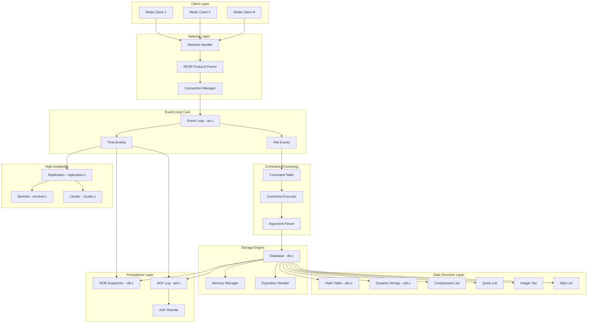
```mermaid
graph TB
    subgraph "Client Layer"
        Client1[Redis Client 1]
        Client2[Redis Client 2]
        ClientN[Redis Client N]
    end
    
    subgraph "Network Layer"
        NetHandler[Network Handler]
        RESP[RESP Protocol Parser]
        ConnMgr[Connection Manager]
    end
    
    subgraph "Event Loop Core"
        EventLoop[Event Loop - ae.c]
        FileEvents[File Events]
        TimeEvents[Time Events]
    end
    
    subgraph "Command Processing"
        CmdTable[Command Table]
        CmdExec[Command Executor]
        ArgParser[Argument Parser]
    end
    
    subgraph "Data Structure Layer"
        Dict[Hash Table - dict.c]
        SDS[Dynamic Strings - sds.c]
        ZipList[Compressed List]
        QuickList[Quick List]
        IntSet[Integer Set]
        ZSkipList[Skip List]
    end
    
    subgraph "Storage Engine"
        Database[Database - db.c]
        Memory[Memory Manager]
        Expire[Expiration Handler]
    end
    
    subgraph "Persistence Layer"
        RDB[RDB Snapshots - rdb.c]
        AOF[AOF Log - aof.c]
        Rewrite[AOF Rewrite]
    end
    
    subgraph "High Availability"
        Replication[Replication - replication.c]
        Sentinel[Sentinel - sentinel.c]
        Cluster[Cluster - cluster.c]
    end
    
    Client1 --> NetHandler
    Client2 --> NetHandler
    ClientN --> NetHandler
    
    NetHandler --> RESP
    RESP --> ConnMgr
    ConnMgr --> EventLoop
    
    EventLoop --> FileEvents
    EventLoop --> TimeEvents
    
    FileEvents --> CmdTable
    CmdTable --> CmdExec
    CmdExec --> ArgParser
    
    ArgParser --> Database
    Database --> Dict
    Database --> SDS
    Database --> ZipList
    Database --> QuickList
    Database --> IntSet
    Database --> ZSkipList
    
    Database --> Memory
    Database --> Expire
    
    TimeEvents --> RDB
    TimeEvents --> AOF
    TimeEvents --> Replication
    
    AOF --> Rewrite
    
    Database --> RDB
    Database --> AOF
    
    Replication --> Sentinel
    Replication --> Cluster
```

### Key Source Files Overview

**Core Server Files:**
- `server.h` / `server.c`: Main server structure, global state, and initialization
- `ae.h` / `ae.c`: Event loop implementation (Asynchronous Events)
- `networking.c`: Network I/O handling and client connection management
- `anet.h` / `anet.c`: Low-level networking utilities (TCP connections, sockets)

**Data Structure Files:**
- `sds.h` / `sds.c`: Simple Dynamic Strings implementation
- `dict.h` / `dict.c`: Hash table implementation
- `adlist.h` / `adlist.c`: Doubly-linked list
- `ziplist.h` / `ziplist.c`: Memory-efficient compressed list
- `quicklist.h` / `quicklist.c`: Hybrid list combining ziplist and linked list
- `intset.h` / `intset.c`: Compact integer set
- `t_string.c`, `t_list.c`, `t_set.c`, `t_zset.c`, `t_hash.c`: Type-specific command implementations

**Database Files:**
- `db.c`: Database operations (GET, SET, DEL, etc.)
- `object.c`: Redis object system and encoding
- `expire.c`: Key expiration management
- `evict.c`: Memory eviction policies

**Persistence Files:**
- `rdb.h` / `rdb.c`: RDB snapshot persistence
- `aof.c`: AOF (Append-Only File) persistence

**Replication and High Availability:**
- `replication.c`: Master-slave replication logic
- `sentinel.c`: Redis Sentinel for high availability
- `cluster.h` / `cluster.c`: Redis Cluster implementation

## Event Loop Architecture (ae.c)

### Overview

The event loop is the heart of Redis, enabling single-threaded asynchronous I/O. Located in `ae.c` (Asynchronous Events), it implements a reactor pattern that multiplexes I/O operations across multiple connections without blocking. This architecture allows Redis to handle thousands of concurrent connections on a single thread.

### Event Loop Structure

**aeEventLoop Structure:**
```c
typedef struct aeEventLoop {
    int maxfd;                    /* Highest file descriptor currently registered */
    int setsize;                  /* Max number of file descriptors tracked */
    long long timeEventNextId;    /* Next time event ID */
    time_t lastTime;              /* Used to detect system clock skew */
    aeFileEvent *events;          /* Registered file events array */
    aeFiredEvent *fired;          /* Fired events array */
    aeTimeEvent *timeEventHead;   /* Time events linked list head */
    int stop;                     /* Flag to stop the event loop */
    void *apidata;                /* OS-specific polling API data (epoll/kqueue/select) */
    aeBeforeSleepProc *beforesleep; /* Called before polling */
    aeBeforeSleepProc *aftersleep;  /* Called after polling */
} aeEventLoop;
```

**aeFileEvent Structure (I/O Events):**
```c
typedef struct aeFileEvent {
    int mask;              /* AE_READABLE, AE_WRITABLE, or both */
    aeFileProc *rfileProc; /* Read callback function */
    aeFileProc *wfileProc; /* Write callback function */
    void *clientData;      /* Client data passed to callbacks */
} aeFileEvent;
```

**aeTimeEvent Structure (Timer Events):**
```c
typedef struct aeTimeEvent {
    long long id;                    /* Time event identifier */
    long when_sec;                   /* Seconds part of trigger time */
    long when_ms;                    /* Milliseconds part */
    aeTimeProc *timeProc;           /* Time callback function */
    aeEventFinalizerProc *finalizerProc; /* Cleanup function */
    void *clientData;                /* Client data */
    struct aeTimeEvent *prev;        /* Previous time event */
    struct aeTimeEvent *next;        /* Next time event */
} aeTimeEvent;
```

### Event Loop Flow

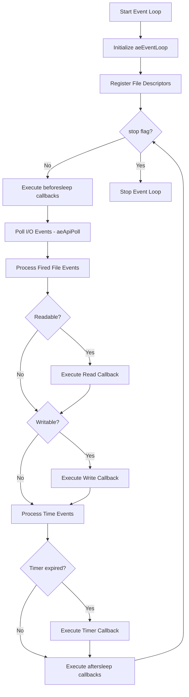
```mermaid
graph TB
    Start[Start Event Loop] --> Init[Initialize aeEventLoop]
    Init --> Register[Register File Descriptors]
    Register --> Loop{stop flag?}
    
    Loop -->|No| BeforeSleep[Execute beforesleep callbacks]
    BeforeSleep --> Poll[Poll I/O Events - aeApiPoll]
    
    Poll --> ProcessFile[Process Fired File Events]
    ProcessFile --> CheckRead{Readable?}
    CheckRead -->|Yes| ReadCallback[Execute Read Callback]
    CheckRead -->|No| CheckWrite{Writable?}
    ReadCallback --> CheckWrite
    
    CheckWrite -->|Yes| WriteCallback[Execute Write Callback]
    CheckWrite -->|No| ProcessTime[Process Time Events]
    WriteCallback --> ProcessTime
    
    ProcessTime --> CheckTimer{Timer expired?}
    CheckTimer -->|Yes| TimerCallback[Execute Timer Callback]
    CheckTimer -->|No| AfterSleep[Execute aftersleep callbacks]
    TimerCallback --> AfterSleep
    
    AfterSleep --> Loop
    Loop -->|Yes| End[Stop Event Loop]
```

### Event Loop Logic Explanation

**1. Initialization (`aeCreateEventLoop`):**
```c
aeEventLoop *aeCreateEventLoop(int setsize) {
    aeEventLoop *eventLoop;
    int i;
    
    // Allocate memory for event loop structure
    if ((eventLoop = zmalloc(sizeof(*eventLoop))) == NULL) goto err;
    
    // Allocate arrays for events
    eventLoop->events = zmalloc(sizeof(aeFileEvent) * setsize);
    eventLoop->fired = zmalloc(sizeof(aeFiredEvent) * setsize);
    
    eventLoop->setsize = setsize;
    eventLoop->lastTime = time(NULL);
    eventLoop->timeEventHead = NULL;
    eventLoop->timeEventNextId = 0;
    eventLoop->stop = 0;
    eventLoop->maxfd = -1;
    eventLoop->beforesleep = NULL;
    eventLoop->aftersleep = NULL;
    
    // Initialize OS-specific polling mechanism (epoll/kqueue/select)
    if (aeApiCreate(eventLoop) == -1) goto err;
    
    // Initialize all events to AE_NONE
    for (i = 0; i < setsize; i++)
        eventLoop->events[i].mask = AE_NONE;
    
    return eventLoop;
}
```

**2. File Event Registration (`aeCreateFileEvent`):**
When a new client connects or a file descriptor needs monitoring:
```c
int aeCreateFileEvent(aeEventLoop *eventLoop, int fd, int mask,
                      aeFileProc *proc, void *clientData) {
    if (fd >= eventLoop->setsize) {
        errno = ERANGE;
        return AE_ERR;
    }
    
    aeFileEvent *fe = &eventLoop->events[fd];
    
    // Register fd with OS-specific API (epoll_ctl, kevent, FD_SET)
    if (aeApiAddEvent(eventLoop, fd, mask) == -1)
        return AE_ERR;
    
    // Set event mask and callbacks
    fe->mask |= mask;
    if (mask & AE_READABLE) fe->rfileProc = proc;
    if (mask & AE_WRITABLE) fe->wfileProc = proc;
    fe->clientData = clientData;
    
    // Update maxfd if necessary
    if (fd > eventLoop->maxfd)
        eventLoop->maxfd = fd;
    
    return AE_OK;
}
```

**3. Main Event Loop (`aeMain` and `aeProcessEvents`):**
```c
void aeMain(aeEventLoop *eventLoop) {
    eventLoop->stop = 0;
    while (!eventLoop->stop) {
        // Process events with optional beforesleep/aftersleep hooks
        aeProcessEvents(eventLoop, AE_ALL_EVENTS | AE_CALL_BEFORE_SLEEP | AE_CALL_AFTER_SLEEP);
    }
}

int aeProcessEvents(aeEventLoop *eventLoop, int flags) {
    int processed = 0, numevents;
    
    // Return early if no time or file events requested
    if (!(flags & AE_TIME_EVENTS) && !(flags & AE_FILE_EVENTS)) return 0;
    
    // Calculate timeout for polling
    struct timeval tv, *tvp;
    if (eventLoop->maxfd != -1 || ((flags & AE_TIME_EVENTS) && !(flags & AE_DONT_WAIT))) {
        aeTimeEvent *shortest = NULL;
        
        if (flags & AE_TIME_EVENTS && !(flags & AE_DONT_WAIT))
            shortest = aeSearchNearestTimer(eventLoop);
        
        if (shortest) {
            // Calculate time until next timer
            long now_sec, now_ms;
            aeGetTime(&now_sec, &now_ms);
            tvp = &tv;
            
            long long ms = (shortest->when_sec - now_sec) * 1000 +
                          shortest->when_ms - now_ms;
            if (ms > 0) {
                tvp->tv_sec = ms / 1000;
                tvp->tv_usec = (ms % 1000) * 1000;
            } else {
                tvp->tv_sec = 0;
                tvp->tv_usec = 0;
            }
        } else {
            tvp = NULL; // Wait indefinitely
        }
        
        // Execute beforesleep callback
        if (flags & AE_CALL_BEFORE_SLEEP && eventLoop->beforesleep)
            eventLoop->beforesleep(eventLoop);
        
        // Poll for I/O events (epoll_wait, kevent, select)
        numevents = aeApiPoll(eventLoop, tvp);
        
        // Execute aftersleep callback
        if (flags & AE_CALL_AFTER_SLEEP && eventLoop->aftersleep)
            eventLoop->aftersleep(eventLoop);
        
        // Process fired file events
        for (int j = 0; j < numevents; j++) {
            aeFileEvent *fe = &eventLoop->events[eventLoop->fired[j].fd];
            int mask = eventLoop->fired[j].mask;
            int fd = eventLoop->fired[j].fd;
            int fired = 0;
            
            // Handle readable events
            if (!invert && fe->mask & mask & AE_READABLE) {
                fe->rfileProc(eventLoop, fd, fe->clientData, mask);
                fired++;
            }
            
            // Handle writable events
            if (fe->mask & mask & AE_WRITABLE) {
                if (!fired || fe->wfileProc != fe->rfileProc)
                    fe->wfileProc(eventLoop, fd, fe->clientData, mask);
                fired++;
            }
            processed++;
        }
    }
    
    // Process time events
    if (flags & AE_TIME_EVENTS)
        processed += processTimeEvents(eventLoop);
    
    return processed;
}
```

**4. Platform-Specific Implementations:**

Redis supports multiple polling mechanisms through compile-time selection:

- **Linux**: `epoll` (ae_epoll.c) - Most efficient for Linux
- **BSD/macOS**: `kqueue` (ae_kqueue.c) - Optimal for BSD systems  
- **POSIX**: `select` (ae_select.c) - Fallback for all POSIX systems

Example epoll implementation:
```c
static int aeApiPoll(aeEventLoop *eventLoop, struct timeval *tvp) {
    aeApiState *state = eventLoop->apidata;
    int retval, numevents = 0;
    
    // Convert timeout to milliseconds
    int timeout = tvp ? (tvp->tv_sec * 1000 + tvp->tv_usec / 1000) : -1;
    
    // Wait for events
    retval = epoll_wait(state->epfd, state->events, eventLoop->setsize, timeout);
    
    if (retval > 0) {
        numevents = retval;
        for (int j = 0; j < numevents; j++) {
            int mask = 0;
            struct epoll_event *e = state->events + j;
            
            if (e->events & EPOLLIN) mask |= AE_READABLE;
            if (e->events & EPOLLOUT) mask |= AE_WRITABLE;
            if (e->events & EPOLLERR) mask |= AE_WRITABLE | AE_READABLE;
            if (e->events & EPOLLHUP) mask |= AE_WRITABLE | AE_READABLE;
            
            eventLoop->fired[j].fd = e->data.fd;
            eventLoop->fired[j].mask = mask;
        }
    }
    
    return numevents;
}
```

### Time Events Processing

Time events handle periodic tasks like server cron jobs, expiring keys, and replication:

```c
static int processTimeEvents(aeEventLoop *eventLoop) {
    int processed = 0;
    aeTimeEvent *te;
    long long maxId;
    
    te = eventLoop->timeEventHead;
    maxId = eventLoop->timeEventNextId - 1;
    
    while (te) {
        long now_sec, now_ms;
        long long id;
        
        // Skip deleted events
        if (te->id == AE_DELETED_EVENT_ID) {
            aeTimeEvent *next = te->next;
            // Cleanup deleted event
            te = next;
            continue;
        }
        
        // Check if event should fire
        if (te->id > maxId) {
            te = te->next;
            continue;
        }
        
        aeGetTime(&now_sec, &now_ms);
        if (now_sec > te->when_sec ||
            (now_sec == te->when_sec && now_ms >= te->when_ms)) {
            int retval;
            
            id = te->id;
            retval = te->timeProc(eventLoop, id, te->clientData);
            processed++;
            
            // If retval != AE_NOMORE, reschedule the event
            if (retval != AE_NOMORE) {
                aeAddMillisecondsToNow(retval, &te->when_sec, &te->when_ms);
            } else {
                te->id = AE_DELETED_EVENT_ID;
            }
        }
        te = te->next;
    }
    
    return processed;
}
```

## Network Layer and RESP Protocol

### Networking Overview

Redis networking is built on non-blocking TCP sockets managed through the event loop. The `networking.c` file contains all client connection handling, while `anet.c` provides low-level socket utilities.

### RESP Protocol (REdis Serialization Protocol)

RESP is a simple, human-readable protocol that serializes different data types:

**Protocol Format:**
- **Simple Strings**: `+OK\r\n`
- **Errors**: `-Error message\r\n`
- **Integers**: `:1000\r\n`
- **Bulk Strings**: `$6\r\nfoobar\r\n` (length-prefixed)
- **Arrays**: `*2\r
$3\r
foo\r
$3\r
bar\r
`

**Example Request (SET command):**
```
*3\r\n
$3\r\n
SET\r\n
$5\r\n
mykey\r\n
$7\r\n
myvalue\r\n
```

**Example Response:**
```
+OK\r\n
```

### Client Connection Flow

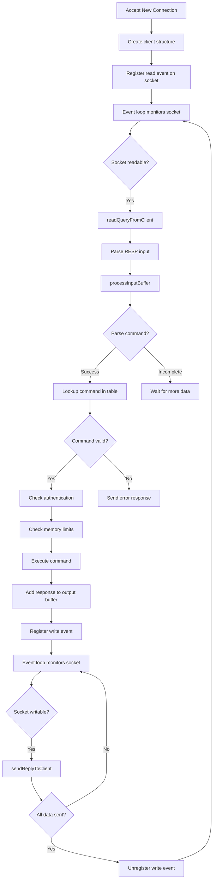
```mermaid
graph TB
    Accept[Accept New Connection] --> CreateClient[Create client structure]
    CreateClient --> RegisterRead[Register read event on socket]
    RegisterRead --> EventLoop[Event loop monitors socket]
    
    EventLoop --> Readable{Socket readable?}
    Readable -->|Yes| ReadQuery[readQueryFromClient]
    ReadQuery --> ParseInput[Parse RESP input]
    ParseInput --> ProcessInput[processInputBuffer]
    
    ProcessInput --> ParseCommand{Parse command?}
    ParseCommand -->|Success| LookupCmd[Lookup command in table]
    ParseCommand -->|Incomplete| WaitMore[Wait for more data]
    
    LookupCmd --> ValidateCmd{Command valid?}
    ValidateCmd -->|Yes| CheckAuth[Check authentication]
    ValidateCmd -->|No| SendError[Send error response]
    
    CheckAuth --> CheckMem[Check memory limits]
    CheckMem --> ExecCmd[Execute command]
    
    ExecCmd --> AddReply[Add response to output buffer]
    AddReply --> RegisterWrite[Register write event]
    
    RegisterWrite --> EventLoop2[Event loop monitors socket]
    EventLoop2 --> Writable{Socket writable?}
    Writable -->|Yes| SendReply[sendReplyToClient]
    SendReply --> Complete{All data sent?}
    Complete -->|Yes| UnregisterWrite[Unregister write event]
    Complete -->|No| EventLoop2
    UnregisterWrite --> EventLoop
```

### Client Structure

Each connected client is represented by a `client` structure:

```c
typedef struct client {
    uint64_t id;              /* Client unique ID */
    int fd;                   /* Socket file descriptor */
    redisDb *db;             /* Pointer to currently selected database */
    robj *name;              /* Client name (set via CLIENT SETNAME) */
    sds querybuf;            /* Input buffer for reading commands */
    size_t qb_pos;           /* Position in querybuf already parsed */
    sds pending_querybuf;    /* Additional query buffer */
    size_t querybuf_peak;    /* Recent peak of querybuf size */
    int argc;                /* Number of command arguments */
    robj **argv;             /* Command arguments array */
    struct redisCommand *cmd, *lastcmd; /* Current and last command */
    
    /* Response buffer */
    int bufpos;              /* Position in static buffer */
    char buf[PROTO_REPLY_CHUNK_BYTES]; /* Static reply buffer */
    list *reply;             /* List of reply objects for large responses */
    unsigned long long reply_bytes; /* Total bytes in reply list */
    
    /* Networking */
    int flags;               /* Client flags (SLAVE, MONITOR, etc.) */
    time_t lastinteraction;  /* Time of last interaction for timeout */
    time_t obuf_soft_limit_reached_time; /* Output buffer limits */
    
    /* Authentication */
    int authenticated;       /* Authentication status */
    
    /* Replication state */
    int replstate;           /* Replication state if this is a slave */
    int repl_put_online_on_ack; /* Install slave write handler on ACK */
    int repldbfd;            /* Replication DB file descriptor */
    off_t repldboff;         /* Replication DB file offset */
    off_t repldbsize;        /* Replication DB file size */
    
    /* Multi/EXEC state */
    multiState mstate;       /* MULTI/EXEC transaction state */
    
    /* Pub/Sub */
    list *pubsub_channels;   /* Channels subscribed to */
    list *pubsub_patterns;   /* Patterns subscribed to */
    
    /* Misc */
    time_t ctime;            /* Client creation time */
    long long duration;      /* Current command duration */
} client;
```

### Reading Client Input

```c
void readQueryFromClient(aeEventLoop *el, int fd, void *privdata, int mask) {
    client *c = (client*) privdata;
    int nread, readlen;
    size_t qblen;
    
    // Determine how much to read
    readlen = PROTO_IOBUF_LEN;
    
    // Expand query buffer if necessary
    qblen = sdslen(c->querybuf);
    if (c->querybuf_peak < qblen) c->querybuf_peak = qblen;
    c->querybuf = sdsMakeRoomFor(c->querybuf, readlen);
    
    // Read from socket
    nread = read(fd, c->querybuf + qblen, readlen);
    
    if (nread == -1) {
        if (errno == EAGAIN) {
            return; // No data available, try again later
        } else {
            // Error reading, free client
            freeClient(c);
            return;
        }
    } else if (nread == 0) {
        // Client closed connection
        freeClient(c);
        return;
    }
    
    // Update buffer length
    sdsIncrLen(c->querybuf, nread);
    c->lastinteraction = server.unixtime;
    
    // Process input buffer
    if (processInputBuffer(c) == C_ERR)
        return;
}

void processInputBuffer(client *c) {
    // Process all complete commands in buffer
    while(sdslen(c->querybuf) - c->qb_pos) {
        // Parse the request based on protocol type
        if (!c->reqtype) {
            if (c->querybuf[c->qb_pos] == '*') {
                c->reqtype = PROTO_REQ_MULTIBULK; // RESP array
            } else {
                c->reqtype = PROTO_REQ_INLINE; // Inline command
            }
        }
        
        if (c->reqtype == PROTO_REQ_INLINE) {
            if (processInlineBuffer(c) != C_OK) break;
        } else if (c->reqtype == PROTO_REQ_MULTIBULK) {
            if (processMultibulkBuffer(c) != C_OK) break;
        }
        
        // Execute the command
        if (c->argc) {
            if (processCommand(c) == C_OK) {
                // Command executed, reset for next command
                resetClient(c);
            }
        }
    }
}
```

### RESP Protocol Parsing

```c
int processMultibulkBuffer(client *c) {
    char *newline = NULL;
    int pos = 0, ok;
    long long ll;
    
    // Parse number of arguments if not yet done
    if (c->multibulklen == 0) {
        // Expect *<count>\r\n
        newline = strchr(c->querybuf + c->qb_pos, '\r');
        if (newline == NULL) {
            if (sdslen(c->querybuf) - c->qb_pos > PROTO_INLINE_MAX_SIZE) {
                addReplyError(c, "Protocol error: too big mbulk count string");
                return C_ERR;
            }
            return C_ERR; // Incomplete
        }
        
        // Parse argument count
        ok = string2ll(c->querybuf + c->qb_pos + 1, newline - (c->querybuf + c->qb_pos + 1), &ll);
        if (!ok || ll > 1024 * 1024) {
            addReplyError(c, "Protocol error: invalid multibulk length");
            return C_ERR;
        }
        
        c->qb_pos = (newline - c->querybuf) + 2; // Skip \r\n
        
        if (ll <= 0) return C_OK;
        
        c->multibulklen = ll;
        c->argv = zmalloc(sizeof(robj*) * c->multibulklen);
    }
    
    // Read each bulk string
    while(c->multibulklen) {
        // Read bulk length
        if (c->bulklen == -1) {
            newline = strchr(c->querybuf + c->qb_pos, '\r');
            if (newline == NULL) {
                if (sdslen(c->querybuf) - c->qb_pos > PROTO_INLINE_MAX_SIZE) {
                    addReplyError(c, "Protocol error: too big bulk count string");
                    return C_ERR;
                }
                break; // Incomplete
            }
            
            // Expect $<length>\r\n
            if (c->querybuf[c->qb_pos] != '$') {
                addReplyError(c, "Protocol error: expected '$'");
                return C_ERR;
            }
            
            ok = string2ll(c->querybuf + c->qb_pos + 1, newline - (c->querybuf + c->qb_pos + 1), &ll);
            if (!ok || ll < 0 || ll > 512 * 1024 * 1024) {
                addReplyError(c, "Protocol error: invalid bulk length");
                return C_ERR;
            }
            
            c->qb_pos = (newline - c->querybuf) + 2;
            c->bulklen = ll;
        }
        
        // Read bulk data
        if (sdslen(c->querybuf) - c->qb_pos < (size_t)(c->bulklen + 2)) {
            break; // Not enough data yet
        } else {
            c->argv[c->argc++] = createStringObject(c->querybuf + c->qb_pos, c->bulklen);
            c->qb_pos += c->bulklen + 2; // Skip data and \r\n
            c->bulklen = -1;
            c->multibulklen--;
        }
    }
    
    // All arguments parsed
    if (c->multibulklen == 0) return C_OK;
    return C_ERR; // Incomplete
}
```

### Sending Responses

```c
void addReply(client *c, robj *obj) {
    if (prepareClientToWrite(c) != C_OK) return;
    
    // Try to add to static buffer first
    if (_addReplyToBuffer(c, obj->ptr, sdslen(obj->ptr)) != C_OK)
        _addReplyStringToList(c, obj->ptr, sdslen(obj->ptr));
}

int _addReplyToBuffer(client *c, const char *s, size_t len) {
    size_t available = sizeof(c->buf) - c->bufpos;
    
    // Return error if already using reply list or buffer full
    if (c->flags & CLIENT_CLOSE_AFTER_REPLY) return C_OK;
    if (listLength(c->reply) > 0) return C_ERR;
    if (len > available) return C_ERR;
    
    // Copy to static buffer
    memcpy(c->buf + c->bufpos, s, len);
    c->bufpos += len;
    return C_OK;
}

void sendReplyToClient(aeEventLoop *el, int fd, void *privdata, int mask) {
    client *c = privdata;
    int nwritten = 0, totwritten = 0;
    size_t objlen;
    sds o;
    
    // Write static buffer first
    if (c->bufpos > 0) {
        nwritten = write(fd, c->buf + c->sentlen, c->bufpos - c->sentlen);
        if (nwritten <= 0) goto write_error;
        c->sentlen += nwritten;
        totwritten += nwritten;
        
        // If buffer fully sent, reset
        if ((int)c->sentlen == c->bufpos) {
            c->bufpos = 0;
            c->sentlen = 0;
        }
    }
    
    // Write reply list objects
    while(c->bufpos == 0 && listLength(c->reply)) {
        o = listNodeValue(listFirst(c->reply));
        objlen = sdslen(o);
        
        if (objlen == 0) {
            listDelNode(c->reply, listFirst(c->reply));
            continue;
        }
        
        nwritten = write(fd, o + c->sentlen, objlen - c->sentlen);
        if (nwritten <= 0) goto write_error;
        c->sentlen += nwritten;
        totwritten += nwritten;
        
        // If object fully sent, remove from list
        if (c->sentlen == objlen) {
            listDelNode(c->reply, listFirst(c->reply));
            c->sentlen = 0;
            c->reply_bytes -= objlen;
        }
    }
    
    // Update stats
    server.stat_net_output_bytes += totwritten;
    
    // If all data sent, unregister write event
    if (!clientHasPendingReplies(c)) {
        c->sentlen = 0;
        aeDeleteFileEvent(server.el, c->fd, AE_WRITABLE);
        
        // Close client if requested
        if (c->flags & CLIENT_CLOSE_AFTER_REPLY) {
            freeClient(c);
            return;
        }
    }
    return;

write_error:
    if (nwritten == -1) {
        if (errno == EAGAIN) {
            nwritten = 0;
        } else {
            freeClient(c);
            return;
        }
    }
}
```

## Data Structures Deep Dive

### Simple Dynamic Strings (SDS)

Redis doesn't use standard C strings. Instead, it implements SDS (Simple Dynamic Strings) in `sds.c`, which provides:

- O(1) length retrieval
- Binary-safe string storage
- Efficient memory management with pre-allocation
- Compatibility with standard C string functions

**SDS Structure:**
```c
// SDS Header (varies by string length)
typedef char *sds;

struct __attribute__ ((__packed__)) sdshdr5 {
    unsigned char flags;  /* 3 lsb of type, 5 msb of string length */
    char buf[];
};

struct __attribute__ ((__packed__)) sdshdr8 {
    uint8_t len;         /* Used length */
    uint8_t alloc;       /* Allocated length excluding header and null terminator */
    unsigned char flags; /* Lower 3 bits = type, upper 5 bits unused */
    char buf[];          /* Actual string data */
};

struct __attribute__ ((__packed__)) sdshdr16 {
    uint16_t len;
    uint16_t alloc;
    unsigned char flags;
    char buf[];
};

struct __attribute__ ((__packed__)) sdshdr32 {
    uint32_t len;
    uint32_t alloc;
    unsigned char flags;
    char buf[];
};

struct __attribute__ ((__packed__)) sdshdr64 {
    uint64_t len;
    uint64_t alloc;
    unsigned char flags;
    char buf[];
};
```

**Key SDS Operations:**

```c
// Create new SDS string
sds sdsnewlen(const void *init, size_t initlen) {
    void *sh;
    sds s;
    char type = sdsReqType(initlen);
    int hdrlen = sdsHdrSize(type);
    unsigned char *fp;
    
    // Allocate memory: header + string + null terminator
    sh = s_malloc(hdrlen + initlen + 1);
    if (sh == NULL) return NULL;
    
    // Initialize based on type
    s = (char*)sh + hdrlen;
    fp = ((unsigned char*)s) - 1;
    
    switch(type) {
        case SDS_TYPE_8: {
            SDS_HDR_VAR(8,s);
            sh->len = initlen;
            sh->alloc = initlen;
            *fp = type;
            break;
        }
        // Similar for other types...
    }
    
    // Copy initial data
    if (initlen && init)
        memcpy(s, init, initlen);
    s[initlen] = '\0';
    return s;
}

// Concatenate to SDS
sds sdscatlen(sds s, const void *t, size_t len) {
    size_t curlen = sdslen(s);
    
    // Expand if necessary
    s = sdsMakeRoomFor(s, len);
    if (s == NULL) return NULL;
    
    // Copy new data
    memcpy(s + curlen, t, len);
    sdssetlen(s, curlen + len);
    s[curlen + len] = '\0';
    return s;
}

// Make room for additional bytes
sds sdsMakeRoomFor(sds s, size_t addlen) {
    void *sh, *newsh;
    size_t avail = sdsavail(s);
    size_t len, newlen;
    char type, oldtype = s[-1] & SDS_TYPE_MASK;
    int hdrlen;
    
    // Return if already enough space
    if (avail >= addlen) return s;
    
    len = sdslen(s);
    sh = (char*)s - sdsHdrSize(oldtype);
    newlen = (len + addlen);
    
    // Preallocation strategy: double if < 1MB, else add 1MB
    if (newlen < SDS_MAX_PREALLOC)
        newlen *= 2;
    else
        newlen += SDS_MAX_PREALLOC;
    
    type = sdsReqType(newlen);
    hdrlen = sdsHdrSize(type);
    
    // Reallocate
    newsh = s_realloc(sh, hdrlen + newlen + 1);
    if (newsh == NULL) return NULL;
    
    s = (char*)newsh + hdrlen;
    
    // Update header
    switch(type) {
        case SDS_TYPE_8: {
            SDS_HDR_VAR(8,s);
            sh->alloc = newlen;
            sh->len = len;
            break;
        }
        // Similar for other types...
    }
    
    return s;
}
```

### Hash Table (dict.c)

Redis hash tables power the main key space and hash data type. The implementation includes:

- Incremental rehashing to avoid blocking
- Separate chaining for collision resolution
- Dynamic resizing based on load factor

**Dictionary Structure:**
```c
typedef struct dictEntry {
    void *key;
    union {
        void *val;
        uint64_t u64;
        int64_t s64;
        double d;
    } v;
    struct dictEntry *next; /* Next entry in collision chain */
} dictEntry;

typedef struct dictht {
    dictEntry **table;      /* Hash table array */
    unsigned long size;     /* Table size (always power of 2) */
    unsigned long sizemask; /* Size mask (size - 1) for modulo */
    unsigned long used;     /* Number of entries */
} dictht;

typedef struct dict {
    dictType *type;         /* Type-specific functions */
    void *privdata;         /* Private data for type functions */
    dictht ht[2];          /* Two hash tables for rehashing */
    long rehashidx;        /* Rehashing progress (-1 if not rehashing) */
    unsigned long iterators; /* Number of iterators currently running */
} dict;

typedef struct dictType {
    uint64_t (*hashFunction)(const void *key);
    void *(*keyDup)(void *privdata, const void *key);
    void *(*valDup)(void *privdata, const void *obj);
    int (*keyCompare)(void *privdata, const void *key1, const void *key2);
    void (*keyDestructor)(void *privdata, void *key);
    void (*valDestructor)(void *privdata, void *obj);
} dictType;
```

**Hash Table Operations:**

```c
// Add entry to dictionary
int dictAdd(dict *d, void *key, void *val) {
    dictEntry *entry = dictAddRaw(d, key, NULL);
    if (!entry) return DICT_ERR;
    dictSetVal(d, entry, val);
    return DICT_OK;
}

dictEntry *dictAddRaw(dict *d, void *key, dictEntry **existing) {
    long index;
    dictEntry *entry;
    dictht *ht;
    
    // Perform incremental rehashing if needed
    if (dictIsRehashing(d)) _dictRehashStep(d);
    
    // Check if key already exists
    if ((index = _dictKeyIndex(d, key, dictHashKey(d,key), existing)) == -1)
        return NULL;
    
    // Allocate entry and add to appropriate hash table
    ht = dictIsRehashing(d) ? &d->ht[1] : &d->ht[0];
    entry = zmalloc(sizeof(*entry));
    entry->next = ht->table[index];
    ht->table[index] = entry;
    ht->used++;
    
    // Set key
    dictSetKey(d, entry, key);
    return entry;
}

// Find entry
dictEntry *dictFind(dict *d, const void *key) {
    dictEntry *he;
    uint64_t h, idx, table;
    
    if (d->ht[0].used + d->ht[1].used == 0) return NULL;
    
    // Perform incremental rehashing
    if (dictIsRehashing(d)) _dictRehashStep(d);
    
    h = dictHashKey(d, key);
    
    // Search in both tables if rehashing
    for (table = 0; table <= 1; table++) {
        idx = h & d->ht[table].sizemask;
        he = d->ht[table].table[idx];
        
        // Walk the collision chain
        while(he) {
            if (key == he->key || dictCompareKeys(d, key, he->key))
                return he;
            he = he->next;
        }
        
        // Don't search second table if not rehashing
        if (!dictIsRehashing(d)) return NULL;
    }
    return NULL;
}
```

**Incremental Rehashing:**

Redis rehashes incrementally to avoid blocking:

```c
int dictRehash(dict *d, int n) {
    int empty_visits = n * 10; /* Max empty buckets to visit */
    
    if (!dictIsRehashing(d)) return 0;
    
    // Rehash n buckets
    while(n-- && d->ht[0].used != 0) {
        dictEntry *de, *nextde;
        
        // Find non-empty bucket
        while(d->ht[0].table[d->rehashidx] == NULL) {
            d->rehashidx++;
            if (--empty_visits == 0) return 1;
        }
        
        de = d->ht[0].table[d->rehashidx];
        
        // Move all entries in this bucket to new table
        while(de) {
            uint64_t h;
            nextde = de->next;
            
            // Calculate index in new table
            h = dictHashKey(d, de->key) & d->ht[1].sizemask;
            de->next = d->ht[1].table[h];
            d->ht[1].table[h] = de;
            d->ht[0].used--;
            d->ht[1].used++;
            de = nextde;
        }
        d->ht[0].table[d->rehashidx] = NULL;
        d->rehashidx++;
    }
    
    // Check if rehashing completed
    if (d->ht[0].used == 0) {
        zfree(d->ht[0].table);
        d->ht[0] = d->ht[1];
        _dictReset(&d->ht[1]);
        d->rehashidx = -1;
        return 0;
    }
    
    return 1; /* More rehashing needed */
}

// Single-step rehash (called on each operation)
static void _dictRehashStep(dict *d) {
    if (d->iterators == 0) dictRehash(d, 1);
}
```

### Skip List (t_zset.c)

Skip lists implement sorted sets in Redis. They provide O(log N) operations with simpler implementation than balanced trees.

**Skip List Structure:**
```c
#define ZSKIPLIST_MAXLEVEL 32
#define ZSKIPLIST_P 0.25  /* Probability for level generation */

typedef struct zskiplistNode {
    sds ele;                      /* Member element */
    double score;                 /* Score for sorting */
    struct zskiplistNode *backward; /* Backward pointer */
    struct zskiplistLevel {
        struct zskiplistNode *forward; /* Forward pointer */
        unsigned long span;            /* Span to next node */
    } level[];                    /* Flexible array of levels */
} zskiplistNode;

typedef struct zskiplist {
    struct zskiplistNode *header, *tail;
    unsigned long length;         /* Number of nodes */
    int level;                    /* Current max level */
} zskiplist;

typedef struct zset {
    dict *dict;                   /* Hash table for O(1) lookup by member */
    zskiplist *zsl;              /* Skip list for range operations */
} zset;
```

**Skip List Operations:**

```c
// Create skip list node with random level
zskiplistNode *zslCreateNode(int level, double score, sds ele) {
    zskiplistNode *zn = zmalloc(sizeof(*zn) + level * sizeof(struct zskiplistLevel));
    zn->score = score;
    zn->ele = ele;
    return zn;
}

// Random level generation (probabilistic)
int zslRandomLevel(void) {
    int level = 1;
    while ((random() & 0xFFFF) < (ZSKIPLIST_P * 0xFFFF))
        level += 1;
    return (level < ZSKIPLIST_MAXLEVEL) ? level : ZSKIPLIST_MAXLEVEL;
}

// Insert node into skip list
zskiplistNode *zslInsert(zskiplist *zsl, double score, sds ele) {
    zskiplistNode *update[ZSKIPLIST_MAXLEVEL], *x;
    unsigned int rank[ZSKIPLIST_MAXLEVEL];
    int i, level;
    
    x = zsl->header;
    
    // Find insertion point at each level
    for (i = zsl->level - 1; i >= 0; i--) {
        rank[i] = i == (zsl->level - 1) ? 0 : rank[i + 1];
        
        while (x->level[i].forward &&
               (x->level[i].forward->score < score ||
                (x->level[i].forward->score == score &&
                 sdscmp(x->level[i].forward->ele, ele) < 0))) {
            rank[i] += x->level[i].span;
            x = x->level[i].forward;
        }
        update[i] = x;
    }
    
    // Generate random level for new node
    level = zslRandomLevel();
    if (level > zsl->level) {
        for (i = zsl->level; i < level; i++) {
            rank[i] = 0;
            update[i] = zsl->header;
            update[i]->level[i].span = zsl->length;
        }
        zsl->level = level;
    }
    
    // Create and insert new node
    x = zslCreateNode(level, score, ele);
    for (i = 0; i < level; i++) {
        x->level[i].forward = update[i]->level[i].forward;
        update[i]->level[i].forward = x;
        
        // Update span
        x->level[i].span = update[i]->level[i].span - (rank[0] - rank[i]);
        update[i]->level[i].span = (rank[0] - rank[i]) + 1;
    }
    
    // Increment span for untouched levels
    for (i = level; i < zsl->level; i++) {
        update[i]->level[i].span++;
    }
    
    // Set backward pointer
    x->backward = (update[0] == zsl->header) ? NULL : update[0];
    if (x->level[0].forward)
        x->level[0].forward->backward = x;
    else
        zsl->tail = x;
    
    zsl->length++;
    return x;
}

// Range query by rank
unsigned long zslGetRank(zskiplist *zsl, double score, sds ele) {
    zskiplistNode *x;
    unsigned long rank = 0;
    int i;
    
    x = zsl->header;
    for (i = zsl->level - 1; i >= 0; i--) {
        while (x->level[i].forward &&
               (x->level[i].forward->score < score ||
                (x->level[i].forward->score == score &&
                 sdscmp(x->level[i].forward->ele, ele) <= 0))) {
            rank += x->level[i].span;
            x = x->level[i].forward;
        }
        
        // Element found
        if (x->ele && sdscmp(x->ele, ele) == 0) {
            return rank;
        }
    }
    return 0;
}
```

### Quick List (quicklist.c)

Quick lists combine linked lists of ziplists for efficient list operations:

```c
typedef struct quicklistNode {
    struct quicklistNode *prev;
    struct quicklistNode *next;
    unsigned char *zl;           /* Ziplist pointer */
    unsigned int sz;             /* Ziplist size in bytes */
    unsigned int count : 16;     /* Number of items in ziplist */
    unsigned int encoding : 2;   /* RAW=1 or LZF=2 */
    unsigned int container : 2;  /* NONE=1 or ZIPLIST=2 */
    unsigned int recompress : 1; /* Was compressed before? */
    unsigned int attempted_compress : 1;
    unsigned int extra : 10;     /* Reserved */
} quicklistNode;

typedef struct quicklist {
    quicklistNode *head;
    quicklistNode *tail;
    unsigned long count;         /* Total items across all ziplists */
    unsigned long len;           /* Number of quicklistNodes */
    int fill : QL_FILL_BITS;    /* Fill factor for individual nodes */
    unsigned int compress : QL_COMP_BITS; /* Depth of end nodes not to compress */
    unsigned int bookmark_count : QL_BM_BITS;
    quicklistBookmark bookmarks[];
} quicklist;
```

## Command Processing

### Command Table Structure

All Redis commands are defined in a global command table:

```c
struct redisCommand {
    char *name;                  /* Command name */
    redisCommandProc *proc;      /* Command implementation function */
    int arity;                   /* Number of arguments, negative for >= */
    char *sflags;                /* String flags */
    uint64_t flags;              /* Binary flags */
    redisGetKeysProc *getkeys_proc; /* Key extraction function */
    int firstkey;                /* First key argument position */
    int lastkey;                 /* Last key argument position */
    int keystep;                 /* Step between key arguments */
    long long microseconds;      /* Total execution time */
    long long calls;             /* Total number of calls */
};

struct redisCommand redisCommandTable[] = {
    {"get", getCommand, 2, "rF", 0, NULL, 1, 1, 1, 0, 0},
    {"set", setCommand, -3, "wm", 0, NULL, 1, 1, 1, 0, 0},
    {"del", delCommand, -2, "w", 0, NULL, 1, -1, 1, 0, 0},
    {"lpush", lpushCommand, -3, "wmF", 0, NULL, 1, 1, 1, 0, 0},
    {"zadd", zaddCommand, -4, "wmF", 0, NULL, 1, 1, 1, 0, 0},
    // ... hundreds more commands
};
```

**Command Flags:**
- `w`: Write command (modifies data)
- `r`: Read command
- `m`: May increase memory usage
- `F`: Fast command (O(1) or O(log N))
- `s`: Slow command
- `R`: Random command (depends on random data)
- `S`: Sort command

### Command Execution Flow

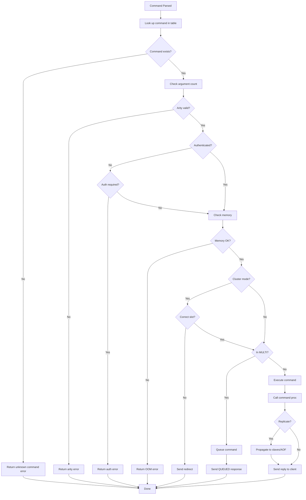
```mermaid
graph TB
    Start[Command Parsed] --> Lookup[Look up command in table]
    Lookup --> Found{Command exists?}
    Found -->|No| ErrorCmd[Return unknown command error]
    Found -->|Yes| CheckArity[Check argument count]
    
    CheckArity --> ArityOK{Arity valid?}
    ArityOK -->|No| ErrorArity[Return arity error]
    ArityOK -->|Yes| CheckAuth{Authenticated?}
    
    CheckAuth -->|No| NeedAuth{Auth required?}
    NeedAuth -->|Yes| ErrorAuth[Return auth error]
    NeedAuth -->|No| CheckMem[Check memory]
    CheckAuth -->|Yes| CheckMem
    
    CheckMem --> MemOK{Memory OK?}
    MemOK -->|No| ErrorMem[Return OOM error]
    MemOK -->|Yes| CheckCluster{Cluster mode?}
    
    CheckCluster -->|Yes| CheckSlot{Correct slot?}
    CheckSlot -->|No| Redirect[Send redirect]
    CheckSlot -->|Yes| CheckMulti{In MULTI?}
    CheckCluster -->|No| CheckMulti
    
    CheckMulti -->|Yes| Queue[Queue command]
    CheckMulti -->|No| Execute[Execute command]
    
    Execute --> CallProc[Call command proc]
    CallProc --> Propagate{Replicate?}
    Propagate -->|Yes| PropagateCmd[Propagate to slaves/AOF]
    Propagate -->|No| SendReply[Send reply to client]
    PropagateCmd --> SendReply
    
    Queue --> SendQueued[Send QUEUED response]
    SendQueued --> End[Done]
    SendReply --> End
    ErrorCmd --> End
    ErrorArity --> End
    ErrorAuth --> End
    ErrorMem --> End
    Redirect --> End
```

### Command Processing Implementation

```c
int processCommand(client *c) {
    // Lookup command
    c->cmd = c->lastcmd = lookupCommand(c->argv[0]->ptr);
    if (!c->cmd) {
        addReplyErrorFormat(c, "unknown command '%s'", (char*)c->argv[0]->ptr);
        return C_OK;
    }
    
    // Check arity
    if ((c->cmd->arity > 0 && c->cmd->arity != c->argc) ||
        (c->argc < -c->cmd->arity)) {
        addReplyErrorFormat(c, "wrong number of arguments for '%s' command",
                          c->cmd->name);
        return C_OK;
    }
    
    // Check authentication
    if (server.requirepass && !c->authenticated && c->cmd->proc != authCommand) {
        addReplyError(c, "NOAUTH Authentication required.");
        return C_OK;
    }
    
    // Cluster redirection
    if (server.cluster_enabled &&
        !(c->flags & CLIENT_MASTER) &&
        !(c->flags & CLIENT_LUA) &&
        !(c->cmd->getkeys_proc == NULL && c->cmd->firstkey == 0)) {
        int hashslot;
        int error_code;
        clusterNode *n = getNodeByQuery(c, c->cmd, c->argv, c->argc, &hashslot, &error_code);
        if (n != server.cluster->myself && !(c->flags & CLIENT_READONLY)) {
            addReplySds(c, sdscatprintf(sdsempty(), "-MOVED %d %s\r\n",
                       hashslot, n->ip, n->port));
            return C_OK;
        }
    }
    
    // Check memory usage for write commands
    if (server.maxmemory && !server.lua_timedout) {
        int out_of_memory = freeMemoryIfNeededAndSafe() == C_ERR;
        if (out_of_memory && (c->cmd->flags & CMD_DENYOOM)) {
            addReply(c, shared.oomerr);
            return C_OK;
        }
    }
    
    // Handle MULTI/EXEC transaction
    if (c->flags & CLIENT_MULTI &&
        c->cmd->proc != execCommand &&
        c->cmd->proc != discardCommand &&
        c->cmd->proc != multiCommand &&
        c->cmd->proc != watchCommand) {
        queueMultiCommand(c);
        addReply(c, shared.queued);
        return C_OK;
    }
    
    // Execute the command
    call(c, CMD_CALL_FULL);
    
    return C_OK;
}

// Command execution wrapper
void call(client *c, int flags) {
    long long dirty, start, duration;
    int client_old_flags = c->flags;
    
    // Record dirty count for replication
    dirty = server.dirty;
    start = ustime();
    
    // Execute command
    c->cmd->proc(c);
    
    // Calculate duration
    duration = ustime() - start;
    
    // Update statistics
    c->cmd->microseconds += duration;
    c->cmd->calls++;
    
    // Propagate command if data modified
    if (dirty != server.dirty && !(c->flags & CLIENT_LUA)) {
        int propagate_flags = PROPAGATE_NONE;
        
        if (flags & CMD_CALL_PROPAGATE_AOF) propagate_flags |= PROPAGATE_AOF;
        if (flags & CMD_CALL_PROPAGATE_REPL) propagate_flags |= PROPAGATE_REPL;
        
        if (propagate_flags != PROPAGATE_NONE)
            propagate(c->cmd, c->db->id, c->argv, c->argc, propagate_flags);
    }
}
```

### Example Command Implementation (GET)

```c
void getCommand(client *c) {
    getGenericCommand(c);
}

int getGenericCommand(client *c) {
    robj *o;
    
    // Lookup key in database
    if ((o = lookupKeyReadOrReply(c, c->argv[1], shared.nullbulk)) == NULL)
        return C_OK;
    
    // Check type
    if (o->type != OBJ_STRING) {
        addReply(c, shared.wrongtypeerr);
        return C_ERR;
    } else {
        addReplyBulk(c, o);
        return C_OK;
    }
}

robj *lookupKeyReadOrReply(client *c, robj *key, robj *reply) {
    robj *o = lookupKeyRead(c->db, key);
    if (!o) addReply(c, reply);
    return o;
}

robj *lookupKeyRead(redisDb *db, robj *key) {
    return lookupKeyReadWithFlags(db, key, LOOKUP_NONE);
}

robj *lookupKeyReadWithFlags(redisDb *db, robj *key, int flags) {
    robj *val;
    
    // Check if key expired
    if (expireIfNeeded(db, key) == 1) {
        // Key expired, return NULL
        return NULL;
    }
    
    // Lookup in dictionary
    val = lookupKey(db, key, flags);
    
    // Update LRU/LFU stats
    if (val) {
        if (!hasActiveChildProcess() && !(flags & LOOKUP_NOTOUCH)) {
            if (server.maxmemory_policy & MAXMEMORY_FLAG_LFU) {
                updateLFU(val);
            } else {
                val->lru = LRU_CLOCK();
            }
        }
    }
    
    return val;
}
```

### Example Command Implementation (SET)

```c
void setCommand(client *c) {
    int j;
    robj *expire = NULL;
    int unit = UNIT_SECONDS;
    int flags = OBJ_SET_NO_FLAGS;
    
    // Parse options (EX, PX, NX, XX, KEEPTTL)
    for (j = 3; j < c->argc; j++) {
        char *a = c->argv[j]->ptr;
        robj *next = (j == c->argc - 1) ? NULL : c->argv[j + 1];
        
        if ((a[0] == 'n' || a[0] == 'N') &&
            (a[1] == 'x' || a[1] == 'X') && a[2] == '\0' &&
            !(flags & OBJ_SET_XX)) {
            flags |= OBJ_SET_NX;
        } else if ((a[0] == 'x' || a[0] == 'X') &&
                   (a[1] == 'x' || a[1] == 'X') && a[2] == '\0' &&
                   !(flags & OBJ_SET_NX)) {
            flags |= OBJ_SET_XX;
        } else if (!strcasecmp(c->argv[j]->ptr, "KEEPTTL") &&
                   !(flags & OBJ_SET_EX) && !(flags & OBJ_SET_PX)) {
            flags |= OBJ_SET_KEEPTTL;
        } else if ((a[0] == 'e' || a[0] == 'E') &&
                   (a[1] == 'x' || a[1] == 'X') && a[2] == '\0' &&
                   next) {
            flags |= OBJ_SET_EX;
            unit = UNIT_SECONDS;
            expire = next;
            j++;
        } else if ((a[0] == 'p' || a[0] == 'P') &&
                   (a[1] == 'x' || a[1] == 'X') && a[2] == '\0' &&
                   next) {
            flags |= OBJ_SET_PX;
            unit = UNIT_MILLISECONDS;
            expire = next;
            j++;
        } else {
            addReply(c, shared.syntaxerr);
            return;
        }
    }
    
    // Try object encoding to save memory
    c->argv[2] = tryObjectEncoding(c->argv[2]);
    setGenericCommand(c, flags, c->argv[1], c->argv[2], expire, unit, NULL, NULL);
}

void setGenericCommand(client *c, int flags, robj *key, robj *val,
                      robj *expire, int unit, robj *ok_reply, robj *abort_reply) {
    long long milliseconds = 0;
    
    // Parse expiration
    if (expire) {
        if (getLongLongFromObjectOrReply(c, expire, &milliseconds, NULL) != C_OK)
            return;
        if (milliseconds <= 0) {
            addReplyErrorFormat(c, "invalid expire time in %s", c->cmd->name);
            return;
        }
        if (unit == UNIT_SECONDS) milliseconds *= 1000;
    }
    
    // Check NX/XX conditions
    if ((flags & OBJ_SET_NX && lookupKeyWrite(c->db, key) != NULL) ||
        (flags & OBJ_SET_XX && lookupKeyWrite(c->db, key) == NULL)) {
        addReply(c, abort_reply ? abort_reply : shared.nullbulk);
        return;
    }
    
    // Set the value
    setKey(c->db, key, val);
    server.dirty++;
    
    // Set expiration
    if (expire) setExpire(c, c->db, key, mstime() + milliseconds);
    
    // Notify keyspace
    notifyKeyspaceEvent(NOTIFY_STRING, "set", key, c->db->id);
    if (expire) notifyKeyspaceEvent(NOTIFY_GENERIC, "expire", key, c->db->id);
    
    addReply(c, ok_reply ? ok_reply : shared.ok);
}

void setKey(redisDb *db, robj *key, robj *val) {
    if (lookupKeyWrite(db, key) == NULL) {
        dbAdd(db, key, val);
    } else {
        dbOverwrite(db, key, val);
    }
    incrRefCount(val);
    removeExpire(db, key);
    signalModifiedKey(db, key);
}
```

## Database and Key Space Management

### Database Structure

Redis supports multiple databases (default 16):

```c
typedef struct redisDb {
    dict *dict;                 /* Main key space */
    dict *expires;              /* Keys with TTL */
    dict *blocking_keys;        /* Keys with blocking clients (BLPOP) */
    dict *ready_keys;           /* Blocked keys ready to be processed */
    dict *watched_keys;         /* WATCHED keys for MULTI/EXEC */
    int id;                     /* Database ID */
    long long avg_ttl;          /* Average TTL */
    unsigned long expires_cursor; /* Cursor for active expire */
    list *defrag_later;         /* List of keys to defrag */
} redisDb;

typedef struct redisObject {
    unsigned type:4;            /* Object type */
    unsigned encoding:4;        /* Encoding type */
    unsigned lru:LRU_BITS;     /* LRU time or LFU data */
    int refcount;               /* Reference count */
    void *ptr;                  /* Actual data pointer */
} robj;
```

### Object Types and Encodings

**Object Types:**
- `OBJ_STRING`: String
- `OBJ_LIST`: List
- `OBJ_SET`: Set
- `OBJ_ZSET`: Sorted set
- `OBJ_HASH`: Hash
- `OBJ_STREAM`: Stream

**Encoding Types:**
```c
// Strings
#define OBJ_ENCODING_RAW 0        /* Simple dynamic string */
#define OBJ_ENCODING_INT 1        /* Encoded as integer */
#define OBJ_ENCODING_EMBSTR 3     /* Embedded string (<=44 bytes) */

// Lists
#define OBJ_ENCODING_QUICKLIST 9  /* Quick list */

// Sets
#define OBJ_ENCODING_HT 2         /* Hash table */
#define OBJ_ENCODING_INTSET 6     /* Integer set */

// Sorted sets
#define OBJ_ENCODING_SKIPLIST 7   /* Skip list + hash table */
#define OBJ_ENCODING_ZIPLIST 5    /* Compressed list */

// Hashes
#define OBJ_ENCODING_ZIPLIST 5    /* Compressed list */
#define OBJ_ENCODING_HT 2         /* Hash table */
```

### Key Expiration

Redis uses a combination of passive and active expiration:

**Passive Expiration (Lazy):**
```c
int expireIfNeeded(redisDb *db, robj *key) {
    if (!keyIsExpired(db, key)) return 0;
    
    // Propagate expire to slaves and AOF
    propagateExpire(db, key, server.lazyfree_lazy_expire);
    notifyKeyspaceEvent(NOTIFY_EXPIRED, "expired", key, db->id);
    
    // Delete key
    int retval = server.lazyfree_lazy_expire ? dbAsyncDelete(db, key) :
                                                 dbSyncDelete(db, key);
    
    server.stat_expiredkeys++;
    return retval;
}

int keyIsExpired(redisDb *db, robj *key) {
    mstime_t when = getExpire(db, key);
    if (when < 0) return 0; /* No expire for this key */
    
    // Slave doesn't expire keys, master does
    if (server.masterhost != NULL) return 0;
    
    return mstime() > when;
}
```

**Active Expiration (Proactive):**
```c
void activeExpireCycle(int type) {
    static unsigned int current_db = 0;
    static int timelimit_exit = 0;
    static long long last_fast_cycle = 0;
    
    unsigned long iteration = 0;
    unsigned long dbs_per_call = CRON_DBS_PER_CALL;
    long long start = ustime(), timelimit, elapsed;
    
    // Determine time limit based on cycle type
    if (type == ACTIVE_EXPIRE_CYCLE_FAST) {
        timelimit = ACTIVE_EXPIRE_CYCLE_FAST_DURATION;
    } else {
        timelimit = ACTIVE_EXPIRE_CYCLE_SLOW_TIME_PERC * 1000000 / server.hz / 100;
    }
    
    for (int j = 0; j < dbs_per_call && timelimit_exit == 0; j++) {
        redisDb *db = server.db + (current_db % server.dbnum);
        current_db++;
        
        do {
            unsigned long num, slots;
            long long now, ttl_sum, ttl_samples;
            
            // Sample random keys with expiration
            if ((num = dictSize(db->expires)) == 0) break;
            
            slots = dictSlots(db->expires);
            now = mstime();
            
            // Sample up to ACTIVE_EXPIRE_CYCLE_LOOKUPS_PER_LOOP keys
            if (num > ACTIVE_EXPIRE_CYCLE_LOOKUPS_PER_LOOP)
                num = ACTIVE_EXPIRE_CYCLE_LOOKUPS_PER_LOOP;
            
            while (num--) {
                dictEntry *de;
                long long ttl;
                
                // Get random entry
                if ((de = dictGetRandomKey(db->expires)) == NULL) break;
                ttl = dictGetSignedIntegerVal(de) - now;
                
                // Delete if expired
                if (activeExpireCycleTryExpire(db, de, now)) {
                    // Key deleted
                }
                
                // Calculate average TTL
                if (ttl > 0) {
                    ttl_sum += ttl;
                    ttl_samples++;
                }
            }
            
            // Update average TTL
            if (ttl_samples) {
                long long avg_ttl = ttl_sum / ttl_samples;
                if (db->avg_ttl == 0) db->avg_ttl = avg_ttl;
                db->avg_ttl = (db->avg_ttl / 50) * 49 + (avg_ttl / 50);
            }
            
            // Check if we exceeded time limit
            iteration++;
            if ((iteration & 0xf) == 0) {
                elapsed = ustime() - start;
                if (elapsed > timelimit) {
                    timelimit_exit = 1;
                    break;
                }
            }
            
            // Continue if expired > 25% of sampled keys
        } while (/* expired percentage > 25% */);
    }
}
```

## Persistence Mechanisms

### RDB (Redis Database) Snapshots

RDB creates point-in-time snapshots of the dataset.

**RDB Save Flow:**
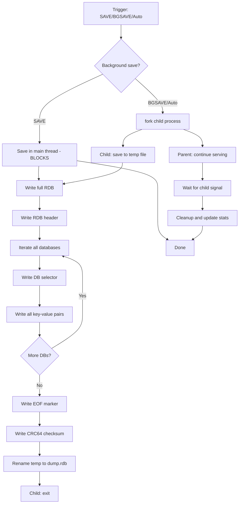
```mermaid
graph TB
    Trigger[Trigger: SAVE/BGSAVE/Auto] --> CheckBG{Background save?}
    CheckBG -->|SAVE| ForkNo[Save in main thread - BLOCKS]
    CheckBG -->|BGSAVE/Auto| Fork[fork child process]
    
    Fork --> Parent[Parent: continue serving]
    Fork --> Child[Child: save to temp file]
    
    ForkNo --> WriteFull[Write full RDB]
    Child --> WriteFull
    
    WriteFull --> WriteHeader[Write RDB header]
    WriteHeader --> IterateDB[Iterate all databases]
    IterateDB --> WriteDB[Write DB selector]
    WriteDB --> WriteKeys[Write all key-value pairs]
    WriteKeys --> MoreDB{More DBs?}
    MoreDB -->|Yes| IterateDB
    MoreDB -->|No| WriteEOF[Write EOF marker]
    WriteEOF --> WriteChecksum[Write CRC64 checksum]
    WriteChecksum --> Rename[Rename temp to dump.rdb]
    Rename --> ChildExit[Child: exit]
    
    Parent --> WaitChild[Wait for child signal]
    WaitChild --> Cleanup[Cleanup and update stats]
    ForkNo --> Done[Done]
    Cleanup --> Done
```

**RDB Implementation:**

```c
int rdbSave(char *filename) {
    char tmpfile[256];
    char cwd[MAXPATHLEN];
    FILE *fp;
    rio rdb;
    int error = 0;
    
    // Create temporary file
    snprintf(tmpfile, 256, "temp-%d.rdb", (int)getpid());
    fp = fopen(tmpfile, "w");
    if (!fp) {
        serverLog(LL_WARNING, "Failed opening .rdb for saving: %s", strerror(errno));
        return C_ERR;
    }
    
    // Initialize RIO (Redis I/O abstraction)
    rioInitWithFile(&rdb, fp);
    
    // Enable checksum computation
    if (server.rdb_checksum)
        rdb.update_cksum = rioGenericUpdateChecksum;
    
    // Write RDB file
    if (rdbSaveRio(&rdb, &error, RDB_SAVE_NONE, NULL) == C_ERR) {
        errno = error;
        goto werr;
    }
    
    // Flush and sync to disk
    if (fflush(fp) == EOF) goto werr;
    if (fsync(fileno(fp)) == -1) goto werr;
    if (fclose(fp) == EOF) goto werr;
    
    // Rename temp file to final name
    if (rename(tmpfile, filename) == -1) {
        serverLog(LL_WARNING, "Error moving temp DB file: %s", strerror(errno));
        unlink(tmpfile);
        return C_ERR;
    }
    
    serverLog(LL_NOTICE, "DB saved on disk");
    server.dirty = 0;
    server.lastsave = time(NULL);
    server.lastbgsave_status = C_OK;
    return C_OK;

werr:
    serverLog(LL_WARNING, "Write error saving DB on disk: %s", strerror(errno));
    fclose(fp);
    unlink(tmpfile);
    return C_ERR;
}

int rdbSaveRio(rio *rdb, int *error, int flags, rdbSaveInfo *rsi) {
    char magic[10];
    uint64_t cksum;
    
    // Write magic string and version
    snprintf(magic, sizeof(magic), "REDIS%04d", RDB_VERSION);
    if (rdbWriteRaw(rdb, magic, 9) == -1) goto werr;
    
    // Write auxiliary fields
    if (rdbSaveInfoAuxFields(rdb, flags, rsi) == -1) goto werr;
    
    // Iterate through all databases
    for (int j = 0; j < server.dbnum; j++) {
        redisDb *db = server.db + j;
        dict *d = db->dict;
        if (dictSize(d) == 0) continue;
        
        // Write database selector
        if (rdbSaveType(rdb, RDB_OPCODE_SELECTDB) == -1) goto werr;
        if (rdbSaveLen(rdb, j) == -1) goto werr;
        
        // Write resize hint
        uint64_t db_size, expires_size;
        db_size = dictSize(db->dict);
        expires_size = dictSize(db->expires);
        if (rdbSaveType(rdb, RDB_OPCODE_RESIZEDB) == -1) goto werr;
        if (rdbSaveLen(rdb, db_size) == -1) goto werr;
        if (rdbSaveLen(rdb, expires_size) == -1) goto werr;
        
        // Iterate through all keys
        dictIterator *di = dictGetSafeIterator(d);
        dictEntry *de;
        
        while((de = dictNext(di)) != NULL) {
            sds keystr = dictGetKey(de);
            robj key, *o = dictGetVal(de);
            long long expire;
            
            initStaticStringObject(key, keystr);
            expire = getExpire(db, &key);
            
            // Save key-value pair
            if (rdbSaveKeyValuePair(rdb, &key, o, expire) == -1) {
                dictReleaseIterator(di);
                goto werr;
            }
        }
        dictReleaseIterator(di);
    }
    
    // Write EOF opcode
    if (rdbSaveType(rdb, RDB_OPCODE_EOF) == -1) goto werr;
    
    // Write checksum
    cksum = rdb->cksum;
    memrev64ifbe(&cksum);
    if (rioWrite(rdb, &cksum, 8) == 0) goto werr;
    return C_OK;

werr:
    if (error) *error = errno;
    return C_ERR;
}

int rdbSaveKeyValuePair(rio *rdb, robj *key, robj *val, long long expiretime) {
    // Save expiration if set
    if (expiretime != -1) {
        if (rdbSaveType(rdb, RDB_OPCODE_EXPIRETIME_MS) == -1) return -1;
        if (rdbSaveMillisecondTime(rdb, expiretime) == -1) return -1;
    }
    
    // Save type
    if (rdbSaveObjectType(rdb, val) == -1) return -1;
    
    // Save key
    if (rdbSaveStringObject(rdb, key) == -1) return -1;
    
    // Save value
    if (rdbSaveObject(rdb, val) == -1) return -1;
    
    return 1;
}
```

**Background Save (BGSAVE):**
```c
int rdbSaveBackground(char *filename, rdbSaveInfo *rsi) {
    pid_t childpid;
    
    // Check if already saving
    if (server.rdb_child_pid != -1) return C_ERR;
    
    // Record dirty count before fork
    server.dirty_before_bgsave = server.dirty;
    server.lastbgsave_try = time(NULL);
    
    // Fork child process
    if ((childpid = fork()) == 0) {
        // Child process
        int retval;
        
        // Close listening sockets
        closeListeningSockets(0);
        
        // Set process title
        redisSetProcTitle("redis-rdb-bgsave");
        
        // Save RDB
        retval = rdbSave(filename);
        
        // Exit with appropriate code
        exitFromChild((retval == C_OK) ? 0 : 1);
    } else {
        // Parent process
        if (childpid == -1) {
            server.lastbgsave_status = C_ERR;
            serverLog(LL_WARNING, "Can't save in background: fork: %s", strerror(errno));
            return C_ERR;
        }
        
        serverLog(LL_NOTICE, "Background saving started by pid %d", childpid);
        server.rdb_save_time_start = time(NULL);
        server.rdb_child_pid = childpid;
        server.rdb_child_type = RDB_CHILD_TYPE_DISK;
        updateDictResizePolicy();
        return C_OK;
    }
    return C_OK; // Unreachable
}
```

### AOF (Append-Only File)

AOF logs every write operation as a RESP command.

**AOF Write Flow:**
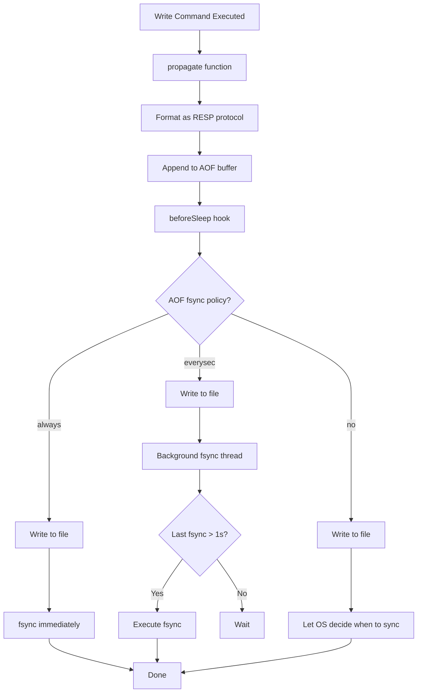
```mermaid
graph TB
    Command[Write Command Executed] --> Propagate[propagate function]
    Propagate --> FormatRESP[Format as RESP protocol]
    FormatRESP --> AppendBuf[Append to AOF buffer]
    
    AppendBuf --> BeforeSleep[beforeSleep hook]
    BeforeSleep --> FlushPolicy{AOF fsync policy?}
    
    FlushPolicy -->|always| WriteImmediate[Write to file]
    WriteImmediate --> FsyncImmediate[fsync immediately]
    
    FlushPolicy -->|everysec| WriteBuf[Write to file]
    WriteBuf --> Background[Background fsync thread]
    
    FlushPolicy -->|no| WriteOnly[Write to file]
    WriteOnly --> OSBuffer[Let OS decide when to sync]
    
    FsyncImmediate --> Done[Done]
    Background --> CheckLast{Last fsync > 1s?}
    CheckLast -->|Yes| DoFsync[Execute fsync]
    CheckLast -->|No| Wait[Wait]
    DoFsync --> Done
    OSBuffer --> Done
```

**AOF Implementation:**
```c
void feedAppendOnlyFile(struct redisCommand *cmd, int dictid, robj **argv, int argc) {
    sds buf = sdsempty();
    robj *tmpargv[3];
    
    // Select database if different
    if (dictid != server.aof_selected_db) {
        char seldb[64];
        snprintf(seldb, sizeof(seldb), "%d", dictid);
        buf = sdscatprintf(buf, "*2\r\n$6\r\nSELECT\r\n$%lu\r\n%s\r\n",
                          (unsigned long)strlen(seldb), seldb);
        server.aof_selected_db = dictid;
    }
    
    // Translate commands if needed (e.g., EXPIRE -> PEXPIREAT)
    if (cmd->proc == expireCommand || cmd->proc == pexpireCommand ||
        cmd->proc == expireatCommand) {
        buf = catAppendOnlyExpireAtCommand(buf, cmd, argv[1], argv[2]);
    } else if (cmd->proc == setexCommand || cmd->proc == psetexCommand) {
        // Split into SET + PEXPIREAT
        tmpargv[0] = createStringObject("SET", 3);
        tmpargv[1] = argv[1];
        tmpargv[2] = argv[3];
        buf = catAppendOnlyGenericCommand(buf, 3, tmpargv);
        decrRefCount(tmpargv[0]);
        buf = catAppendOnlyExpireAtCommand(buf, cmd, argv[1], argv[2]);
    } else {
        // Normal command
        buf = catAppendOnlyGenericCommand(buf, argc, argv);
    }
    
    // Append to AOF buffer
    if (server.aof_state == AOF_ON)
        server.aof_buf = sdscatlen(server.aof_buf, buf, sdslen(buf));
    
    sdsfree(buf);
}

sds catAppendOnlyGenericCommand(sds dst, int argc, robj **argv) {
    char buf[32];
    int len, j;
    robj *o;
    
    // Format: *<argc>\r\n
    buf[0] = '*';
    len = 1 + ll2string(buf + 1, sizeof(buf) - 1, argc);
    buf[len++] = '\r';
    buf[len++] = '\n';
    dst = sdscatlen(dst, buf, len);
    
    // For each argument: $<len>\r\n<data>\r\n
    for (j = 0; j < argc; j++) {
        o = getDecodedObject(argv[j]);
        
        buf[0] = '$';
        len = 1 + ll2string(buf + 1, sizeof(buf) - 1, sdslen(o->ptr));
        buf[len++] = '\r';
        buf[len++] = '\n';
        dst = sdscatlen(dst, buf, len);
        dst = sdscatlen(dst, o->ptr, sdslen(o->ptr));
        dst = sdscatlen(dst, "\r\n", 2);
        
        decrRefCount(o);
    }
    return dst;
}

// Flush AOF buffer to disk
void flushAppendOnlyFile(int force) {
    ssize_t nwritten;
    int sync_in_progress = 0;
    mstime_t latency;
    
    if (sdslen(server.aof_buf) == 0) {
        // Try to fsync even if no write pending
        if (server.aof_fsync == AOF_FSYNC_EVERYSEC &&
            server.aof_fsync_offset != server.aof_current_size) {
            goto try_fsync;
        } else {
            return;
        }
    }
    
    // Check background fsync status
    if (server.aof_fsync == AOF_FSYNC_EVERYSEC)
        sync_in_progress = bioPendingJobsOfType(BIO_AOF_FSYNC) != 0;
    
    if (server.aof_fsync == AOF_FSYNC_EVERYSEC && !force) {
        // With everysec policy, postpone write if fsync is still in progress
        if (sync_in_progress) {
            if (server.aof_flush_postponed_start == 0) {
                server.aof_flush_postponed_start = server.unixtime;
                return;
            } else if (server.unixtime - server.aof_flush_postponed_start < 2) {
                return;
            }
            // If postponed for more than 2 seconds, force write
            server.aof_delayed_fsync++;
        }
    }
    
    // Write buffer to file
    latencyStartMonitor(latency);
    nwritten = aofWrite(server.aof_fd, server.aof_buf, sdslen(server.aof_buf));
    latencyEndMonitor(latency);
    
    if (nwritten != (ssize_t)sdslen(server.aof_buf)) {
        if (nwritten == -1) {
            serverLog(LL_WARNING, "Error writing to AOF file: %s", strerror(errno));
        } else {
            serverLog(LL_WARNING, "Short write to AOF file: %ld vs %ld",
                     nwritten, sdslen(server.aof_buf));
            
            if (ftruncate(server.aof_fd, server.aof_current_size) == -1) {
                serverLog(LL_WARNING, "Could not truncate AOF file: %s", strerror(errno));
            }
        }
        
        // Critical error
        if (server.aof_fsync == AOF_FSYNC_ALWAYS) {
            serverLog(LL_WARNING, "Can't recover from AOF write error when fsync=always");
            exit(1);
        }
    }
    
    server.aof_current_size += nwritten;
    server.aof_flush_postponed_start = 0;
    
    // Clear buffer if fully written
    if ((ssize_t)sdslen(server.aof_buf) == nwritten) {
        sdsfree(server.aof_buf);
        server.aof_buf = sdsempty();
    } else {
        // Keep remaining data
        sdsrange(server.aof_buf, nwritten, -1);
    }

try_fsync:
    // Fsync based on policy
    if (server.aof_no_fsync_on_rewrite && hasActiveChildProcess())
        return;
    
    if (server.aof_fsync == AOF_FSYNC_ALWAYS) {
        latencyStartMonitor(latency);
        redis_fsync(server.aof_fd);
        latencyEndMonitor(latency);
        server.aof_fsync_offset = server.aof_current_size;
        server.aof_last_fsync = server.unixtime;
    } else if ((server.aof_fsync == AOF_FSYNC_EVERYSEC &&
                server.unixtime > server.aof_last_fsync)) {
        if (!sync_in_progress) {
            aof_background_fsync(server.aof_fd);
            server.aof_fsync_offset = server.aof_current_size;
        }
        server.aof_last_fsync = server.unixtime;
    }
}
```

**AOF Rewrite:**

AOF files grow over time. Redis rewrites them by reconstructing commands from current state:

```c
int rewriteAppendOnlyFileBackground(void) {
    pid_t childpid;
    
    if (server.aof_child_pid != -1) return C_ERR;
    
    // Create pipes for incremental data
    if (aofCreatePipes() != C_OK) return C_ERR;
    
    if ((childpid = fork()) == 0) {
        // Child process
        char tmpfile[256];
        
        closeListeningSockets(1);
        redisSetProcTitle("redis-aof-rewrite");
        
        snprintf(tmpfile, 256, "temp-rewriteaof-bg-%d.aof", (int)getpid());
        if (rewriteAppendOnlyFile(tmpfile) == C_OK) {
            sendChildCOWInfo(CHILD_INFO_TYPE_AOF, "AOF rewrite");
            exitFromChild(0);
        } else {
            exitFromChild(1);
        }
    } else {
        // Parent process
        if (childpid == -1) {
            serverLog(LL_WARNING, "Can't rewrite AOF in background: fork: %s",
                     strerror(errno));
            aofClosePipes();
            return C_ERR;
        }
        
        serverLog(LL_NOTICE, "Background AOF rewrite started by pid %d", childpid);
        server.aof_rewrite_scheduled = 0;
        server.aof_rewrite_time_start = time(NULL);
        server.aof_child_pid = childpid;
        updateDictResizePolicy();
        
        // Make parent's writes to go to pipes as well
        server.aof_selected_db = -1;
        replicationScriptCacheFlush();
        return C_OK;
    }
    return C_OK;
}

int rewriteAppendOnlyFile(char *filename) {
    rio aof;
    FILE *fp;
    char tmpfile[256];
    
    snprintf(tmpfile, 256, "temp-rewriteaof-%d.aof", (int)getpid());
    fp = fopen(tmpfile, "w");
    if (!fp) {
        serverLog(LL_WARNING, "Opening AOF rewrite file: %s", strerror(errno));
        return C_ERR;
    }
    
    rioInitWithFile(&aof, fp);
    
    // Write current state
    if (rewriteAppendOnlyFileRio(&aof) == C_ERR) goto werr;
    
    // Flush and sync
    if (fflush(fp) == EOF) goto werr;
    if (fsync(fileno(fp)) == -1) goto werr;
    
    // Read incremental diff from parent
    if (aofReadDiffFromParent() != C_OK) goto werr;
    
    // Rename
    if (rename(tmpfile, filename) == -1) {
        serverLog(LL_WARNING, "Error moving temp AOF rewrite file: %s", strerror(errno));
        unlink(tmpfile);
        fclose(fp);
        return C_ERR;
    }
    
    fclose(fp);
    return C_OK;

werr:
    serverLog(LL_WARNING, "Write error writing AOF rewrite file: %s", strerror(errno));
    fclose(fp);
    unlink(tmpfile);
    return C_ERR;
}

int rewriteAppendOnlyFileRio(rio *aof) {
    dictIterator *di = NULL;
    dictEntry *de;
    
    // Iterate all databases
    for (int j = 0; j < server.dbnum; j++) {
        char selectcmd[] = "*2\r\n$6\r\nSELECT\r\n";
        redisDb *db = server.db + j;
        dict *d = db->dict;
        if (dictSize(d) == 0) continue;
        
        di = dictGetSafeIterator(d);
        
        // Write SELECT command
        if (rioWrite(aof, selectcmd, sizeof(selectcmd) - 1) == 0) goto werr;
        if (rioWriteBulkLongLong(aof, j) == 0) goto werr;
        
        // Iterate all keys
        while((de = dictNext(di)) != NULL) {
            sds keystr;
            robj key, *o;
            long long expiretime;
            
            keystr = dictGetKey(de);
            o = dictGetVal(de);
            initStaticStringObject(key, keystr);
            
            expiretime = getExpire(db, &key);
            
            // Write command to recreate key
            if (rewriteAppendOnlyFileObject(aof, &key, o) == 0) goto werr;
            
            // Write expiration if set
            if (expiretime != -1) {
                char cmd[] = "*3\r\n$9\r\nPEXPIREAT\r\n";
                if (rioWrite(aof, cmd, sizeof(cmd) - 1) == 0) goto werr;
                if (rioWriteBulkObject(aof, &key) == 0) goto werr;
                if (rioWriteBulkLongLong(aof, expiretime) == 0) goto werr;
            }
        }
        dictReleaseIterator(di);
        di = NULL;
    }
    return C_OK;

werr:
    if (di) dictReleaseIterator(di);
    return C_ERR;
}
```

## Replication

### Master-Slave Replication

Redis replication allows slave instances to be exact copies of master instances.

**Replication Flow:**
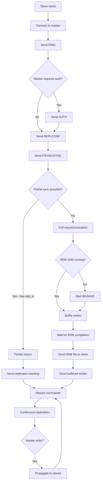
```mermaid
graph TB
    SlaveStart[Slave starts] --> Connect[Connect to master]
    Connect --> SendPing[Send PING]
    SendPing --> Auth{Master requires auth?}
    
    Auth -->|Yes| SendAuth[Send AUTH]
    Auth -->|No| SendReplConf[Send REPLCONF]
    SendAuth --> SendReplConf
    
    SendReplConf --> SendPsync[Send PSYNC/SYNC]
    SendPsync --> MasterCheck{Partial sync possible?}
    
    MasterCheck -->|Yes - has repl_id| PartialSync[Partial resync]
    PartialSync --> SendBacklog[Send replication backlog]
    SendBacklog --> StreamCmd[Stream commands]
    
    MasterCheck -->|No| FullSync[Full resynchronization]
    FullSync --> BgSave{RDB child running?}
    BgSave -->|No| StartBgSave[Start BGSAVE]
    BgSave -->|Yes| BufferWrites[Buffer writes]
    StartBgSave --> BufferWrites
    
    BufferWrites --> WaitRDB[Wait for RDB completion]
    WaitRDB --> SendRDB[Send RDB file to slave]
    SendRDB --> SendBuffer[Send buffered writes]
    SendBuffer --> StreamCmd
    
    StreamCmd --> Continuous[Continuous replication]
    Continuous --> WriteCmd{Master write?}
    WriteCmd -->|Yes| Propagate[Propagate to slaves]
    Propagate --> StreamCmd
```

**Replication Implementation:**

```c
// Slave initiates replication
void replicationCron(void) {
    // If we are a slave, handle replication
    if (server.masterhost) {
        // Check connection state
        if (server.repl_state == REPL_STATE_CONNECT) {
            serverLog(LL_NOTICE, "Connecting to MASTER %s:%d",
                     server.masterhost, server.masterport);
            if (connectWithMaster() == C_OK) {
                serverLog(LL_NOTICE, "MASTER <-> REPLICA sync started");
            }
        }
        
        // Send ACK to master if needed
        if (server.repl_state == REPL_STATE_CONNECTED) {
            if (server.repl_ack_time < server.unixtime - server.repl_ack_off) {
                // Send REPLCONF ACK
                replicationSendAck();
            }
        }
    }
    
    // Disconnect timed out slaves
    if (listLength(server.slaves)) {
        listIter li;
        listNode *ln;
        listRewind(server.slaves, &li);
        
        while((ln = listNext(&li))) {
            client *slave = ln->value;
            if (slave->replstate == SLAVE_STATE_ONLINE) {
                if ((server.unixtime - slave->repl_ack_time) > server.repl_timeout) {
                    serverLog(LL_WARNING, "Disconnecting timedout replica: %s",
                             replicationGetSlaveName(slave));
                    freeClient(slave);
                }
            }
        }
    }
}

int connectWithMaster(void) {
    int fd;
    
    fd = anetTcpNonBlockBestEffortBindConnect(NULL,
                                              server.masterhost,
                                              server.masterport,
                                              NET_FIRST_BIND_ADDR);
    if (fd == -1) {
        serverLog(LL_WARNING, "Unable to connect to MASTER: %s", strerror(errno));
        return C_ERR;
    }
    
    // Register read and write events
    if (aeCreateFileEvent(server.el, fd, AE_READABLE | AE_WRITABLE,
                         syncWithMaster, NULL) == AE_ERR) {
        close(fd);
        serverLog(LL_WARNING, "Can't create readable event for SYNC");
        return C_ERR;
    }
    
    server.repl_transfer_lastio = server.unixtime;
    server.repl_transfer_s = fd;
    server.repl_state = REPL_STATE_CONNECTING;
    return C_OK;
}

void syncWithMaster(aeEventLoop *el, int fd, void *privdata, int mask) {
    char tmpfile[256], *err = NULL;
    int dfd = -1, maxtries = 5;
    int sockerr = 0, psync_result;
    socklen_t errlen = sizeof(sockerr);
    
    // Check socket error
    if (getsockopt(fd, SOL_SOCKET, SO_ERROR, &sockerr, &errlen) == -1)
        sockerr = errno;
    if (sockerr) {
        serverLog(LL_WARNING, "Error condition on socket for SYNC: %s",
                 strerror(sockerr));
        goto error;
    }
    
    // State machine for synchronization process
    if (server.repl_state == REPL_STATE_CONNECTING) {
        serverLog(LL_NOTICE, "Non blocking connect for SYNC fired the event.");
        aeDeleteFileEvent(server.el, fd, AE_WRITABLE);
        server.repl_state = REPL_STATE_SEND_PING;
    }
    
    // Send PING
    if (server.repl_state == REPL_STATE_SEND_PING) {
        if (syncWrite(fd, "PING\r\n", 6, server.repl_syncio_timeout * 1000) == -1) {
            serverLog(LL_WARNING, "I/O error writing to MASTER: %s", strerror(errno));
            goto error;
        }
        server.repl_state = REPL_STATE_RECEIVE_PONG;
    }
    
    // Receive PONG
    if (server.repl_state == REPL_STATE_RECEIVE_PONG) {
        char buf[1024];
        if (syncReadLine(fd, buf, sizeof(buf), server.repl_syncio_timeout * 1000) == -1) {
            serverLog(LL_WARNING, "I/O error reading PING reply from master: %s",
                     strerror(errno));
            goto error;
        }
        server.repl_state = REPL_STATE_SEND_AUTH;
    }
    
    // Send AUTH if needed
    if (server.repl_state == REPL_STATE_SEND_AUTH) {
        if (server.masterauth) {
            char authcmd[1024];
            int authlen = snprintf(authcmd, sizeof(authcmd),
                                  "AUTH %s\r\n", server.masterauth);
            if (syncWrite(fd, authcmd, authlen, server.repl_syncio_timeout * 1000) == -1) {
                serverLog(LL_WARNING, "I/O error writing auth to MASTER: %s",
                         strerror(errno));
                goto error;
            }
            server.repl_state = REPL_STATE_RECEIVE_AUTH;
        } else {
            server.repl_state = REPL_STATE_SEND_PORT;
        }
    }
    
    // ... more states ...
    
    // Send PSYNC
    if (server.repl_state == REPL_STATE_SEND_PSYNC) {
        if (slaveTryPartialResynchronization(fd, 0) == PSYNC_WRITE_ERROR) {
            goto error;
        }
        server.repl_state = REPL_STATE_RECEIVE_PSYNC;
        return;
    }
    
    // Receive PSYNC reply
    psync_result = slaveTryPartialResynchronization(fd, 1);
    if (psync_result == PSYNC_WAIT_REPLY) return;
    
    if (psync_result == PSYNC_CONTINUE) {
        // Partial resync
        serverLog(LL_NOTICE, "MASTER <-> REPLICA sync: Master accepted a Partial Resynchronization.");
        return;
    }
    
    // Full resync - receive RDB
    aeDeleteFileEvent(server.el, fd, AE_READABLE);
    serverLog(LL_NOTICE, "MASTER <-> REPLICA sync: receiving %lld bytes from master",
             server.repl_transfer_size);
    
    // Create temporary file for RDB
    snprintf(tmpfile, 256, "temp-%d.%ld.rdb", (int)server.unixtime, (long int)getpid());
    dfd = open(tmpfile, O_CREAT | O_WRONLY | O_EXCL, 0644);
    if (dfd == -1) {
        serverLog(LL_WARNING, "Opening temp file for MASTER <-> REPLICA transfer: %s",
                 strerror(errno));
        goto error;
    }
    
    // Register read event to receive RDB
    if (aeCreateFileEvent(server.el, fd, AE_READABLE, readSyncBulkPayload, NULL) == AE_ERR) {
        serverLog(LL_WARNING, "Can't create readable event for SYNC");
        goto error;
    }
    
    server.repl_state = REPL_STATE_TRANSFER;
    server.repl_transfer_fd = dfd;
    server.repl_transfer_lastio = server.unixtime;
    server.repl_transfer_tmpfile = zstrdup(tmpfile);
    return;

error:
    if (dfd != -1) close(dfd);
    close(fd);
    server.repl_transfer_s = -1;
    server.repl_state = REPL_STATE_CONNECT;
    return;
}

// Master side: handle PSYNC command
void syncCommand(client *c) {
    // PSYNC <repl_id> <offset>
    if (!strcasecmp(c->argv[0]->ptr, "psync")) {
        long long psync_offset;
        char *master_replid = c->argv[1]->ptr;
        
        if (getLongLongFromObjectOrReply(c, c->argv[2], &psync_offset, NULL) != C_OK)
            return;
        
        // Check if we can do partial resync
        if (masterTryPartialResynchronization(c, psync_offset) == C_OK) {
            server.stat_sync_partial_ok++;
            return; // Partial resync started
        } else {
            server.stat_sync_partial_err++;
            // Fall through to full sync
        }
    }
    
    // Full resynchronization
    server.stat_sync_full++;
    
    // Setup slave client
    c->replstate = SLAVE_STATE_WAIT_BGSAVE_START;
    if (server.repl_disable_tcp_nodelay)
        anetDisableTcpNoDelay(NULL, c->fd);
    c->repldbfd = -1;
    c->flags |= CLIENT_SLAVE;
    listAddNodeTail(server.slaves, c);
    
    // Start BGSAVE if not already running
    if (server.rdb_child_pid == -1) {
        // No BGSAVE in progress, start one
        if (startBgsaveForReplication() != C_OK) {
            serverLog(LL_WARNING, "BGSAVE for replication failed");
            freeClient(c);
            return;
        }
    } else {
        // BGSAVE already in progress
        if (server.rdb_child_type == RDB_CHILD_TYPE_DISK) {
            // Disk-based, can wait for it
            c->replstate = SLAVE_STATE_WAIT_BGSAVE_END;
        } else {
            // Socket-based for another slave, need new BGSAVE
            // Kill current and restart
        }
    }
    return;
}

int masterTryPartialResynchronization(client *c, long long psync_offset) {
    long long psync_len;
    char *master_replid = c->argv[1]->ptr;
    
    // Check if replication ID matches
    if (strcasecmp(master_replid, server.replid) &&
        (strcasecmp(master_replid, server.replid2) ||
         psync_offset > server.second_replid_offset)) {
        // Replication ID mismatch or offset too old
        goto need_full_resync;
    }
    
    // Check if offset is in backlog
    if (!server.repl_backlog ||
        psync_offset < server.repl_backlog_off ||
        psync_offset > (server.repl_backlog_off + server.repl_backlog_histlen)) {
        // Offset not available in backlog
        goto need_full_resync;
    }
    
    // We can do partial resync
    c->flags |= CLIENT_SLAVE;
    c->replstate = SLAVE_STATE_ONLINE;
    c->repl_ack_time = server.unixtime;
    c->repl_put_online_on_ack = 0;
    listAddNodeTail(server.slaves, c);
    
    // Send +CONTINUE reply
    psync_len = addReplyReplicationBacklog(c, psync_offset);
    addReplySds(c, sdscatprintf(sdsempty(), "+CONTINUE %s\r\n", server.replid));
    
    serverLog(LL_NOTICE, "Partial resynchronization request from %s accepted. Sending %lld bytes of backlog.",
             replicationGetSlaveName(c), psync_len);
    
    // Refresh connection to avoid timeout
    refreshGoodSlavesCount();
    return C_OK;

need_full_resync:
    return C_ERR;
}

// Propagate write commands to slaves and AOF
void propagate(struct redisCommand *cmd, int dbid, robj **argv, int argc, int flags) {
    // Propagate to AOF
    if (server.aof_state != AOF_OFF && flags & PROPAGATE_AOF)
        feedAppendOnlyFile(cmd, dbid, argv, argc);
    
    // Propagate to slaves
    if (flags & PROPAGATE_REPL)
        replicationFeedSlaves(server.slaves, dbid, argv, argc);
}

void replicationFeedSlaves(list *slaves, int dictid, robj **argv, int argc) {
    listNode *ln;
    listIter li;
    int j, len;
    char llstr[LONG_STR_SIZE];
    
    // If no slaves, do nothing
    if (listLength(slaves) == 0) return;
    
    // Create replication backlog if not exists
    if (server.repl_backlog == NULL && listLength(slaves) == 1)
        replicationCreateMasterBacklog();
    
    // Select database if needed
    if (server.slaveseldb != dictid) {
        robj *selectcmd;
        
        if (dictid >= 0 && dictid < PROTO_SHARED_SELECT_CMDS) {
            selectcmd = shared.select[dictid];
        } else {
            int dictid_len = ll2string(llstr, sizeof(llstr), dictid);
            selectcmd = createObject(OBJ_STRING,
                                    sdscatprintf(sdsempty(),
                                    "*2\r\n$6\r\nSELECT\r\n$%d\r\n%s\r\n",
                                    dictid_len, llstr));
        }
        
        // Send to all slaves
        listRewind(slaves, &li);
        while((ln = listNext(&li))) {
            client *slave = ln->value;
            if (slave->replstate == SLAVE_STATE_WAIT_BGSAVE_START) continue;
            addReply(slave, selectcmd);
        }
        
        if (dictid < 0 || dictid >= PROTO_SHARED_SELECT_CMDS)
            decrRefCount(selectcmd);
        
        server.slaveseldb = dictid;
    }
    
    // Feed command to backlog
    if (server.repl_backlog) {
        char aux[LONG_STR_SIZE + 3];
        
        // Format: *<argc>\r\n
        aux[0] = '*';
        len = ll2string(aux + 1, sizeof(aux) - 1, argc);
        aux[len + 1] = '\r';
        aux[len + 2] = '\n';
        feedReplicationBacklog(aux, len + 3);
        
        for (j = 0; j < argc; j++) {
            long objlen = stringObjectLen(argv[j]);
            
            // $<len>\r\n
            aux[0] = '$';
            len = ll2string(aux + 1, sizeof(aux) - 1, objlen);
            aux[len + 1] = '\r';
            aux[len + 2] = '\n';
            feedReplicationBacklog(aux, len + 3);
            feedReplicationBacklogWithObject(argv[j]);
            feedReplicationBacklog("\r\n", 2);
        }
    }
    
    // Send to all slaves
    listRewind(slaves, &li);
    while((ln = listNext(&li))) {
        client *slave = ln->value;
        
        if (slave->replstate == SLAVE_STATE_WAIT_BGSAVE_START) continue;
        
        // Add command in RESP format
        addReplyArrayLen(slave, argc);
        for (j = 0; j < argc; j++)
            addReplyBulk(slave, argv[j]);
    }
}
```

## Memory Management

### Memory Eviction Policies

When `maxmemory` is reached, Redis evicts keys based on the configured policy:

**Eviction Policies:**
- `noeviction`: Return errors when memory limit is reached
- `allkeys-lru`: Evict least recently used keys
- `allkeys-lfu`: Evict least frequently used keys  
- `allkeys-random`: Evict random keys
- `volatile-lru`: Evict LRU keys with expiration set
- `volatile-lfu`: Evict LFU keys with expiration set
- `volatile-random`: Evict random keys with expiration
- `volatile-ttl`: Evict keys with shortest TTL

**Eviction Implementation:**
```c
int freeMemoryIfNeeded(void) {
    size_t mem_reported, mem_tofree, mem_freed;
    mstime_t latency, eviction_latency;
    long long delta;
    int slaves = listLength(server.slaves);
    
    // Check memory usage
    if (getMaxmemoryState(&mem_reported, NULL, &mem_tofree, NULL) == C_OK)
        return C_OK;
    
    mem_freed = 0;
    latencyStartMonitor(latency);
    
    if (server.maxmemory_policy == MAXMEMORY_NO_EVICTION) {
        goto cant_free;
    }
    
    // Evict keys until enough memory freed
    while (mem_freed < mem_tofree) {
        int j, k, i;
        static unsigned int next_db = 0;
        sds bestkey = NULL;
        int bestdbid;
        redisDb *db;
        dict *dict;
        dictEntry *de;
        
        if (server.maxmemory_policy & (MAXMEMORY_FLAG_LRU | MAXMEMORY_FLAG_LFU) ||
            server.maxmemory_policy == MAXMEMORY_VOLATILE_TTL) {
            
            struct evictionPoolEntry *pool = EvictionPoolLRU;
            
            // Populate eviction pool
            while(bestkey == NULL) {
                unsigned long total_keys = 0, keys;
                
                // Sample keys from databases
                for (i = 0; i < server.dbnum; i++) {
                    db = server.db + i;
                    dict = (server.maxmemory_policy & MAXMEMORY_FLAG_ALLKEYS) ?
                           db->dict : db->expires;
                    if ((keys = dictSize(dict)) != 0) {
                        evictionPoolPopulate(i, dict, db->dict, pool);
                        total_keys += keys;
                    }
                }
                
                if (!total_keys) break;
                
                // Find best key from pool
                for (k = EVPOOL_SIZE - 1; k >= 0; k--) {
                    if (pool[k].key == NULL) continue;
                    bestdbid = pool[k].dbid;
                    
                    if (server.maxmemory_policy & MAXMEMORY_FLAG_ALLKEYS) {
                        de = dictFind(server.db[bestdbid].dict, pool[k].key);
                    } else {
                        de = dictFind(server.db[bestdbid].expires, pool[k].key);
                    }
                    
                    if (de) {
                        bestkey = dictGetKey(de);
                        break;
                    } else {
                        pool[k].key = NULL;
                    }
                }
            }
        } else if (server.maxmemory_policy == MAXMEMORY_ALLKEYS_RANDOM ||
                   server.maxmemory_policy == MAXMEMORY_VOLATILE_RANDOM) {
            // Random eviction
            for (i = 0; i < server.dbnum; i++) {
                db = server.db + i;
                dict = (server.maxmemory_policy == MAXMEMORY_ALLKEYS_RANDOM) ?
                       db->dict : db->expires;
                if (dictSize(dict) != 0) {
                    de = dictGetRandomKey(dict);
                    bestkey = dictGetKey(de);
                    bestdbid = i;
                    break;
                }
            }
        }
        
        // Delete selected key
        if (bestkey) {
            db = server.db + bestdbid;
            robj *keyobj = createStringObject(bestkey, sdslen(bestkey));
            propagateExpire(db, keyobj, server.lazyfree_lazy_eviction);
            
            delta = (long long) zmalloc_used_memory();
            latencyStartMonitor(eviction_latency);
            
            if (server.lazyfree_lazy_eviction)
                dbAsyncDelete(db, keyobj);
            else
                dbSyncDelete(db, keyobj);
            
            latencyEndMonitor(eviction_latency);
            latencyAddSampleIfNeeded("eviction-del", eviction_latency);
            
            delta -= (long long) zmalloc_used_memory();
            mem_freed += delta;
            
            server.stat_evictedkeys++;
            notifyKeyspaceEvent(NOTIFY_EVICTED, "evicted", keyobj, db->id);
            decrRefCount(keyobj);
            
            // Update slaves and AOF
            signalModifiedKey(db, keyobj);
            server.dirty++;
        } else {
            goto cant_free;
        }
    }
    
    latencyEndMonitor(latency);
    latencyAddSampleIfNeeded("eviction-cycle", latency);
    return C_OK;

cant_free:
    latencyEndMonitor(latency);
    latencyAddSampleIfNeeded("eviction-cycle", latency);
    return C_ERR;
}

// Populate eviction pool with candidate keys
void evictionPoolPopulate(int dbid, dict *sampledict, dict *keydict,
                         struct evictionPoolEntry *pool) {
    int j, k, count;
    dictEntry *samples[server.maxmemory_samples];
    
    // Sample random keys
    count = dictGetSomeKeys(sampledict, samples, server.maxmemory_samples);
    
    for (j = 0; j < count; j++) {
        unsigned long long idle;
        sds key;
        robj *o;
        dictEntry *de;
        
        de = samples[j];
        key = dictGetKey(de);
        
        // Calculate idle time based on policy
        if (server.maxmemory_policy & MAXMEMORY_FLAG_LRU) {
            idle = estimateObjectIdleTime(dictGetVal(de));
        } else if (server.maxmemory_policy & MAXMEMORY_FLAG_LFU) {
            idle = 255 - LFUDecrAndReturn(dictGetVal(de));
        } else if (server.maxmemory_policy == MAXMEMORY_VOLATILE_TTL) {
            idle = ULLONG_MAX - (long long)dictGetSignedIntegerVal(de);
        } else {
            continue;
        }
        
        // Insert into pool
        k = 0;
        while (k < EVPOOL_SIZE &&
               pool[k].key &&
               pool[k].idle < idle) k++;
        if (k == 0 && pool[EVPOOL_SIZE - 1].key != NULL) {
            continue;
        } else if (k < EVPOOL_SIZE && pool[k].key == NULL) {
            // Empty spot
        } else {
            // Insert in the middle, shift others
            if (pool[EVPOOL_SIZE - 1].key == NULL) {
                sds cached = pool[EVPOOL_SIZE - 1].cached;
                memmove(pool + k + 1, pool + k,
                       sizeof(pool[0]) * (EVPOOL_SIZE - k - 1));
                pool[k].cached = cached;
            } else {
                k--;
                sds cached = pool[0].cached;
                if (pool[0].key != pool[0].cached) sdsfree(pool[0].key);
                memmove(pool, pool + 1, sizeof(pool[0]) * k);
                pool[k].cached = cached;
            }
        }
        
        // Store in pool
        int klen = sdslen(key);
        if (klen > EVPOOL_CACHED_SDS_SIZE) {
            pool[k].key = sdsdup(key);
        } else {
            memcpy(pool[k].cached, key, klen + 1);
            pool[k].key = pool[k].cached;
        }
        pool[k].idle = idle;
        pool[k].dbid = dbid;
    }
}
```

### LRU and LFU Approximation

Redis uses approximate LRU/LFU to save memory:

```c
// LRU Clock - 24-bit timestamp
unsigned int LRU_CLOCK(void) {
    unsigned int lruclock;
    if (1000 / server.hz <= LRU_CLOCK_RESOLUTION) {
        atomicGet(server.lruclock, lruclock);
    } else {
        lruclock = getLRUClock();
    }
    return lruclock;
}

unsigned int getLRUClock(void) {
    return (mstime() / LRU_CLOCK_RESOLUTION) & LRU_CLOCK_MAX;
}

// Estimate object idle time
unsigned long long estimateObjectIdleTime(robj *o) {
    unsigned long long lruclock = LRU_CLOCK();
    if (lruclock >= o->lru) {
        return (lruclock - o->lru) * LRU_CLOCK_RESOLUTION;
    } else {
        return (lruclock + (LRU_CLOCK_MAX - o->lru)) * LRU_CLOCK_RESOLUTION;
    }
}

// LFU (Least Frequently Used)
// Uses 8-bit counter with logarithmic increment and time-based decay

void updateLFU(robj *val) {
    unsigned long counter = LFUDecrAndReturn(val);
    counter = LFULogIncr(counter);
    val->lru = (LFUGetTimeInMinutes() << 8) | counter;
}

unsigned long LFUDecrAndReturn(robj *o) {
    unsigned long ldt = o->lru >> 8;
    unsigned long counter = o->lru & 255;
    unsigned long num_periods = server.lfu_decay_time ? 
                                LFUTimeElapsed(ldt) / server.lfu_decay_time : 0;
    if (num_periods)
        counter = (num_periods > counter) ? 0 : counter - num_periods;
    return counter;
}

uint8_t LFULogIncr(uint8_t counter) {
    if (counter == 255) return 255;
    double r = (double)rand() / RAND_MAX;
    double baseval = counter - LFU_INIT_VAL;
    if (baseval < 0) baseval = 0;
    double p = 1.0 / (baseval * server.lfu_log_factor + 1);
    if (r < p) counter++;
    return counter;
}
```

## Server Initialization and Main Loop

### Server Startup Sequence

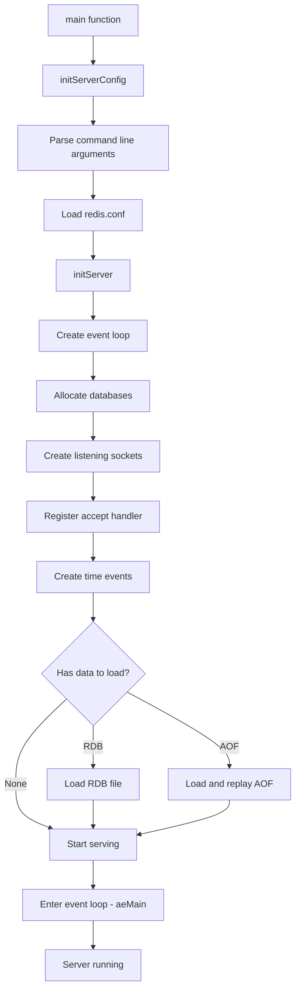
```mermaid
graph TB
    Start[main function] --> InitConfig[initServerConfig]
    InitConfig --> ParseArgs[Parse command line arguments]
    ParseArgs --> LoadConfig[Load redis.conf]
    LoadConfig --> InitServer[initServer]
    
    InitServer --> CreateEventLoop[Create event loop]
    CreateEventLoop --> AllocDB[Allocate databases]
    AllocDB --> CreateSocket[Create listening sockets]
    CreateSocket --> RegisterAccept[Register accept handler]
    RegisterAccept --> CreateTimers[Create time events]
    
    CreateTimers --> LoadData{Has data to load?}
    LoadData -->|RDB| LoadRDB[Load RDB file]
    LoadData -->|AOF| LoadAOF[Load and replay AOF]
    LoadData -->|None| StartServing
    LoadRDB --> StartServing[Start serving]
    LoadAOF --> StartServing
    
    StartServing --> EventLoop[Enter event loop - aeMain]
    EventLoop --> Running[Server running]
```

**Server Initialization:**
```c
void initServer(void) {
    int j;
    
    // Setup signal handlers
    signal(SIGHUP, SIG_IGN);
    signal(SIGPIPE, SIG_IGN);
    setupSignalHandlers();
    
    // Initialize server state
    server.pid = getpid();
    server.current_client = NULL;
    server.clients = listCreate();
    server.clients_to_close = listCreate();
    server.slaves = listCreate();
    server.monitors = listCreate();
    server.clients_pending_write = listCreate();
    server.slaveseldb = -1;
    server.unixtime = time(NULL);
    server.mstime = mstime();
    server.commands = dictCreate(&commandTableDictType, NULL);
    server.orig_commands = dictCreate(&commandTableDictType, NULL);
    
    // Populate command table
    populateCommandTable();
    
    // Create event loop
    server.el = aeCreateEventLoop(server.maxclients + CONFIG_FDSET_INCR);
    if (server.el == NULL) {
        serverLog(LL_WARNING, "Failed creating the event loop. Error message: '%s'",
                 strerror(errno));
        exit(1);
    }
    
    // Allocate databases
    server.db = zmalloc(sizeof(redisDb) * server.dbnum);
    for (j = 0; j < server.dbnum; j++) {
        server.db[j].dict = dictCreate(&dbDictType, NULL);
        server.db[j].expires = dictCreate(&dbExpiresDictType, NULL);
        server.db[j].blocking_keys = dictCreate(&keylistDictType, NULL);
        server.db[j].ready_keys = dictCreate(&objectKeyPointerValueDictType, NULL);
        server.db[j].watched_keys = dictCreate(&keylistDictType, NULL);
        server.db[j].id = j;
        server.db[j].avg_ttl = 0;
        server.db[j].defrag_later = listCreate();
    }
    
    // Create pub/sub structures
    server.pubsub_channels = dictCreate(&keylistDictType, NULL);
    server.pubsub_patterns = listCreate();
    
    // Setup networking
    if (server.port != 0 &&
        listenToPort(server.port, server.ipfd, &server.ipfd_count) == C_ERR)
        exit(1);
    
    if (server.unixsocket != NULL) {
        unlink(server.unixsocket);
        server.sofd = anetUnixServer(server.neterr, server.unixsocket,
                                     server.unixsocketperm, server.tcp_backlog);
    }
    
    // Register event handlers
    for (j = 0; j < server.ipfd_count; j++) {
        if (aeCreateFileEvent(server.el, server.ipfd[j], AE_READABLE,
                             acceptTcpHandler, NULL) == AE_ERR) {
            serverPanic("Unrecoverable error creating server.ipfd file event.");
        }
    }
    
    if (server.sofd > 0 && aeCreateFileEvent(server.el, server.sofd, AE_READABLE,
                                             acceptUnixHandler, NULL) == AE_ERR)
        serverPanic("Unrecoverable error creating server.sofd file event.");
    
    // Open AOF file if needed
    if (server.aof_state == AOF_ON) {
        server.aof_fd = open(server.aof_filename,
                            O_WRONLY | O_APPEND | O_CREAT, 0644);
        if (server.aof_fd == -1) {
            serverLog(LL_WARNING, "Can't open the append-only file: %s",
                     strerror(errno));
            exit(1);
        }
    }
    
    // Create server cron time event
    if (aeCreateTimeEvent(server.el, 1, serverCron, NULL, NULL) == AE_ERR) {
        serverPanic("Can't create event loop timers.");
        exit(1);
    }
    
    // Set before/after sleep callbacks
    aeSetBeforeSleepProc(server.el, beforeSleep);
    aeSetAfterSleepProc(server.el, afterSleep);
}
```

### Server Cron Job

The `serverCron` function runs periodically (default 10 times per second) to handle maintenance tasks:

```c
int serverCron(struct aeEventLoop *eventLoop, long long id, void *clientData) {
    int j;
    
    // Update server time cache
    updateCachedTime();
    
    // Show info about connected clients
    run_with_period(5000) {
        serverLog(LL_VERBOSE, "%lu clients connected (%lu replicas), %zu bytes in use",
                 listLength(server.clients) - listLength(server.slaves),
                 listLength(server.slaves),
                 zmalloc_used_memory());
    }
    
    // Check clients
    clientsCron();
    
    // Handle background operations from modules
    moduleHandleCron();
    
    // Check databases
    databasesCron();
    
    // Expire keys
    activeExpireCycle(ACTIVE_EXPIRE_CYCLE_SLOW);
    
    // Defragmentation
    if (server.active_defrag_enabled)
        activeDefragCycle();
    
    // AOF rewrite
    if (server.rdb_child_pid == -1 && server.aof_child_pid == -1 &&
        server.aof_rewrite_perc &&
        server.aof_current_size > server.aof_rewrite_min_size) {
        long long base = server.aof_rewrite_base_size ?
                        server.aof_rewrite_base_size : 1;
        long long growth = (server.aof_current_size * 100 / base) - 100;
        if (growth >= server.aof_rewrite_perc) {
            serverLog(LL_NOTICE, "Starting automatic rewriting of AOF on %lld%% growth",
                     growth);
            rewriteAppendOnlyFileBackground();
        }
    }
    
    // RDB snapshot based on save configuration
    if (server.rdb_child_pid == -1 && server.aof_child_pid == -1) {
        for (j = 0; j < server.saveparamslen; j++) {
            struct saveparam *sp = server.saveparams + j;
            
            if (server.dirty >= sp->changes &&
                server.unixtime - server.lastsave > sp->seconds &&
                (server.unixtime - server.lastbgsave_try > CONFIG_BGSAVE_RETRY_DELAY ||
                 server.lastbgsave_status == C_OK)) {
                serverLog(LL_NOTICE, "%d changes in %d seconds. Saving...",
                         sp->changes, (int)sp->seconds);
                rdbSaveInfo rsi, *rsiptr;
                rsiptr = rdbPopulateSaveInfo(&rsi);
                rdbSaveBackground(server.rdb_filename, rsiptr);
                break;
            }
        }
    }
    
    // Check if BGSAVE or AOF rewrite completed
    if (server.rdb_child_pid != -1 || server.aof_child_pid != -1 ||
        ldbPendingChildren()) {
        int statloc;
        pid_t pid;
        
        if ((pid = wait3(&statloc, WNOHANG, NULL)) != 0) {
            int exitcode = WEXITSTATUS(statloc);
            int bysignal = 0;
            
            if (WIFSIGNALED(statloc)) bysignal = WTERMSIG(statloc);
            
            if (pid == -1) {
                // Error
            } else if (pid == server.rdb_child_pid) {
                backgroundSaveDoneHandler(exitcode, bysignal);
            } else if (pid == server.aof_child_pid) {
                backgroundRewriteDoneHandler(exitcode, bysignal);
            }
            updateDictResizePolicy();
        }
    }
    
    // Replication cron
    replicationCron();
    
    // Cluster cron
    if (server.cluster_enabled) clusterCron();
    
    // Sentinel cron
    if (server.sentinel_mode) sentinelTimer();
    
    // Resize hash tables if needed
    if (server.activerehashing) {
        for (j = 0; j < server.dbnum; j++) {
            int work_done = incrementallyRehash(j);
            if (work_done) {
                break;
            }
        }
    }
    
    // Update stats
    server.stat_numcommands = 0;
    server.ops_sec_samples[server.ops_sec_idx] = server.stat_numcommands;
    server.ops_sec_idx = (server.ops_sec_idx + 1) % OPS_SEC_SAMPLES;
    
    return 1000 / server.hz; // Run again in X milliseconds
}
```

## Complete Request-Response Flow Example

Let's trace a complete `SET mykey myvalue` command through the entire Redis codebase:

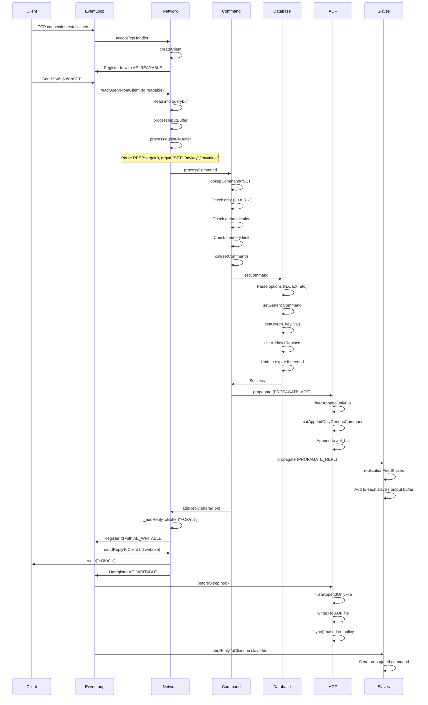
```mermaid
sequenceDiagram
    participant Client
    participant EventLoop
    participant Network
    participant Command
    participant Database
    participant AOF
    participant Slaves
    
    Client->>EventLoop: TCP connection established
    EventLoop->>Network: acceptTcpHandler
    Network->>Network: createClient
    Network->>EventLoop: Register fd with AE_READABLE
    
    Client->>EventLoop: Send *3\r\n$3\r\nSET...
    EventLoop->>Network: readQueryFromClient (fd readable)
    Network->>Network: Read into querybuf
    Network->>Network: processInputBuffer
    Network->>Network: processMultibulkBuffer
    Note over Network: Parse RESP: argc=3, argv=["SET","mykey","myvalue"]
    
    Network->>Command: processCommand
    Command->>Command: lookupCommand("SET")
    Command->>Command: Check arity (3 >= 3 ✓)
    Command->>Command: Check authentication
    Command->>Command: Check memory limit
    Command->>Command: call(setCommand)
    
    Command->>Database: setCommand
    Database->>Database: Parse options (NX, EX, etc.)
    Database->>Database: setGenericCommand
    Database->>Database: setKey(db, key, val)
    Database->>Database: dictAdd/dictReplace
    Database->>Database: Update expire if needed
    Database->>Command: Success
    
    Command->>AOF: propagate (PROPAGATE_AOF)
    AOF->>AOF: feedAppendOnlyFile
    AOF->>AOF: catAppendOnlyGenericCommand
    AOF->>AOF: Append to aof_buf
    
    Command->>Slaves: propagate (PROPAGATE_REPL)
    Slaves->>Slaves: replicationFeedSlaves
    Slaves->>Slaves: Add to each slave's output buffer
    
    Command->>Network: addReply(shared.ok)
    Network->>Network: _addReplyToBuffer("+OK\r\n")
    Network->>EventLoop: Register fd with AE_WRITABLE
    
    EventLoop->>Network: sendReplyToClient (fd writable)
    Network->>Client: write("+OK\r\n")
    Network->>EventLoop: Unregister AE_WRITABLE
    
    EventLoop->>AOF: beforeSleep hook
    AOF->>AOF: flushAppendOnlyFile
    AOF->>AOF: write() to AOF file
    AOF->>AOF: fsync() based on policy
    
    EventLoop->>Slaves: sendReplyToClient on slave fds
    Slaves->>Slaves: Send propagated command
```

**Detailed Step-by-Step Flow:**

1. **Connection Establishment:**
   - Client connects to Redis TCP port
   - `acceptTcpHandler` accepts connection
   - `createClient` allocates client structure
   - File descriptor registered with event loop for reading

2. **Request Reading:**
   - Event loop detects fd is readable
   - `readQueryFromClient` invoked
   - Data read into client's `querybuf` (SDS string)
   - Buffer contains: `*3\r
$3\r
SET\r
$5\r
mykey\r
$7\r
myvalue\r
`

3. **Protocol Parsing:**
   - `processInputBuffer` processes buffer
   - `processMultibulkBuffer` parses RESP protocol
   - Extracts: `argc = 3`, `argv = ["SET", "mykey", "myvalue"]`
   - Each argument stored as `robj` (Redis object)

4. **Command Lookup:**
   - `processCommand` looks up "SET" in command table
   - Finds `redisCommand` structure with `setCommand` function pointer
   - Validates: arity (3 args), authentication, memory, cluster slot

5. **Command Execution:**
   - `call` function invokes `setCommand`
   - `setCommand` parses options (EX, PX, NX, XX, KEEPTTL)
   - `setGenericCommand` performs the actual set operation
   - `setKey` adds/updates key in database dictionary
   - If key exists: `dbOverwrite`, else: `dbAdd`
   - Dictionary entry created with key and value objects

6. **Data Storage:**
   - Key stored in `db->dict` (main hash table)
   - If expiration set, also stored in `db->expires`
   - Object encoding optimized (INT, EMBSTR, or RAW)
   - Memory allocated via jemalloc

7. **Propagation to AOF:**
   - `propagate` called with `PROPAGATE_AOF` flag
   - `feedAppendOnlyFile` formats command as RESP
   - Command appended to `server.aof_buf`
   - Will be flushed to disk in `beforeSleep`

8. **Propagation to Slaves:**
   - `propagate` called with `PROPAGATE_REPL` flag
   - `replicationFeedSlaves` iterates all slave clients
   - Command added to each slave's output buffer
   - Also added to replication backlog for partial resync

9. **Response Preparation:**
   - `addReply(c, shared.ok)` adds "+OK\r\n" to output
   - First tries static buffer `c->buf`
   - If full, uses dynamic reply list
   - File descriptor registered for writing

10. **Response Sending:**
    - Event loop detects fd is writable
    - `sendReplyToClient` invoked
    - Writes data from buffer to socket
    - If all data sent, unregisters write event
    - Connection kept alive for pipelining

11. **Before Sleep Hook:**
    - `beforeSleep` called before polling
    - `flushAppendOnlyFile` writes AOF buffer to disk
    - Fsync based on policy (always/everysec/no)
    - Handles pending writes to slaves

12. **Slave Updates:**
    - Slaves receive propagated SET command
    - Execute same command on their databases
    - Send ACK back to master
    - Maintain replication offset

## Advanced Topics

### Pub/Sub Implementation

Redis Pub/Sub allows message broadcasting:

```c
// Subscribe to channel
void subscribeCommand(client *c) {
    int j;
    for (j = 1; j < c->argc; j++)
        pubsubSubscribeChannel(c, c->argv[j]);
    c->flags |= CLIENT_PUBSUB;
}

int pubsubSubscribeChannel(client *c, robj *channel) {
    dictEntry *de;
    list *clients = NULL;
    int retval = 0;
    
    // Add channel to client's subscriptions
    if (dictAdd(c->pubsub_channels, channel, NULL) == DICT_OK) {
        retval = 1;
        incrRefCount(channel);
        
        // Add client to channel's subscribers
        de = dictFind(server.pubsub_channels, channel);
        if (de == NULL) {
            clients = listCreate();
            dictAdd(server.pubsub_channels, channel, clients);
            incrRefCount(channel);
        } else {
            clients = dictGetVal(de);
        }
        listAddNodeTail(clients, c);
    }
    
    // Send confirmation
    addReplyPubsubSubscribed(c, channel);
    return retval;
}

// Publish message to channel
void publishCommand(client *c) {
    int receivers = pubsubPublishMessage(c->argv[1], c->argv[2]);
    if (server.cluster_enabled)
        clusterPropagatePublish(c->argv[1], c->argv[2]);
    else
        forceCommandPropagation(c, PROPAGATE_REPL);
    addReplyLongLong(c, receivers);
}

int pubsubPublishMessage(robj *channel, robj *message) {
    int receivers = 0;
    dictEntry *de;
    listNode *ln;
    listIter li;
    
    // Send to channel subscribers
    de = dictFind(server.pubsub_channels, channel);
    if (de) {
        list *list = dictGetVal(de);
        listRewind(list, &li);
        while ((ln = listNext(&li)) != NULL) {
            client *c = ln->value;
            addReplyPubsubMessage(c, channel, message);
            receivers++;
        }
    }
    
    // Send to pattern subscribers
    if (listLength(server.pubsub_patterns)) {
        listRewind(server.pubsub_patterns, &li);
        channel = getDecodedObject(channel);
        while ((ln = listNext(&li)) != NULL) {
            pubsubPattern *pat = ln->value;
            if (stringmatchlen((char*)pat->pattern->ptr,
                             sdslen(pat->pattern->ptr),
                             (char*)channel->ptr,
                             sdslen(channel->ptr), 0)) {
                addReplyPubsubPatMessage(pat->client, pat->pattern, channel, message);
                receivers++;
            }
        }
        decrRefCount(channel);
    }
    return receivers;
}
```

### Transactions (MULTI/EXEC)

Redis transactions queue commands for atomic execution:

```c
// Start transaction
void multiCommand(client *c) {
    if (c->flags & CLIENT_MULTI) {
        addReplyError(c, "MULTI calls can not be nested");
        return;
    }
    c->flags |= CLIENT_MULTI;
    addReply(c, shared.ok);
}

// Queue command
void queueMultiCommand(client *c) {
    multiCmd *mc;
    int j;
    
    c->mstate.commands = zrealloc(c->mstate.commands,
                                  sizeof(multiCmd) * (c->mstate.count + 1));
    mc = c->mstate.commands + c->mstate.count;
    mc->cmd = c->cmd;
    mc->argc = c->argc;
    mc->argv = zmalloc(sizeof(robj*) * c->argc);
    memcpy(mc->argv, c->argv, sizeof(robj*) * c->argc);
    for (j = 0; j < c->argc; j++)
        incrRefCount(mc->argv[j]);
    c->mstate.count++;
}

// Execute transaction
void execCommand(client *c) {
    int j;
    robj **orig_argv;
    int orig_argc;
    struct redisCommand *orig_cmd;
    
    if (!(c->flags & CLIENT_MULTI)) {
        addReplyError(c, "EXEC without MULTI");
        return;
    }
    
    // Check if WATCH keys were modified
    if (c->flags & (CLIENT_DIRTY_CAS | CLIENT_DIRTY_EXEC)) {
        addReply(c, c->flags & CLIENT_DIRTY_EXEC ? shared.execaborterr :
                                                    shared.nullarray);
        discardTransaction(c);
        return;
    }
    
    // Unwatch all keys
    unwatchAllKeys(c);
    
    // Execute all commands
    orig_argv = c->argv;
    orig_argc = c->argc;
    orig_cmd = c->cmd;
    addReplyArrayLen(c, c->mstate.count);
    
    for (j = 0; j < c->mstate.count; j++) {
        c->argc = c->mstate.commands[j].argc;
        c->argv = c->mstate.commands[j].argv;
        c->cmd = c->mstate.commands[j].cmd;
        
        // Propagate commands
        call(c, CMD_CALL_FULL);
        
        c->woff = server.master_repl_offset;
    }
    
    // Restore original state
    c->argv = orig_argv;
    c->argc = orig_argc;
    c->cmd = orig_cmd;
    discardTransaction(c);
}

// WATCH implementation
void watchCommand(client *c) {
    int j;
    
    if (c->flags & CLIENT_MULTI) {
        addReplyError(c, "WATCH inside MULTI is not allowed");
        return;
    }
    
    for (j = 1; j < c->argc; j++)
        watchForKey(c, c->argv[j]);
    addReply(c, shared.ok);
}

void watchForKey(client *c, robj *key) {
    list *clients = NULL;
    listIter li;
    listNode *ln;
    watchedKey *wk;
    
    // Check if already watching
    listRewind(c->watched_keys, &li);
    while((ln = listNext(&li))) {
        wk = listNodeValue(ln);
        if (wk->db == c->db && equalStringObjects(wk->key, key))
            return;
    }
    
    // Add to client's watched keys
    wk = zmalloc(sizeof(*wk));
    wk->key = key;
    wk->db = c->db;
    incrRefCount(key);
    listAddNodeTail(c->watched_keys, wk);
    
    // Add client to key's watchers
    clients = dictFetchValue(c->db->watched_keys, key);
    if (!clients) {
        clients = listCreate();
        dictAdd(c->db->watched_keys, key, clients);
        incrRefCount(key);
    }
    listAddNodeTail(clients, c);
}

void touchWatchedKey(redisDb *db, robj *key) {
    list *clients;
    listIter li;
    listNode *ln;
    
    if (dictSize(db->watched_keys) == 0) return;
    clients = dictFetchValue(db->watched_keys, key);
    if (!clients) return;
    
    // Mark all watching clients as dirty
    listRewind(clients, &li);
    while((ln = listNext(&li))) {
        client *c = listNodeValue(ln);
        c->flags |= CLIENT_DIRTY_CAS;
    }
}
```

### Lua Scripting

Redis embeds Lua for server-side scripting:

```c
void evalCommand(client *c) {
    evalGenericCommand(c, 0);
}

void evalGenericCommand(client *c, int evalsha) {
    lua_State *lua = server.lua;
    char funcname[43];
    long long numkeys;
    
    // Get number of keys
    if (getLongLongFromObjectOrReply(c, c->argv[2], &numkeys, NULL) != C_OK)
        return;
    if (numkeys > (c->argc - 3)) {
        addReplyError(c, "Number of keys can't be greater than number of args");
        return;
    }
    
    // Generate function name from SHA1
    funcname[0] = 'f';
    funcname[1] = '_';
    if (!evalsha) {
        // EVAL - compute SHA1 of script
        sha1hex(funcname + 2, c->argv[1]->ptr, sdslen(c->argv[1]->ptr));
    } else {
        // EVALSHA - use provided SHA1
        memcpy(funcname + 2, c->argv[1]->ptr, 40);
    }
    
    // Try to lookup cached function
    lua_getglobal(lua, funcname);
    if (lua_isnil(lua, -1)) {
        lua_pop(lua, 1);
        
        if (evalsha) {
            addReply(c, shared.noscripterr);
            return;
        }
        
        // Load and compile script
        if (luaCreateFunction(c, lua, funcname, c->argv[1]) == C_ERR) return;
        lua_getglobal(lua, funcname);
    }
    
    // Setup Lua environment
    luaSetGlobalArray(lua, "KEYS", c->argv + 3, numkeys);
    luaSetGlobalArray(lua, "ARGV", c->argv + 3 + numkeys, c->argc - 3 - numkeys);
    
    // Execute script
    server.lua_caller = c;
    server.lua_time_start = mstime();
    server.lua_kill = 0;
    
    if (lua_pcall(lua, 0, 1, 0)) {
        // Error executing script
        addReplyErrorFormat(c, "Error running script: %s", lua_tostring(lua, -1));
        lua_pop(lua, 1);
        return;
    }
    
    // Convert Lua result to Redis reply
    luaReplyToRedisReply(c, lua);
    
    // Cleanup
    server.lua_caller = NULL;
    lua_gc(lua, LUA_GCCOLLECT, 0);
}
```

### Cluster Mode

Redis Cluster provides automatic sharding:

**Key Concepts:**
- 16384 hash slots distributed across nodes
- Hash slot = CRC16(key) % 16384
- Each node holds subset of slots
- Client redirection for wrong slot
- Gossip protocol for cluster state

```c
// Calculate hash slot for key
unsigned int keyHashSlot(char *key, int keylen) {
    int s, e;
    
    // Hash tag support: {tag}
    for (s = 0; s < keylen; s++)
        if (key[s] == '{') break;
    
    if (s == keylen) return crc16(key, keylen) & 0x3FFF;
    
    for (e = s + 1; e < keylen; e++)
        if (key[e] == '}') break;
    
    if (e == keylen || e == s + 1) return crc16(key, keylen) & 0x3FFF;
    
    return crc16(key + s + 1, e - s - 1) & 0x3FFF;
}

// Redirect client to correct node
void clusterRedirectClient(client *c, clusterNode *n, int hashslot, int error_code) {
    if (error_code == CLUSTER_REDIR_CROSS_SLOT) {
        addReplySds(c, sdsnew("-CROSSSLOT Keys in request don't hash to the same slot\r\n"));
    } else if (error_code == CLUSTER_REDIR_UNSTABLE) {
        addReplySds(c, sdsnew("-TRYAGAIN Multiple keys request during rehashing\r\n"));
    } else if (error_code == CLUSTER_REDIR_DOWN_STATE) {
        addReplySds(c, sdsnew("-CLUSTERDOWN The cluster is down\r\n"));
    } else if (error_code == CLUSTER_REDIR_DOWN_UNBOUND) {
        addReplySds(c, sdsnew("-CLUSTERDOWN Hash slot not served\r\n"));
    } else if (error_code == CLUSTER_REDIR_MOVED) {
        addReplySds(c, sdscatprintf(sdsempty(),
            "-MOVED %d %s:%d\r\n", hashslot, n->ip, n->port));
    } else if (error_code == CLUSTER_REDIR_ASK) {
        addReplySds(c, sdscatprintf(sdsempty(),
            "-ASK %d %s:%d\r\n", hashslot, n->ip, n->port));
    } else {
        serverPanic("Unknown redirect error code");
    }
}
```

## Performance Optimization Techniques

### 1. Memory Optimization

**Shared Objects:**
Redis shares common objects to save memory:
```c
struct sharedObjectsStruct {
    robj *crlf, *ok, *err, *emptybulk, *czero, *cone, *pong, *space,
    *colon, *queued, *null[4], *nullarray[4],
    *emptymap[4], *emptyset[4], *emptyarray,
    *wrongtypeerr, *nokeyerr, *syntaxerr, *sameobjecterr,
    *outofrangeerr, *noscripterr, *loadingerr,
    *slowevalerr, *slowscripterr, *slowmoduleerr, *bgsaveerr,
    *masterdownerr, *roslaveerr, *execaborterr, *noautherr, *noreplicaserr,
    *busykeyerr, *oomerr, *plus, *messagebulk, *pmessagebulk, *subscribebulk,
    *unsubscribebulk, *psubscribebulk, *punsubscribebulk, *del, *unlink,
    *rpop, *lpop, *lpush, *rpoplpush, *zpopmin, *zpopmax, *emptyscan,
    *multi, *exec,
    *left, *right,
    *hset, *srem, *xgroup, *xclaim,
    *script, *replconf, *eval, *persist, *set, *pexpireat, *pexpire,
    *time, *pxat, *absttl, *redisobject,
    *select[PROTO_SHARED_SELECT_CMDS],
    *integers[OBJ_SHARED_INTEGERS],
    *mbulkhdr[OBJ_SHARED_BULKHDR_LEN],
    *bulkhdr[OBJ_SHARED_BULKHDR_LEN],
    *maphdr[OBJ_SHARED_BULKHDR_LEN],
    *sethdr[OBJ_SHARED_BULKHDR_LEN];
} shared;
```

**Object Encoding:**
Redis automatically chooses optimal encoding:
- Strings: INT (long), EMBSTR (<= 44 bytes), RAW
- Lists: QUICKLIST (ziplist nodes)
- Sets: INTSET (all integers), HT (hash table)
- Sorted Sets: ZIPLIST (small), SKIPLIST + HT (large)
- Hashes: ZIPLIST (small), HT (large)

### 2. I/O Optimization

**Pipelining:**
Redis processes multiple commands without waiting for replies:
```
Client: SET key1 val1\r\nSET key2 val2\r\nGET key1\r\n
Server: +OK\r
+OK\r
$4\r
val1\r

```

**Non-blocking I/O:**
All network operations use non-blocking sockets with event loop

**TCP_NODELAY:**
Disables Nagle's algorithm for low latency

### 3. CPU Optimization

**Single-threaded:**
No locking overhead, cache-friendly

**Lazy Freeing:**
Defer expensive operations to background threads:
```c
void freeClientAsync(client *c) {
    if (c->flags & CLIENT_CLOSE_ASAP || c->flags & CLIENT_LUA) return;
    c->flags |= CLIENT_CLOSE_ASAP;
    listAddNodeTail(server.clients_to_close, c);
}

int dbAsyncDelete(redisDb *db, robj *key) {
    if (dictSize(db->expires) > 0) dictDelete(db->expires, key->ptr);
    
    dictEntry *de = dictUnlink(db->dict, key->ptr);
    if (de) {
        robj *val = dictGetVal(de);
        size_t free_effort = lazyfreeGetFreeEffort(val);
        
        if (free_effort > LAZYFREE_THRESHOLD) {
            atomicIncr(lazyfree_objects, 1);
            bioCreateBackgroundJob(BIO_LAZY_FREE, val, NULL, NULL);
            dictSetVal(db->dict, de, NULL);
        }
        dictFreeUnlinkedEntry(db->dict, de);
        return 1;
    }
    return 0;
}
```

## Conclusion

This comprehensive tutorial has covered the Redis source code architecture from multiple angles:

**Core Components:**
- Event loop (ae.c) - Single-threaded asynchronous I/O using epoll/kqueue/select
- Networking (networking.c, anet.c) - Non-blocking TCP handling and RESP protocol
- Data structures (dict.c, sds.c, ziplist.c, etc.) - Highly optimized implementations
- Command processing - Table-driven dispatch with validation and execution
- Database (db.c) - Key-value storage with multiple databases and expiration

**Persistence:**
- RDB - Point-in-time binary snapshots with fork-based background saving
- AOF - Command logging with fsync policies and automatic rewriting
- Hybrid - Best of both worlds for fast restarts and durability

**High Availability:**
- Replication - Master-slave with partial resynchronization
- Sentinel - Automatic failover and monitoring
- Cluster - Distributed sharding across 16384 slots

**Advanced Features:**
- Transactions (MULTI/EXEC) with optimistic locking (WATCH)
- Pub/Sub messaging with channels and patterns
- Lua scripting for atomic server-side operations
- Memory eviction with LRU/LFU approximation

**Performance:**
- In-memory architecture for microsecond latencies
- Single-threaded model eliminates lock contention
- Pipelining and multiplexing for high throughput
- Lazy freeing for non-blocking deletions
- Object encoding optimization

**Key Takeaways:**

1. **Simplicity**: Redis favors simple, proven algorithms over complex solutions
2. **Performance**: Every design decision optimizes for speed and low latency
3. **Reliability**: Fork-based persistence ensures data safety without blocking
4. **Scalability**: Cluster mode enables horizontal scaling while maintaining simplicity
5. **Flexibility**: Rich data structures and Lua scripting provide powerful abstractions

Redis demonstrates that exceptional performance doesn't require excessive complexity. The single-threaded event loop, incremental algorithms (rehashing, expiration), and careful memory management create a system that's both fast and maintainable.

By studying Redis source code, you learn:
- How to build high-performance network servers
- Event-driven programming patterns
- Efficient data structure implementations
- Non-blocking I/O and asynchronous processing
- Memory management in C
- Distributed system design

The Redis codebase is a masterclass in system programming, proving that clear design and attention to detail can produce software that's simultaneously simple, fast, and reliable.
```

### Key Source Files

The Redis source code contains numerous C files, each serving specific purposes:

#### Core Server Files

| File | Purpose | Key Responsibilities |
|------|---------|---------------------|
| server.c | Main server implementation | Server initialization, main loop, global state management |
| server.h | Core header file | Data structure definitions, function prototypes, constants |
| networking.c | Network operations | Socket management, client connection handling, data transmission |
| ae.c | Asynchronous event library | Event loop implementation, file/time event management |
| anet.c | Network utility | TCP/Unix socket creation, connection setup, network configuration |

#### Data Structure Files

| File | Purpose | Key Responsibilities |
|------|---------|---------------------|
| sds.c | Simple Dynamic String | String manipulation, memory-efficient string storage |
| dict.c | Hash table | Generic hash table implementation, rehashing logic |
| adlist.c | Doubly linked list | List operations for various internal uses |
| ziplist.c | Compressed list | Memory-efficient sequential data storage |
| quicklist.c | Quick list | Hybrid list combining linked list and ziplist |
| intset.c | Integer set | Sorted set of integers with encoding optimization |
| t_string.c | String commands | STRING data type operations (GET, SET, INCR, etc.) |
| t_list.c | List commands | LIST data type operations (LPUSH, RPOP, etc.) |
| t_hash.c | Hash commands | HASH data type operations (HSET, HGET, etc.) |
| t_set.c | Set commands | SET data type operations (SADD, SMEMBERS, etc.) |
| t_zset.c | Sorted set commands | ZSET data type operations with skip list implementation |
| t_stream.c | Stream commands | STREAM data type for log-like data structures |

#### Database and Storage Files

| File | Purpose | Key Responsibilities |
|------|---------|---------------------|
| db.c | Database operations | Key-value operations, database selection, expiration |
| rdb.c | RDB persistence | Snapshot creation, loading, binary serialization |
| aof.c | AOF persistence | Append-only file management, command logging |
| rio.c | Redis I/O abstraction | Unified interface for file, buffer, and socket I/O |
| object.c | Redis object system | Object creation, reference counting, encoding management |

#### High Availability Files

| File | Purpose | Key Responsibilities |
|------|---------|---------------------|
| replication.c | Master-replica replication | Synchronization, partial resync, replication stream |
| sentinel.c | Redis Sentinel | Monitoring, failover, notification system |
| cluster.c | Redis Cluster | Distributed implementation, slot management, gossip protocol |

## Server Initialization and Lifecycle

### Server Startup Flow

The Redis server initialization follows a well-defined sequence that prepares all subsystems before accepting client connections.

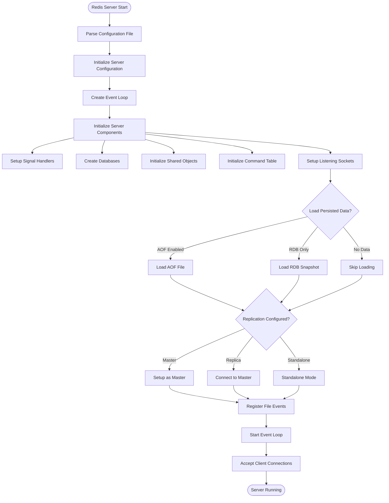
```mermaid
flowchart TD
    Start([Redis Server Start]) --> ParseConfig[Parse Configuration File]
    ParseConfig --> InitServerConfig[Initialize Server Configuration]
    InitServerConfig --> CreateEventLoop[Create Event Loop]
    CreateEventLoop --> InitServer[Initialize Server Components]
    
    InitServer --> SetupSignals[Setup Signal Handlers]
    InitServer --> CreateDB[Create Databases]
    InitServer --> InitSharedObjects[Initialize Shared Objects]
    InitServer --> InitCommandTable[Initialize Command Table]
    InitServer --> SetupListen[Setup Listening Sockets]
    
    SetupListen --> LoadPersistence{Load Persisted Data?}
    LoadPersistence -->|AOF Enabled| LoadAOF[Load AOF File]
    LoadPersistence -->|RDB Only| LoadRDB[Load RDB Snapshot]
    LoadPersistence -->|No Data| SkipLoad[Skip Loading]
    
    LoadAOF --> StartReplication{Replication Configured?}
    LoadRDB --> StartReplication
    SkipLoad --> StartReplication
    
    StartReplication -->|Master| SetupMaster[Setup as Master]
    StartReplication -->|Replica| ConnectMaster[Connect to Master]
    StartReplication -->|Standalone| StandaloneMode[Standalone Mode]
    
    SetupMaster --> RegisterEvents[Register File Events]
    ConnectMaster --> RegisterEvents
    StandaloneMode --> RegisterEvents
    
    RegisterEvents --> StartEventLoop[Start Event Loop]
    StartEventLoop --> AcceptConnections[Accept Client Connections]
    AcceptConnections --> Running([Server Running])
```

### Initialization Phase Details

**Configuration Parsing**
The server begins by parsing the redis.conf configuration file or command-line arguments. Configuration parameters control every aspect of server behavior including network settings, memory limits, persistence options, and replication settings. Default values are applied for any unspecified parameters.

**Server State Initialization**
Redis initializes the global server state structure (server.c) containing all server configuration, statistics, client lists, database arrays, and subsystem pointers. This structure serves as the central repository for all server runtime information.

**Event Loop Creation**
The event loop (ae.c) is created with capacity for the maximum number of clients plus additional file descriptors for server sockets, AOF files, and replication connections. The event loop uses the most efficient I/O multiplexing mechanism available on the host system (epoll on Linux, kqueue on BSD, select as fallback).

**Database Initialization**
Redis creates the configured number of databases (default 16), each containing an empty key-value dictionary and expiration dictionary. The database structures are allocated and initialized with default hash table sizes.

**Command Table Setup**
The command table maps command names to their implementation functions, along with metadata including argument count, flags (read-only, write, admin, etc.), and performance characteristics. This table enables dynamic command dispatch and validation.

**Network Socket Setup**
Listening sockets are created for the configured TCP port (default 6379) and optional Unix domain socket. Sockets are configured with SO_REUSEADDR, TCP_NODELAY, and other performance optimizations. Each listening socket is registered with the event loop for accept events.

**Data Persistence Loading**
If persistence is enabled and data files exist, Redis loads data from disk. AOF takes precedence over RDB when both exist. The loading process recreates the entire dataset in memory, applying integrity checks and validation. During loading, the server is not yet accepting client connections.

**Replication Setup**
If configured as a replica, Redis initiates connection to the master server. The replication handshake involves authentication, synchronization type negotiation, and offset tracking setup. Masters prepare to accept replica connections and maintain replication backlog buffers.

**Event Registration**
Listening sockets are registered with the event loop to accept incoming connections. Time events are scheduled for periodic tasks including database expiration, RDB snapshots, AOF rewriting, replication ping, and statistics updates.

## Event Loop Implementation

### Event Loop Architecture

The event loop (ae.c and ae.h) is the heart of Redis, providing the foundation for all asynchronous operations. Redis implements a reactor pattern where the event loop waits for events and dispatches them to registered handlers.

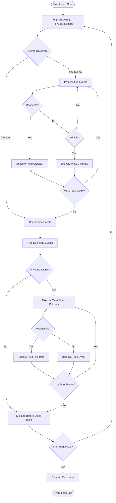
```mermaid
flowchart TD
    Start([Event Loop Start]) --> Wait[Wait for Events - Poll/Epoll/Kqueue]
    Wait --> CheckEvents{Events Occurred?}
    
    CheckEvents -->|File Events| ProcessFile[Process File Events]
    CheckEvents -->|Timeout| CheckTime[Check Time Events]
    
    ProcessFile --> ReadEvent{Readable?}
    ReadEvent -->|Yes| ReadCallback[Execute Read Callback]
    ReadEvent -->|No| WriteEvent{Writable?}
    
    WriteEvent -->|Yes| WriteCallback[Execute Write Callback]
    WriteEvent -->|No| ProcessFile
    
    ReadCallback --> MoreFile{More File Events?}
    WriteCallback --> MoreFile
    
    MoreFile -->|Yes| ProcessFile
    MoreFile -->|No| CheckTime
    
    CheckTime --> FindDue[Find Due Time Events]
    FindDue --> AnyDue{Any Due Events?}
    
    AnyDue -->|Yes| TimeCallback[Execute Time Event Callback]
    AnyDue -->|No| BeforeSleep
    
    TimeCallback --> Reschedule{Reschedule?}
    Reschedule -->|Yes| UpdateTime[Update Next Fire Time]
    Reschedule -->|No| RemoveTime[Remove Time Event]
    
    UpdateTime --> MoreTime{More Due Events?}
    RemoveTime --> MoreTime
    
    MoreTime -->|Yes| TimeCallback
    MoreTime -->|No| BeforeSleep
    
    BeforeSleep[Execute Before-Sleep Tasks]
    BeforeSleep --> CheckStop{Stop Requested?}
    
    CheckStop -->|No| Wait
    CheckStop -->|Yes| Cleanup[Cleanup Resources]
    Cleanup --> End([Event Loop End])
```

### Event Loop Components

**File Events**
File events represent I/O readiness on file descriptors (sockets, pipes, regular files). Each file event associates a file descriptor with callback functions for readable and/or writable conditions. Redis registers file events for:
- Listening sockets to accept new connections
- Client sockets to read commands and write responses
- Replication sockets for master-replica communication
- AOF file descriptor for persistence writes

**Time Events**
Time events trigger callbacks at scheduled times or intervals. Redis uses time events for periodic maintenance tasks:
- serverCron: Main periodic task running every 100ms by default
- Database expiration scanning
- RDB snapshot scheduling
- AOF rewriting checks
- Replication connection management
- Statistics collection and reporting

**Before-Sleep Handler**
Before each iteration of waiting for events, Redis executes the before-sleep handler to perform urgent tasks:
- Flush AOF buffer to disk
- Handle pending writes to clients
- Perform background I/O operations
- Update replication offset

**Event Loop State**
The event loop maintains state including:
- Maximum file descriptor set size
- Arrays of registered file events with their callbacks
- Linked list of scheduled time events
- Stop flag for graceful shutdown
- Platform-specific polling state (epoll fd, kqueue fd, etc.)

### I/O Multiplexing Abstraction

Redis abstracts I/O multiplexing mechanisms through a unified interface that selects the best available system call:

**Priority Order**
1. **evport** (Solaris event ports) - Most efficient on Solaris
2. **epoll** (Linux) - Edge-triggered or level-triggered polling
3. **kqueue** (BSD, macOS) - Highly efficient event notification
4. **select** (POSIX) - Fallback for maximum portability

**Abstraction Layer**
The abstraction provides consistent API:
- Create: Initialize polling state
- Add Event: Register file descriptor with interest mask
- Delete Event: Unregister file descriptor
- Poll: Wait for events with timeout
- Cleanup: Free polling resources

This design allows Redis to compile and run efficiently on diverse platforms while maintaining a single event loop implementation.

## Network Layer and Protocol

### Connection Handling Flow

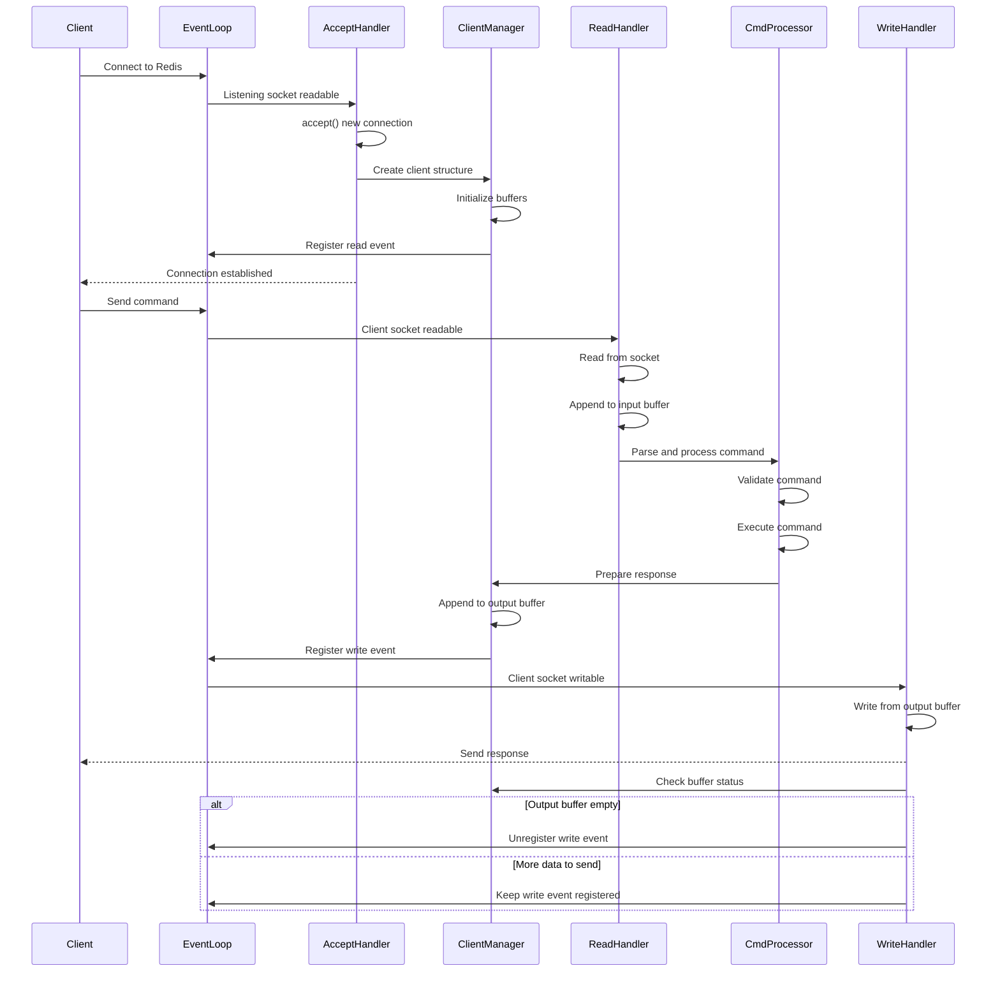
```mermaid
sequenceDiagram
    participant Client
    participant EventLoop
    participant AcceptHandler
    participant ClientManager
    participant ReadHandler
    participant CmdProcessor
    participant WriteHandler
    
    Client->>EventLoop: Connect to Redis
    EventLoop->>AcceptHandler: Listening socket readable
    AcceptHandler->>AcceptHandler: accept() new connection
    AcceptHandler->>ClientManager: Create client structure
    ClientManager->>ClientManager: Initialize buffers
    ClientManager->>EventLoop: Register read event
    AcceptHandler-->>Client: Connection established
    
    Client->>EventLoop: Send command
    EventLoop->>ReadHandler: Client socket readable
    ReadHandler->>ReadHandler: Read from socket
    ReadHandler->>ReadHandler: Append to input buffer
    ReadHandler->>CmdProcessor: Parse and process command
    CmdProcessor->>CmdProcessor: Validate command
    CmdProcessor->>CmdProcessor: Execute command
    CmdProcessor->>ClientManager: Prepare response
    ClientManager->>ClientManager: Append to output buffer
    ClientManager->>EventLoop: Register write event
    
    EventLoop->>WriteHandler: Client socket writable
    WriteHandler->>WriteHandler: Write from output buffer
    WriteHandler-->>Client: Send response
    WriteHandler->>ClientManager: Check buffer status
    
    alt Output buffer empty
        WriteHandler->>EventLoop: Unregister write event
    else More data to send
        WriteHandler->>EventLoop: Keep write event registered
    end
```

### Client Connection Structure

Each connected client is represented by a comprehensive structure tracking all connection state:

**Connection Identity**
- Unique client ID (monotonically increasing)
- File descriptor for the socket
- Client name (set via CLIENT SETNAME)
- Client address and port information

**Communication Buffers**
- Input buffer (query buffer): Accumulates incoming data until complete commands are received
- Output buffer list: Stores responses waiting to be sent
- Reply bytes: Tracks total bytes queued for transmission

**State and Flags**
- Connection flags: master, replica, monitor, blocked, close-after-reply, etc.
- Current database selection (0-15 by default)
- Authentication state
- Transaction state (MULTI/EXEC)
- Subscription state (PUBSUB channels and patterns)

**Command Context**
- Current command being executed
- Command arguments
- Command arrival timestamp

**Blocking Operations**
- Blocking timeout
- Keys being waited on (BLPOP, BRPOP, BRPOPLPUSH, etc.)
- Blocking type

**Statistics and Monitoring**
- Commands processed counter
- Creation time and last interaction time
- Network I/O statistics

### RESP Protocol (Redis Serialization Protocol)

Redis uses RESP for client-server communication, providing a simple, efficient, human-readable protocol.

**Data Types**

RESP defines five data type encodings:

1. **Simple Strings**: `+OK\r\n`
   - Start with plus sign
   - Terminated by CRLF
   - Used for simple status replies

2. **Errors**: `-Error message\r\n`
   - Start with minus sign
   - Terminated by CRLF
   - Indicate command execution errors

3. **Integers**: `:1000\r\n`
   - Start with colon
   - Decimal string representation
   - Used for counts and numeric results

4. **Bulk Strings**: `$6\r\nfoobar\r\n`
   - Start with dollar sign followed by length
   - CRLF after length
   - String content followed by CRLF
   - Null bulk string: `$-1\r\n`

5. **Arrays**: `*2\r
$3\r
foo\r
$3\r
bar\r
`
   - Start with asterisk followed by element count
   - Each element is a valid RESP type
   - Can be nested
   - Null array: `*-1\r\n`

**Command Request Format**

Clients send commands as arrays of bulk strings:
- First element: command name
- Subsequent elements: command arguments

Example - `SET key value`:
```
*3\r
$3\r
SET\r
$3\r
key\r
$5\r
value\r

```

**Response Format**

Servers respond using appropriate RESP types:
- Simple operations: Simple strings or integers
- Complex data: Bulk strings or arrays
- Errors: Error type with descriptive message

### Protocol Parsing Logic

Redis implements an incremental protocol parser that handles partial data:

**Parser State Machine**
The parser maintains state across multiple reads:
- Current parsing position in input buffer
- Expected data length for bulk strings
- Array element count and nesting level
- Multi-bulk command argument count

**Incremental Parsing**
As data arrives:
1. Append to input buffer
2. Attempt to parse complete commands
3. Extract parsed commands for processing
4. Retain unparsed data for next read

**Error Handling**
Protocol errors result in:
- Client disconnection for malformed requests
- Error responses for invalid command syntax
- Logging of protocol violations

## Data Structures Implementation

### Simple Dynamic String (SDS)

SDS is Redis's replacement for C strings, providing efficiency and safety.

**Structure Design**

SDS prepends metadata before the string buffer:

| Field | Type | Purpose |
|-------|------|--------|
| len | varies | Current string length |
| alloc | varies | Allocated capacity (excluding header and null terminator) |
| flags | uint8 | SDS type identifier |
| buf | char[] | Actual string data (null-terminated) |

**SDS Types**

Redis uses different SDS types to optimize memory based on string length:

- **SDS_TYPE_5**: 0-31 bytes, 1-byte header (flags only)
- **SDS_TYPE_8**: Up to 255 bytes, 3-byte header
- **SDS_TYPE_16**: Up to 64KB, 5-byte header
- **SDS_TYPE_32**: Up to 4GB, 9-byte header
- **SDS_TYPE_64**: Up to 2^64 bytes, 17-byte header

**Key Advantages**

1. **O(1) Length**: Length stored in header, no strlen() needed
2. **Binary Safe**: Explicit length allows embedded null bytes
3. **Buffer Overrun Protection**: Allocated size tracking prevents overflows
4. **Memory Efficiency**: Right-sized headers minimize overhead
5. **Lazy Free Space**: Unused capacity allows efficient append operations
6. **C String Compatibility**: Null-terminated for compatibility with C APIs

**Memory Allocation Strategy**

SDS uses intelligent preallocation:
- Small strings (< 1MB): Double the required size
- Large strings: Add 1MB extra capacity
- Reduces reallocations for growing strings
- Balances memory efficiency with performance

### Hash Table (dict.c)

Redis's hash table powers the main key-value store and hash data types.

**Hash Table Architecture**

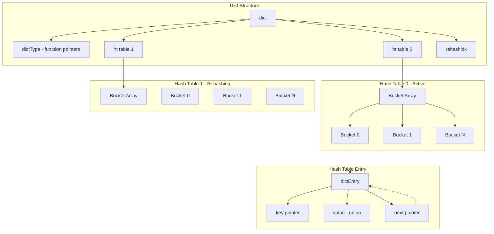
```mermaid
graph TD
    subgraph "Dict Structure"
        Dict[dict]
        Type[dictType - function pointers]
        HT0[ht table 0]
        HT1[ht table 1]
        RehashIdx[rehashidx]
    end
    
    subgraph "Hash Table 0 - Active"
        Table0[Bucket Array]
        B0_0[Bucket 0]
        B0_1[Bucket 1]
        B0_N[Bucket N]
    end
    
    subgraph "Hash Table 1 - Rehashing"
        Table1[Bucket Array]
        B1_0[Bucket 0]
        B1_1[Bucket 1]
        B1_N[Bucket N]
    end
    
    subgraph "Hash Table Entry"
        Entry[dictEntry]
        Key[key pointer]
        Value[value - union]
        Next[next pointer]
    end
    
    Dict --> Type
    Dict --> HT0
    Dict --> HT1
    Dict --> RehashIdx
    
    HT0 --> Table0
    HT1 --> Table1
    
    Table0 --> B0_0
    Table0 --> B0_1
    Table0 --> B0_N
    
    B0_0 --> Entry
    Entry --> Key
    Entry --> Value
    Entry --> Next
    Next -.-> Entry
```

**Core Components**

**Dictionary Structure**
- Two hash tables for incremental rehashing
- Type-specific operations (hash, compare, destructor)
- Rehash progress index (-1 when not rehashing)
- Private data pointer for type-specific context

**Hash Table Structure**
- Bucket array (power-of-2 size)
- Size and size mask for fast modulo
- Used entry count

**Dictionary Entry**
- Key pointer
- Value (union supporting pointer, integer, double)
- Next pointer for chaining (collision resolution)

**Incremental Rehashing**

Redis performs rehashing incrementally to avoid blocking:

**Rehashing Trigger**
Rehashing begins when:
- Load factor > 1 and no child process exists (RDB/AOF)
- Load factor > 5 (forced rehashing)

Load factor = used entries / table size

**Rehashing Process**
1. Allocate new hash table (ht[1]) with doubled size
2. Set rehashidx to 0
3. During each operation, move N buckets from ht[0] to ht[1]
4. When all entries migrated, swap ht[1] to ht[0]
5. Free old table and reset rehashidx to -1

**Active Rehashing**
The serverCron function performs 1ms of rehashing per cycle to ensure progress even without traffic.

**Operations During Rehashing**
- Lookups: Check both tables
- Additions: Only to new table (ht[1])
- Deletions: Search both tables

### Skip List (t_zset.c)

Skip lists implement sorted sets, providing O(log N) operations.

**Skip List Structure**

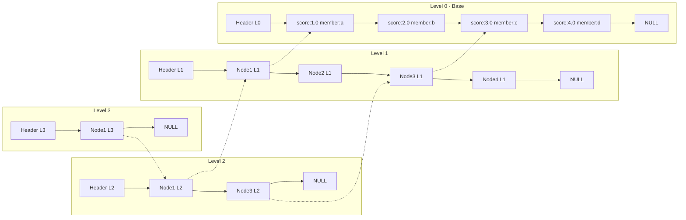
```mermaid
graph LR
    subgraph "Level 3"
        H3[Header L3] --> N1_3[Node1 L3] --> NULL3[NULL]
    end
    
    subgraph "Level 2"
        H2[Header L2] --> N1_2[Node1 L2] --> N3_2[Node3 L2] --> NULL2[NULL]
    end
    
    subgraph "Level 1"
        H1[Header L1] --> N1_1[Node1 L1] --> N2_1[Node2 L1] --> N3_1[Node3 L1] --> N4_1[Node4 L1] --> NULL1[NULL]
    end
    
    subgraph "Level 0 - Base"
        H0[Header L0] --> N1[score:1.0 member:a] --> N2[score:2.0 member:b] --> N3[score:3.0 member:c] --> N4[score:4.0 member:d] --> NULL0[NULL]
    end
    
    N1_3 -.-> N1_2
    N1_2 -.-> N1_1
    N1_1 -.-> N1
    
    N3_2 -.-> N3_1
    N3_1 -.-> N3
```

**Key Characteristics**

**Probabilistic Balancing**
- Random level assignment (geometric distribution)
- Level 1: 100% probability
- Level N+1: 25% of Level N
- Maximum 32 levels

**Skip List Node**
- Score (double): Primary sort key
- Member (SDS): Secondary sort key, must be unique
- Backward pointer: Enables reverse traversal
- Forward array: Pointers to next nodes at each level
- Span array: Distance to next node at each level

**Operations Complexity**
- Search: O(log N) average
- Insert: O(log N) average
- Delete: O(log N) average
- Range queries: O(log N + M) where M is result count

**Why Skip List Over Balanced Tree?**
- Simpler implementation
- Better cache locality
- Easier to implement range operations
- Comparable performance
- Memory efficient with proper tuning

### Quick List (quicklist.c)

Quick list combines doubly linked lists with ziplists for memory-efficient lists.

**Quick List Architecture**

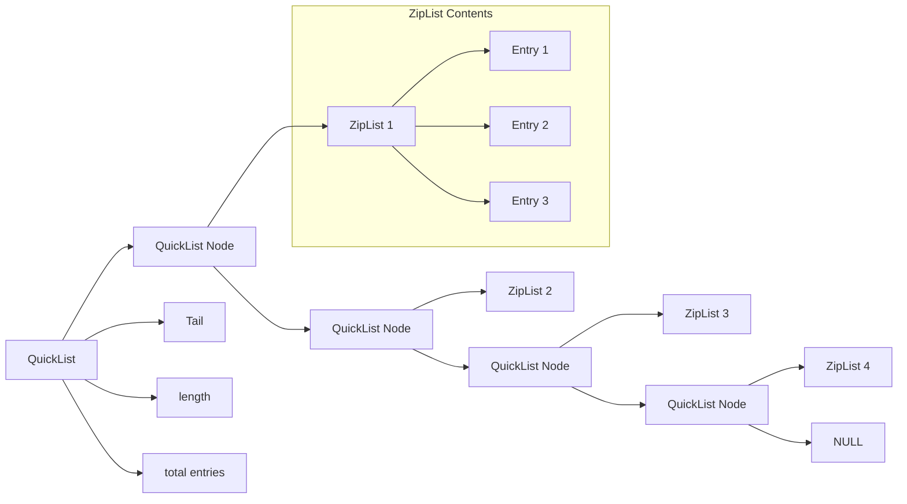
```mermaid
graph LR
    QL[QuickList] --> Head
    QL --> Tail
    QL --> Len[length]
    QL --> Count[total entries]
    
    Head[QuickList Node] --> ZL1[ZipList 1]
    Head --> Node2
    
    Node2[QuickList Node] --> ZL2[ZipList 2]
    Node2 --> Node3
    
    Node3[QuickList Node] --> ZL3[ZipList 3]
    Node3 --> TailNode
    
    TailNode[QuickList Node] --> ZL4[ZipList 4]
    TailNode --> NULL[NULL]
    
    subgraph "ZipList Contents"
        ZL1 --> E1[Entry 1]
        ZL1 --> E2[Entry 2]
        ZL1 --> E3[Entry 3]
    end
```

**Design Rationale**

Quick list balances:
- Memory efficiency of packed structures (ziplist)
- Flexibility of linked lists
- Performance of localized operations

**QuickList Node**
- Pointer to ziplist (or compressed LZF blob)
- Previous and next node pointers
- Ziplist size in bytes
- Entry count
- Encoding (raw or compressed)
- Container type

**Compression Strategy**
Redis can compress middle nodes:
- Keep N nodes at each end uncompressed
- Compress middle nodes with LZF
- Decompress on access
- Balances memory and performance

**Configuration**
- list-max-ziplist-size: Max ziplist size or entry count
- list-compress-depth: Uncompressed nodes at each end

### Integer Set (intset.c)

Integer sets store sorted integers with encoding optimization.

**Encoding Types**

| Encoding | Storage | Range |
|----------|---------|-------|
| INT16 | 2 bytes per integer | -32,768 to 32,767 |
| INT32 | 4 bytes per integer | -2,147,483,648 to 2,147,483,647 |
| INT64 | 8 bytes per integer | Full 64-bit range |

**Automatic Upgrade**

When adding an integer exceeding current encoding:
1. Allocate new array with larger encoding
2. Copy and upgrade all existing integers
3. Insert new integer in sorted position
4. Replace old array

Downgrade never occurs (optimization trade-off).

**Operations**
- All operations maintain sorted order
- Search uses binary search: O(log N)
- Insert requires element shifting: O(N)
- Efficient for small to medium sets

### Zip List (ziplist.c)

Zip lists provide extremely compact sequential storage.

**Memory Layout**

```
+--------+--------+--------+--------+--------+--------+--------+
| zlbytes| zltail | zllen  | entry1 | entry2 | ...    | zlend  |
+--------+--------+--------+--------+--------+--------+--------+
```

- **zlbytes**: Total bytes (4 bytes)
- **zltail**: Offset to last entry (4 bytes)
- **zllen**: Entry count, 65535 means count > 65534 (2 bytes)
- **entries**: Variable-length encoded entries
- **zlend**: End marker 0xFF (1 byte)

**Entry Encoding**

Each entry contains:
1. Previous entry length (1 or 5 bytes)
2. Encoding type and length
3. Content

**Encoding Types**
- Small integers: 4-bit to 64-bit
- Byte arrays: Length-prefixed with various size encodings

**Cascade Updates**

Inserting large entries may trigger cascade:
- New entry causes next entry's prevlen to grow from 1 to 5 bytes
- This may cascade through multiple entries
- Worst case: O(N^2) but rare in practice

**Usage Threshold**

Ziplists used when:
- Entry count below list-max-ziplist-entries (default 512)
- Individual entry size below list-max-ziplist-value (default 64 bytes)

Exceeding thresholds triggers conversion to other encodings.

## Command Processing Pipeline

### Command Execution Flow

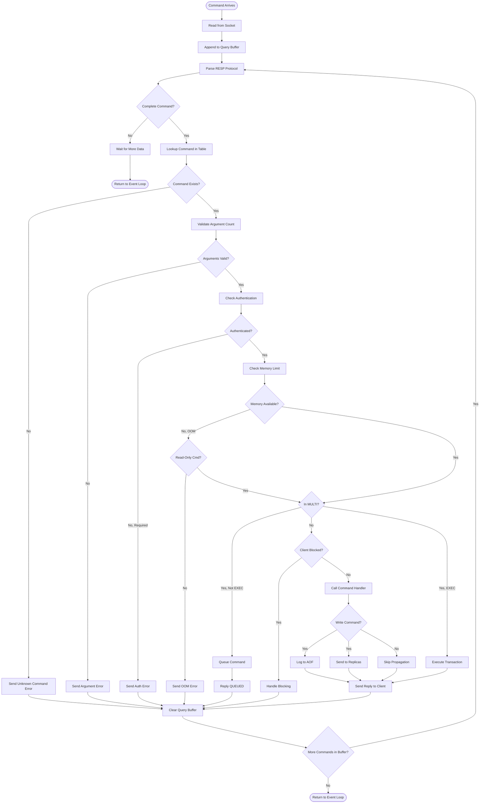
```mermaid
flowchart TD
    Start([Command Arrives]) --> ReadData[Read from Socket]
    ReadData --> Append[Append to Query Buffer]
    Append --> Parse[Parse RESP Protocol]
    
    Parse --> Complete{Complete Command?}
    Complete -->|No| WaitMore[Wait for More Data]
    Complete -->|Yes| Lookup[Lookup Command in Table]
    
    WaitMore --> End1([Return to Event Loop])
    
    Lookup --> Found{Command Exists?}
    Found -->|No| ErrorCmd[Send Unknown Command Error]
    Found -->|Yes| ValidateArgs[Validate Argument Count]
    
    ErrorCmd --> ClearBuffer
    
    ValidateArgs --> ArgsOK{Arguments Valid?}
    ArgsOK -->|No| ErrorArgs[Send Argument Error]
    ArgsOK -->|Yes| CheckAuth[Check Authentication]
    
    ErrorArgs --> ClearBuffer
    
    CheckAuth --> Authenticated{Authenticated?}
    Authenticated -->|No, Required| ErrorAuth[Send Auth Error]
    Authenticated -->|Yes| CheckMemory[Check Memory Limit]
    
    ErrorAuth --> ClearBuffer
    
    CheckMemory --> MemOK{Memory Available?}
    MemOK -->|No, OOM| CheckFlags{Read-Only Cmd?}
    MemOK -->|Yes| CheckMulti
    
    CheckFlags -->|No| ErrorOOM[Send OOM Error]
    CheckFlags -->|Yes| CheckMulti
    
    ErrorOOM --> ClearBuffer
    
    CheckMulti{In MULTI?}
    CheckMulti -->|Yes, Not EXEC| QueueCmd[Queue Command]
    CheckMulti -->|No| CheckBlock
    CheckMulti -->|Yes, EXEC| ExecMulti[Execute Transaction]
    
    QueueCmd --> ReplyQueued[Reply QUEUED]
    ReplyQueued --> ClearBuffer
    
    CheckBlock{Client Blocked?}
    CheckBlock -->|Yes| HandleBlock[Handle Blocking]
    CheckBlock -->|No| CallCmd[Call Command Handler]
    
    HandleBlock --> ClearBuffer
    
    CallCmd --> PropagateCmd{Write Command?}
    PropagateCmd -->|Yes| LogAOF[Log to AOF]
    PropagateCmd -->|Yes| ReplicateCmd[Send to Replicas]
    PropagateCmd -->|No| SkipPropagate
    
    LogAOF --> SendReply
    ReplicateCmd --> SendReply
    SkipPropagate[Skip Propagation] --> SendReply
    
    ExecMulti --> SendReply
    
    SendReply[Send Reply to Client] --> ClearBuffer[Clear Query Buffer]
    ClearBuffer --> HasMore{More Commands in Buffer?}
    
    HasMore -->|Yes| Parse
    HasMore -->|No| End2([Return to Event Loop])
```

### Command Table Structure

Redis maintains a command table mapping command names to their implementations:

**Command Entry Fields**

| Field | Purpose | Example |
|-------|---------|--------|
| name | Command name | "get", "set", "lpush" |
| proc | Function pointer | getCommand, setCommand |
| arity | Argument count | -2 (at least 2), 3 (exactly 3) |
| sflags | String flags | "write", "readonly", "fast" |
| flags | Parsed flag bits | CMD_WRITE, CMD_READONLY |
| getkeys_proc | Key extraction function | For complex key patterns |
| firstkey | First key argument index | 1 for GET, SET |
| lastkey | Last key argument index | 1 for GET, -1 for MGET |
| keystep | Step between keys | 1 for most, 2 for MSET |
| microseconds | Cumulative execution time | Performance tracking |
| calls | Total invocation count | Usage statistics |

**Command Flags**

- **CMD_WRITE**: Modifies data, must replicate
- **CMD_READONLY**: Does not modify data
- **CMD_DENYOOM**: Denied when out of memory
- **CMD_ADMIN**: Administrative command
- **CMD_PUBSUB**: Pub/Sub command
- **CMD_NOSCRIPT**: Not allowed in scripts
- **CMD_RANDOM**: Non-deterministic result
- **CMD_SORT_FOR_SCRIPT**: Sort reply for scripting
- **CMD_LOADING**: Allowed during loading
- **CMD_STALE**: Allowed on stale replica
- **CMD_SKIP_MONITOR**: Not shown in MONITOR
- **CMD_ASKING**: Cluster redirection bypass
- **CMD_FAST**: O(1) or O(log N) command
- **CMD_MOVABLE_KEYS**: Keys not at fixed positions

### Multi/Exec Transactions

Redis transactions provide command batching with atomic execution:

**Transaction Lifecycle**

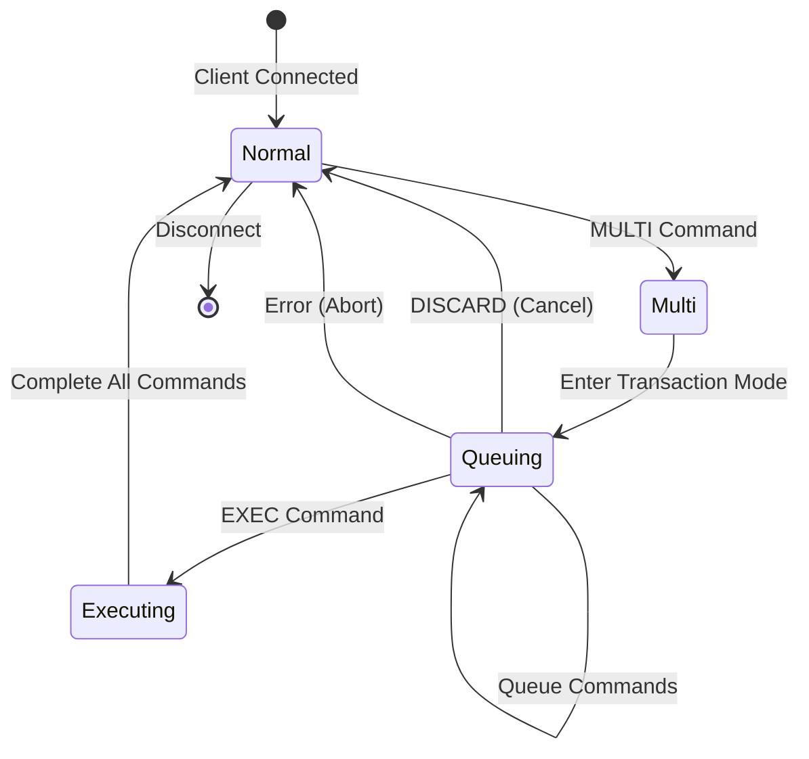
```mermaid
stateDiagram-v2
    [*] --> Normal: Client Connected
    Normal --> Multi: MULTI Command
    Multi --> Queuing: Enter Transaction Mode
    Queuing --> Queuing: Queue Commands
    Queuing --> Normal: DISCARD (Cancel)
    Queuing --> Executing: EXEC Command
    Executing --> Normal: Complete All Commands
    Queuing --> Normal: Error (Abort)
    Normal --> [*]: Disconnect
```

**Transaction Semantics**

**Atomicity**
- All commands executed sequentially without interruption
- No other client commands interleaved
- No isolation - other clients see intermediate state

**Error Handling**
- Syntax errors during queuing: Transaction aborted
- Runtime errors during execution: Continue remaining commands
- No rollback mechanism

**WATCH/UNWATCH**
- Optimistic locking mechanism
- WATCH monitors keys for modifications
- EXEC aborts if watched keys modified
- Enables check-and-set operations

### Pub/Sub System

Redis implements publish/subscribe messaging:

**Subscription Management**

**Channel Subscriptions**
- Dictionary: channel name → list of clients
- Client subscribes to exact channel names
- PUBLISH sends message to all subscribers

**Pattern Subscriptions**
- List of pattern-client pairs
- Supports glob-style patterns
- PUBLISH checks all patterns for matches
- Less efficient than channel subscriptions

**Message Delivery**
- Fire-and-forget semantics
- No message persistence
- No delivery guarantees
- Subscribers receive messages only while connected

**Client State Impact**
- Subscribed clients enter special mode
- Only Pub/Sub commands allowed
- PING, SUBSCRIBE, UNSUBSCRIBE, PSUBSCRIBE, PUNSUBSCRIBE, QUIT
- Prevents regular commands during subscription

## Persistence Mechanisms

### RDB (Redis Database) Snapshots

RDB creates point-in-time binary snapshots of the dataset.

**RDB Triggering**

**Manual Triggers**
- SAVE: Synchronous snapshot (blocks server)
- BGSAVE: Background snapshot (forks child process)
- SHUTDOWN: Creates snapshot before exit

**Automatic Triggers**
Configured with save directives:
- save 900 1: After 900 seconds if 1+ key changed
- save 300 10: After 300 seconds if 10+ keys changed
- save 60 10000: After 60 seconds if 10000+ keys changed

**Replication Trigger**
- Replica requests full synchronization
- Master creates RDB for transmission

**RDB Creation Process**

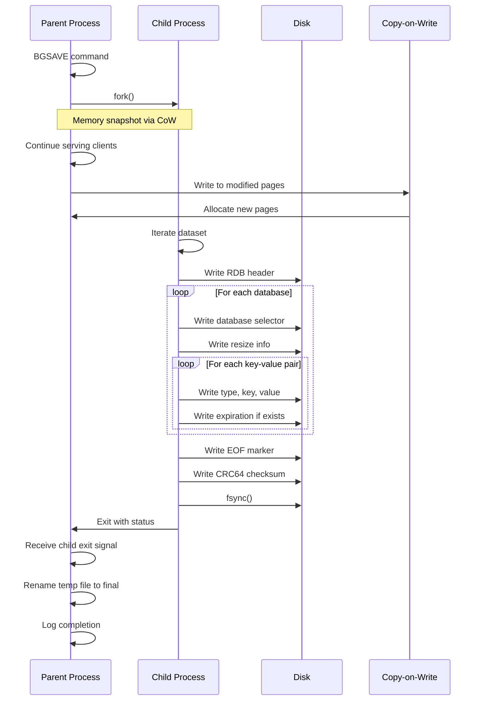
```mermaid
sequenceDiagram
    participant Parent as Parent Process
    participant Child as Child Process
    participant Disk
    participant COW as Copy-on-Write
    
    Parent->>Parent: BGSAVE command
    Parent->>Child: fork()
    Note over Parent,Child: Memory snapshot via CoW
    
    Parent->>Parent: Continue serving clients
    Parent->>COW: Write to modified pages
    COW->>Parent: Allocate new pages
    
    Child->>Child: Iterate dataset
    Child->>Disk: Write RDB header
    
    loop For each database
        Child->>Disk: Write database selector
        Child->>Disk: Write resize info
        loop For each key-value pair
            Child->>Disk: Write type, key, value
            Child->>Disk: Write expiration if exists
        end
    end
    
    Child->>Disk: Write EOF marker
    Child->>Disk: Write CRC64 checksum
    Child->>Disk: fsync()
    Child->>Parent: Exit with status
    
    Parent->>Parent: Receive child exit signal
    Parent->>Parent: Rename temp file to final
    Parent->>Parent: Log completion
```

**RDB File Format**

**Header Structure**
- Magic string: "REDIS" (5 bytes)
- Version: 4-digit ASCII (4 bytes)
- Auxiliary fields: Metadata key-value pairs

**Database Sections**
For each non-empty database:
- SELECTDB opcode
- Database number
- RESIZEDB opcode
- Database size and expires size
- Key-value pairs

**Key-Value Encoding**
- Optional expiration (ms or seconds)
- Value type opcode
- Key (string encoding)
- Value (type-specific encoding)

**Footer**
- EOF opcode
- CRC64 checksum (8 bytes)

**Encoding Optimizations**

**String Encoding**
- Integer encoding for numeric strings
- LZF compression for compressible strings
- Raw encoding otherwise

**Specialized Encodings**
- Ziplist for small hashes, lists, sorted sets
- Intset for integer-only sets
- Quicklist for lists
- Regular encoding for larger structures

**Advantages**
- Compact binary format
- Fast loading (faster than AOF)
- Single file for entire dataset
- Suitable for backups and disaster recovery
- Enables replica partial resync

**Disadvantages**
- Data loss between snapshots
- Fork overhead for large datasets
- CPU-intensive serialization
- Blocking on SAVE command

### AOF (Append-Only File)

AOF logs every write operation for durability.

**AOF Writing Flow**

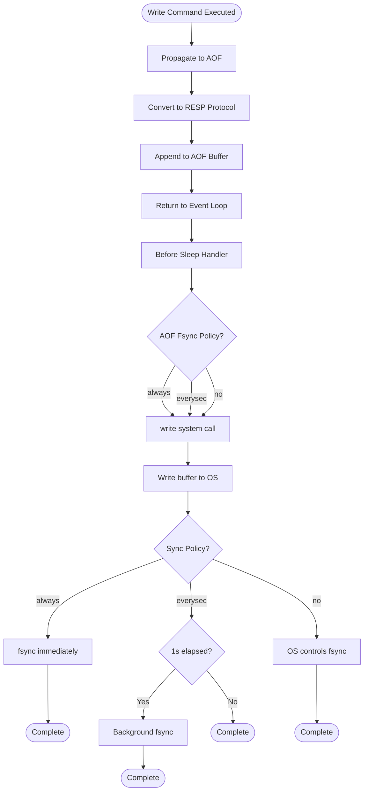
```mermaid
flowchart TD
    Start([Write Command Executed]) --> Propagate[Propagate to AOF]
    Propagate --> Convert[Convert to RESP Protocol]
    Convert --> AppendBuf[Append to AOF Buffer]
    AppendBuf --> EventLoop[Return to Event Loop]
    
    EventLoop --> BeforeSleep[Before Sleep Handler]
    BeforeSleep --> CheckPolicy{AOF Fsync Policy?}
    
    CheckPolicy -->|always| WriteCall[write system call]
    CheckPolicy -->|everysec| WriteCall
    CheckPolicy -->|no| WriteCall
    
    WriteCall --> WriteData[Write buffer to OS]
    WriteData --> CheckSync{Sync Policy?}
    
    CheckSync -->|always| FsyncNow[fsync immediately]
    CheckSync -->|everysec| CheckTimer{1s elapsed?}
    CheckSync -->|no| SkipFsync[OS controls fsync]
    
    FsyncNow --> Done1
    CheckTimer -->|Yes| BgFsync[Background fsync]
    CheckTimer -->|No| Done2
    SkipFsync --> Done3
    BgFsync --> Done4
    
    Done1([Complete])
    Done2([Complete])
    Done3([Complete])
    Done4([Complete])
```

**AOF Fsync Policies**

| Policy | Description | Durability | Performance |
|--------|-------------|------------|-------------|
| always | Fsync after every write command | Maximum (no data loss) | Slowest |
| everysec | Fsync once per second | Good (up to 1s loss) | Good |
| no | OS controls fsync timing | Lowest (seconds of loss) | Fastest |

**AOF Rewrite**

AOF grows continuously; rewriting compacts it:

**Rewrite Trigger**
- Auto: When size exceeds threshold percentage
- Manual: BGREWRITEAOF command

**Rewrite Process**

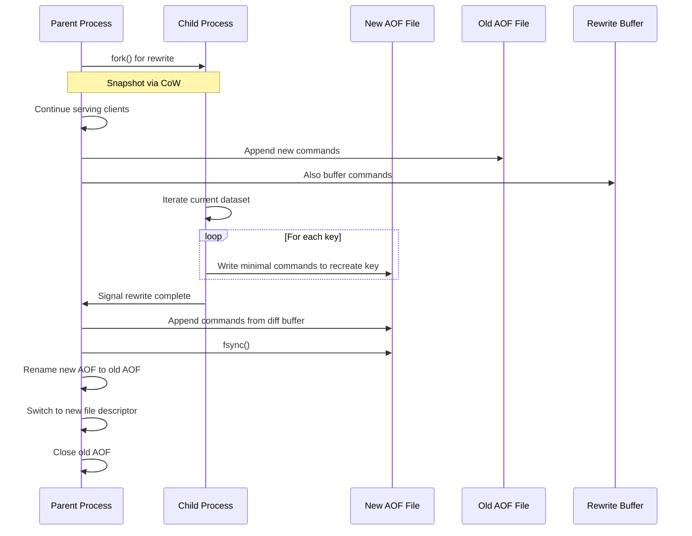
```mermaid
sequenceDiagram
    participant Parent as Parent Process
    participant Child as Child Process
    participant NewAOF as New AOF File
    participant OldAOF as Old AOF File
    participant DiffBuf as Rewrite Buffer
    
    Parent->>Child: fork() for rewrite
    Note over Parent,Child: Snapshot via CoW
    
    Parent->>Parent: Continue serving clients
    Parent->>OldAOF: Append new commands
    Parent->>DiffBuf: Also buffer commands
    
    Child->>Child: Iterate current dataset
    loop For each key
        Child->>NewAOF: Write minimal commands to recreate key
    end
    
    Child->>Parent: Signal rewrite complete
    
    Parent->>NewAOF: Append commands from diff buffer
    Parent->>NewAOF: fsync()
    Parent->>Parent: Rename new AOF to old AOF
    Parent->>Parent: Switch to new file descriptor
    Parent->>Parent: Close old AOF
```

**Rewrite Optimization**

Child process generates minimal commands:
- Multi-element collections: Single bulk command
- Expired keys: Omitted entirely
- Intermediate states: Omitted
- Result: Much smaller file than original

**Rewrite Difference Buffer**

During rewrite:
- New commands written to old AOF
- Also buffered in memory (rewrite buffer)
- Applied to new AOF before activation
- Ensures no data loss during rewrite

**AOF Loading Process**

```mermaid
flowchart TD
    Start([Server Starts]) --> CheckAOF{AOF Enabled?}
    CheckAOF -->|No| CheckRDB
    CheckAOF -->|Yes| AOFExists{AOF File Exists?}
    
    AOFExists -->|No| CheckRDB
    AOFExists -->|Yes| CreateFakeClient[Create Fake Client]
    
    CreateFakeClient --> ReadAOF[Read AOF File]
    ReadAOF --> ParseCmd[Parse RESP Command]
    ParseCmd --> ExecuteCmd[Execute Command]
    ExecuteCmd --> MoreCmds{More Commands?}
    
    MoreCmds -->|Yes| ParseCmd
    MoreCmds -->|No| ValidateChecksum[Validate Checksum]
    
    ValidateChecksum --> ChecksumOK{Checksum Valid?}
    ChecksumOK -->|Yes| LoadComplete
    ChecksumOK -->|No| CheckTruncate{aof-load-truncated?}
    
    CheckTruncate -->|Yes| WarnTruncate[Warn about truncation]
    CheckTruncate -->|No| ErrorExit[Exit with error]
    
    WarnTruncate --> LoadComplete
    
    CheckRDB{RDB File Exists?}
    CheckRDB -->|Yes| LoadRDB[Load RDB]
    CheckRDB -->|No| EmptyStart[Start with empty dataset]
    
    LoadRDB --> LoadComplete
    EmptyStart --> LoadComplete
    LoadComplete([Loading Complete])
```

**Advantages**
- Maximum durability with proper fsync policy
- Append-only: Less corruption risk
- Human-readable format (RESP)
- Automatic rewrite for size management
- Every write operation preserved

**Disadvantages**
- Larger file size than RDB
- Slower loading than RDB
- Fsync overhead impacts performance
- Potential rewrite overhead

### Hybrid Persistence (RDB+AOF)

Redis supports combining both mechanisms:

**Combined Strategy**
- RDB for fast recovery and backups
- AOF for maximum durability
- Load AOF if both exist (more complete data)
- Provides best of both worlds

**RDB-AOF Preamble**

Recent Redis versions support AOF with RDB preamble:
- AOF rewrite creates RDB snapshot
- Followed by incremental AOF commands
- Faster loading than pure AOF
- Maintains durability of AOF

## Replication Architecture

### Master-Replica Replication

Redis replication provides data redundancy and read scalability.

**Replication Topology**

```mermaid
graph TD
    M[Master Node] --> R1[Replica 1]
    M --> R2[Replica 2]
    M --> R3[Replica 3]
    
    R1 --> R1A[Sub-Replica 1A]
    R1 --> R1B[Sub-Replica 1B]
    
    R2 --> R2A[Sub-Replica 2A]
    
    style M fill:#ff9999
    style R1 fill:#99ccff
    style R2 fill:#99ccff
    style R3 fill:#99ccff
    style R1A fill:#99ff99
    style R1B fill:#99ff99
    style R2A fill:#99ff99
```

**Replication Features**
- Asynchronous replication (non-blocking)
- One master, multiple replicas
- Replicas can have sub-replicas (cascading)
- Non-blocking replication on both sides
- Read scalability through replicas
- Automatic reconnection with partial resync

### Full Synchronization Flow

```mermaid
sequenceDiagram
    participant Replica
    participant Master
    participant RDB as RDB File
    
    Replica->>Master: PSYNC ? -1 (first sync)
    
    Master->>Master: Start BGSAVE
    Master->>Replica: +FULLRESYNC <runid> <offset>
    
    Note over Master: Fork child process
    Master->>RDB: Generate RDB file
    Master->>Master: Buffer new writes
    
    RDB->>Master: RDB generation complete
    Master->>Replica: Send RDB file
    
    Replica->>Replica: Flush old dataset
    Replica->>Replica: Load RDB file
    
    Master->>Replica: Send buffered writes (replication stream)
    Replica->>Replica: Apply buffered writes
    
    Note over Master,Replica: Now in sync
    
    Master->>Replica: Continuous replication stream
```

**Full Sync Phases**

1. **Handshake**: Replica sends PSYNC with runid and offset
2. **RDB Generation**: Master creates snapshot (may reuse existing BGSAVE)
3. **Buffer Accumulation**: Master buffers writes during RDB transfer
4. **RDB Transfer**: Master sends RDB file to replica
5. **RDB Loading**: Replica loads RDB, reconstructing dataset
6. **Buffer Application**: Master sends buffered writes to replica
7. **Streaming**: Continuous replication of new writes

### Partial Synchronization

Partial resync avoids full sync after brief disconnections.

**Replication Backlog**

Master maintains circular buffer:
- Fixed size (default 1MB, configurable)
- Stores recent replication stream
- Enables partial resync if replica offset within backlog

**Partial Sync Flow**

```mermaid
sequenceDiagram
    participant Replica
    participant Master
    
    Note over Replica: Connection lost
    Note over Replica: Reconnects
    
    Replica->>Master: PSYNC <runid> <offset>
    
    Master->>Master: Check runid matches
    Master->>Master: Check offset in backlog
    
    alt Offset in backlog
        Master->>Replica: +CONTINUE
        Master->>Replica: Send missing data from offset
        Note over Master,Replica: Partial sync complete
    else Offset too old or runid mismatch
        Master->>Replica: +FULLRESYNC <runid> <offset>
        Note over Master,Replica: Fall back to full sync
    end
```

**Conditions for Partial Sync**
- Replica knows master's runid
- Replica's replication offset within backlog range
- Master's backlog contains required data

**Replication ID**
Each Redis instance has replication ID:
- Generated on startup or promotion
- Allows replicas to identify correct master
- Secondary replication ID tracks failover history

### Replication Stream Protocol

Continuous replication after synchronization:

**Write Propagation**

Master propagates:
- All write commands
- Database selection (SELECT)
- Expiration commands (DEL for expired keys)
- Flush commands (FLUSHDB, FLUSHALL)

**Protocol Format**
Commands sent as RESP arrays (same as AOF):
- Enables easy replication and AOF sharing
- Consistent protocol across persistence and replication

**Offset Tracking**
- Master increments offset for each byte sent
- Replica ACKs offset periodically (REPLCONF ACK)
- Enables partial resync and lag monitoring

**Heartbeat**
- Master sends PING periodically (default 10s)
- Replica sends REPLCONF ACK with offset
- Detects connection issues
- Enables lag calculation

### Replication Configuration

**Master Configuration**
- repl-backlog-size: Backlog buffer size
- repl-backlog-ttl: Time to retain backlog after last replica
- repl-diskless-sync: Stream RDB to replicas without disk
- repl-diskless-sync-delay: Wait for multiple replicas

**Replica Configuration**
- replicaof <masterip> <masterport>: Set master
- replica-read-only: Default yes, allow only reads
- replica-serve-stale-data: Serve old data if disconnected
- repl-disable-tcp-nodelay: Trade latency for bandwidth

## Memory Management

### Memory Allocation Strategy

Redis uses sophisticated memory management for efficiency.

**Memory Allocator**

Redis supports multiple allocators:
- **jemalloc** (default): Excellent fragmentation characteristics
- **tcmalloc**: Google's allocator, also low fragmentation
- **libc malloc**: System default, fallback option

**Allocation Tracking**
Redis tracks:
- Used memory (zmalloc_used_memory)
- RSS (Resident Set Size) from OS
- Fragmentation ratio (RSS / used memory)
- Peak memory usage
- Memory overhead (non-data memory)

### Memory Limits and Eviction

**maxmemory Configuration**

When maxmemory reached, eviction policy applies.

**Eviction Policies**

| Policy | Description | Use Case |
|--------|-------------|----------|
| noeviction | Return errors for write commands | Prevent data loss |
| allkeys-lru | Evict least recently used keys | General caching |
| allkeys-lfu | Evict least frequently used keys | Frequency-based caching |
| allkeys-random | Evict random keys | Uniform access patterns |
| volatile-lru | LRU among keys with expiration | Cache with explicit TTL |
| volatile-lfu | LFU among keys with expiration | Frequency + TTL |
| volatile-random | Random among keys with expiration | Simple TTL management |
| volatile-ttl | Evict keys with nearest expiration | Time-based priority |

**Eviction Process**

```mermaid
flowchart TD
    Start([Write Command]) --> CheckMem{Memory > maxmemory?}
    CheckMem -->|No| ExecuteCmd[Execute Command]
    CheckMem -->|Yes| CheckPolicy{Eviction Policy?}
    
    CheckPolicy -->|noeviction| ErrorOOM[Return OOM Error]
    CheckPolicy -->|Other policies| SelectSample[Select Key Sample]
    
    SelectSample --> ApplyAlgo{Algorithm?}
    ApplyAlgo -->|LRU| FindLRU[Find LRU Key]
    ApplyAlgo -->|LFU| FindLFU[Find LFU Key]
    ApplyAlgo -->|Random| PickRandom[Pick Random Key]
    ApplyAlgo -->|TTL| FindSoonest[Find Soonest Expiration]
    
    FindLRU --> DeleteKey
    FindLFU --> DeleteKey
    PickRandom --> DeleteKey
    FindSoonest --> DeleteKey
    
    DeleteKey[Delete Selected Key] --> StillOver{Still Over Limit?}
    StillOver -->|Yes| SelectSample
    StillOver -->|No| ExecuteCmd
    
    ExecuteCmd --> Done([Complete])
    ErrorOOM --> Done
```

**LRU Implementation**

Redis uses approximate LRU:
- 24-bit timestamp in Redis object
- Sample N keys (default 5)
- Evict key with oldest timestamp
- Trade-off: Accuracy vs performance

**LFU Implementation**

Redis uses Morris counter for frequency:
- 8 bits for frequency counter
- Logarithmic probability-based increment
- Decay over time
- 16 bits for last decrement time

### Expiration Mechanism

Redis handles key expiration through multiple strategies.

**Expiration Storage**
- Separate dictionary per database
- Maps keys to expiration timestamp (Unix ms)
- Only keys with TTL stored

**Lazy Expiration**
On key access:
1. Check expiration dictionary
2. If expired, delete key
3. Return key not found

**Active Expiration**
Periodic sampling (serverCron):
1. Select random database
2. Sample 20 keys with expiration
3. Delete all found expired keys
4. If > 25% expired, repeat from step 2
5. Limit total time per cycle

**Expiration in Replication**
- Masters delete and synthesize DEL command
- DEL propagated to replicas
- Replicas never expire keys independently (except in rare conditions)
- Ensures consistency across replicas

**Expiration in Persistence**
- RDB: Expired keys not saved
- AOF: Explicit DEL appended when expired
- Ensures expired keys not reloaded

## Advanced Topics

### Lua Scripting

Redis embeds Lua for atomic script execution.

**Script Execution Model**
- Scripts run atomically (like transactions)
- No other commands execute during script
- Deterministic execution for replication
- Sandboxed environment

**EVAL Command**
Execute Lua script:
- EVAL script numkeys key [key ...] arg [arg ...]
- Script receives keys and arguments
- Returns value to client

**EVALSHA Command**
- Execute cached script by SHA1
- Reduces bandwidth for repeated scripts
- SCRIPT LOAD preloads scripts

**Redis API in Lua**
- redis.call(): Executes command, propagates errors
- redis.pcall(): Executes command, returns errors
- redis.log(): Logs messages
- redis.error_reply(): Returns error
- redis.status_reply(): Returns status

**Script Caching**
- Scripts stored by SHA1 hash
- Persists across server restarts (if scripts re-executed)
- SCRIPT FLUSH clears cache
- SCRIPT EXISTS checks presence

**Replication Considerations**
- Write commands replicated to replicas
- Random/time-based commands require special handling
- redis.replicate_commands() for fine control

### Cluster Mode

Redis Cluster provides automatic sharding.

**Cluster Architecture**

```mermaid
graph TB
    subgraph "Cluster - 3 Masters + 3 Replicas"
        M1[Master 1<br/>Slots 0-5460] --> R1[Replica 1]
        M2[Master 2<br/>Slots 5461-10922] --> R2[Replica 2]
        M3[Master 3<br/>Slots 10923-16383] --> R3[Replica 3]
        
        M1 -.Gossip.-> M2
        M2 -.Gossip.-> M3
        M3 -.Gossip.-> M1
        M1 -.Gossip.-> R2
        M2 -.Gossip.-> R3
        M3 -.Gossip.-> R1
    end
    
    Client[Client] --> M1
    Client --> M2
    Client --> M3
    
    style M1 fill:#ff9999
    style M2 fill:#ff9999
    style M3 fill:#ff9999
    style R1 fill:#99ccff
    style R2 fill:#99ccff
    style R3 fill:#99ccff
```

**Key Features**
- 16384 hash slots
- Automatic slot assignment
- Client-side routing
- Automatic failover
- Linear scalability
- No single point of failure

**Hash Slot Calculation**
- HASH_SLOT = CRC16(key) mod 16384
- Hash tags for multi-key operations: {user}:profile, {user}:posts
- Keys with same hash tag assigned to same slot

**Cluster Protocol**
- Gossip protocol for membership
- Heartbeat and state propagation
- Failure detection through consensus
- Configurable cluster-node-timeout

**Client Redirection**
- MOVED: Slot permanently assigned elsewhere
- ASK: Slot being migrated
- Clients should update slot mapping
- Smart clients cache slot topology

**Slot Migration**
- Supports online resharding
- Slots migrated between nodes
- Atomic key migration
- ASK redirection during migration

### Sentinel for High Availability

Redis Sentinel monitors and manages failover.

**Sentinel Architecture**

```mermaid
graph TB
    subgraph "Sentinel Quorum"
        S1[Sentinel 1]
        S2[Sentinel 2]
        S3[Sentinel 3]
    end
    
    M[Master] --> R1[Replica 1]
    M --> R2[Replica 2]
    
    S1 -.Monitor.-> M
    S1 -.Monitor.-> R1
    S1 -.Monitor.-> R2
    
    S2 -.Monitor.-> M
    S2 -.Monitor.-> R1
    S2 -.Monitor.-> R2
    
    S3 -.Monitor.-> M
    S3 -.Monitor.-> R1
    S3 -.Monitor.-> R2
    
    S1 -.Gossip.-> S2
    S2 -.Gossip.-> S3
    S3 -.Gossip.-> S1
    
    Client[Client] --> S1
    Client --> S2
    Client --> S3
    
    style M fill:#ff9999
    style R1 fill:#99ccff
    style R2 fill:#99ccff
    style S1 fill:#99ff99
    style S2 fill:#99ff99
    style S3 fill:#99ff99
```

**Sentinel Responsibilities**
- Monitoring: Check master and replicas health
- Notification: Alert administrators via Pub/Sub
- Automatic failover: Promote replica to master
- Configuration provider: Clients discover master

**Failure Detection**

**SDOWN (Subjectively Down)**
- Single Sentinel detects unresponsive instance
- Based on configured timeout
- Triggers investigation

**ODOWN (Objectively Down)**
- Quorum of Sentinels agree instance is down
- Required for failover initiation
- Configurable quorum size

**Failover Process**

```mermaid
sequenceDiagram
    participant S1 as Sentinel 1
    participant S2 as Sentinel 2
    participant S3 as Sentinel 3
    participant M as Master (Down)
    participant R1 as Replica 1
    participant R2 as Replica 2
    
    S1->>M: PING (no response)
    S1->>S1: Mark SDOWN
    S1->>S2: Request ODOWN vote
    S1->>S3: Request ODOWN vote
    
    S2->>S1: Vote Yes
    S3->>S1: Vote Yes
    
    S1->>S1: Quorum reached - ODOWN
    S1->>S2: Request failover authorization
    S1->>S3: Request failover authorization
    
    S2->>S1: Authorization granted
    S3->>S1: Authorization granted
    
    S1->>S1: Select best replica (R1)
    S1->>R1: SLAVE OF NO ONE (promote)
    R1->>R1: Become master
    
    S1->>R2: SLAVE OF R1 (reconfigure)
    R2->>R1: Start replication
    
    S1->>S2: Notify master changed
    S1->>S3: Notify master changed
    
    Note over S1,R2: Failover complete
```

**Replica Selection**
Sentinel chooses replica based on:
1. Replica priority (configurable)
2. Replication offset (most up-to-date)
3. Lexicographic runid (tie-breaker)

**Configuration Epoch**
- Versioning for configuration changes
- Prevents split-brain scenarios
- Higher epoch wins conflicts

## Performance Optimization

### Pipelining

Send multiple commands without waiting for replies.

**Without Pipelining**
- RTT for each command
- Total time = RTT * command_count

**With Pipelining**
- Batch multiple commands
- Single RTT for entire batch
- Massive throughput improvement

**Implementation**
- Client-side feature
- Send N commands
- Read N replies
- No special server support needed

### Transaction vs Pipeline vs Script

| Feature | Pipeline | Transaction | Lua Script |
|---------|----------|-------------|------------|
| Atomicity | No | Yes | Yes |
| Round trips | 1 | 2 (MULTI/EXEC) | 1 |
| Conditional logic | No | No | Yes |
| Deterministic | No | Yes | Yes |
| Replication | Individual cmds | Block | Single unit |

### Memory Optimization Techniques

**Data Structure Tuning**
- Adjust ziplist/intset thresholds
- Use hashes for related small values
- Leverage bit operations for flags

**Key Naming Strategy**
- Short, consistent key names
- Avoid excessive prefixes
- Use hash tags strategically

**Encoding Optimization**
- Store numbers as integers when possible
- Use compressed lists for small collections
- Leverage specialized encodings

**Lazy Free**
- UNLINK instead of DEL for large keys
- lazyfree-lazy-eviction, lazyfree-lazy-expire
- Background thread performs actual deletion

### Slow Query Analysis

**SLOWLOG**
- Records queries exceeding threshold
- slowlog-log-slower-than microseconds
- slowlog-max-len for history size
- SLOWLOG GET retrieves entries

**Monitoring Commands**
- INFO: Comprehensive server statistics
- CLIENT LIST: Connected clients
- MONITOR: Real-time command stream (use carefully)
- LATENCY DOCTOR: Latency analysis

**Profiling Tips**
- Use O(N) commands carefully
- Prefer SCAN over KEYS
- Limit ZUNIONSTORE/ZINTERSTORE size
- Use appropriate data structures

## Conclusion

### Key Takeaways

Redis source code demonstrates:

**Architectural Excellence**
- Single-threaded simplicity with high performance
- Event-driven design for scalability
- Clear separation of concerns
- Modular, maintainable codebase

**Performance Through Design**
- In-memory data structures optimized for speed
- Incremental algorithms (rehashing, expiration)
- Memory-efficient encodings
- Minimal overhead in hot paths

**Reliability Features**
- Multiple persistence options
- Robust replication mechanism
- High availability through Sentinel
- Distributed scaling via Cluster

**Developer-Friendly**
- Simple, intuitive API
- Rich data structure support
- Lua scripting for flexibility
- Comprehensive monitoring tools

### Further Exploration

To deepen understanding:

1. **Build Redis from source**: Compile and experiment
2. **Read specific modules**: Focus on areas of interest
3. **Contribute**: Fix bugs, add features, improve documentation
4. **Experiment**: Test edge cases, measure performance
5. **Study related projects**: KeyDB, Dragonfly, Valkey for alternative implementations

### Resources

**Official Documentation**
- redis.io/documentation
- redis.io/commands
- redis.io/topics

**Source Code**
- github.com/redis/redis
- Well-commented C code
- Comprehensive test suite

**Community**
- Redis mailing list
- GitHub issues and discussions
- Stack Overflow redis tag
- Redis Discord/Slack channels

### Final Thoughts

Redis source code is a masterclass in system design, showcasing how simplicity, elegance, and careful engineering create a powerful, reliable data store. The codebase balances performance, reliability, and maintainability, providing valuable lessons for any software engineer. Whether you're building high-performance systems, designing data structures, or implementing distributed systems, Redis offers patterns and techniques worth studying and applying.
